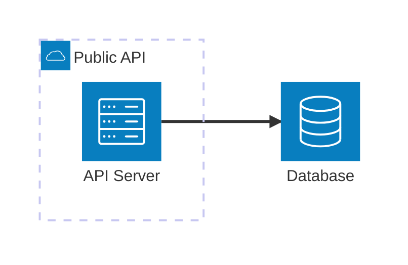
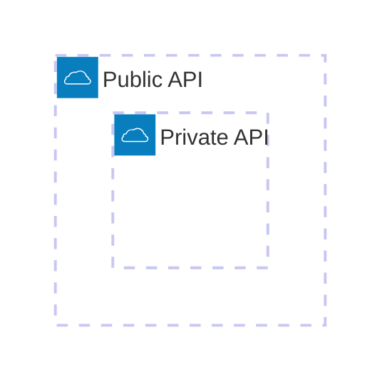
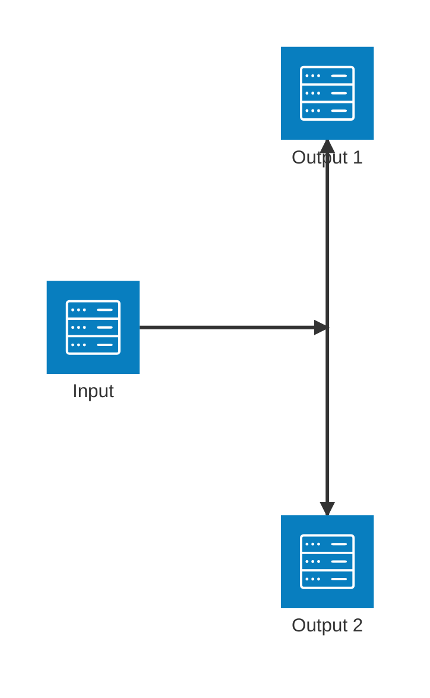

# Architecture Diagrams Reference

Architecture diagrams visualize cloud services, CI/CD deployments, and infrastructure relationships. Introduced in Mermaid v11.1.0.

## Basic Syntax



## Building Blocks

### Groups

Group related services together:

```
group {groupId}({icon})[{title}] (in {parentId})?
```



### Services

Declare services (nodes):

```
service {serviceId}({icon})[{title}] (in {parentId})?
```

```mermaid
architecture-beta
    service api(server)[API Server]
    service db(database)[Database]
    service cache(redis)[Cache] in api
```

### Edges

Connect services with edges:

```
{serviceId}{{group}}?:{T|B|L|R} {<}?--{>}? {T|B|L|R}:{serviceId}{{group}}?
```

**Directions:** `T` (top), `B` (bottom), `L` (left), `R` (right)

**Arrows:** `<` for incoming, `>` for outgoing

```mermaid
architecture-beta
    service client(browser)[Client]
    service api(server)[API]
    service db(database)[Database]

    client:B --> T:api
    api:R --> L:db
```



### Junctions

Create 4-way splits:

```
junction {junctionId} (in {parentId})?
```



## Icons

**Default icons:** `cloud`, `database`, `disk`, `internet`, `server`

**Custom icons:** Use any of 200,000+ icons from iconify.design:

```mermaid
architecture-beta
    service web(aws:ec2)[Web Server]
    service storage(aws:s3)[Storage]
```



### Using @iconify-json Icon Packs

Use npm icon packs with Mermaid CLI for a wide variety of technology logos:

```bash
npm install @iconify-json/logos @mermaid-js/mermaid-cli
mmdc --iconPacks @iconify-json/logos -i ./diagram.mmd -o ./output.svg
```

Use icons with the `logos:` prefix:

```mermaid
architecture-beta
    service web(logos:docker)[Docker Container]
    service k8s(logos:kubernetes)[Kubernetes Cluster]
    service aws(logos:aws)[AWS Services]
    service github(logos:github)[GitHub Actions]

    web:R --> L:k8s
    k8s:R --> L:aws
    web:R --> L:github
```



**Popular icon packs:**

| Icon Pack                    | Description                                   | Install                            |
| ---------------------------- | --------------------------------------------- | ---------------------------------- |
| `@iconify-json/logos`        | Technology brands (Docker, AWS, GitHub, etc.) | `npm i @iconify-json/logos`        |
| `@iconify-json/bi`           | Bootstrap icons                               | `npm i @iconify-json/bi`           |
| `@iconify-json/mdi`          | Material Design icons                         | `npm i @iconify-json/mdi`          |
| `@iconify-json/simple-icons` | Simple icons                                  | `npm i @iconify-json/simple-icons` |

Usage: `pack:icon-name` (e.g., `logos:docker`, `mdi:database`)

## Complex Example

```mermaid
architecture-beta
    group internet(cloud)[Internet]
    group private_vpc(cloud)[Private VPC]

    service lb(load_balancer)[Load Balancer] in internet
    service api1(api)[API Server 1] in private_vpc
    service api2(api)[API Server 2] in private_vpc
    service db(database)[Primary Database] in private_vpc
    service replica(database)[Read Replica] in private_vpc

    lb:R --> L:api1
    lb:R --> L:api2
    api1:R --> L:db
    api2:R --> L:db
    db:R --> L:replica
```



## Edge Patterns

| Pattern              | Description               |
| -------------------- | ------------------------- |
| `A:R -- L:B`         | Horizontal edge           |
| `A:T -- B:B`         | Vertical edge (90 degree) |
| `A:R --> L:B`        | Edge with arrow           |
| `A:R <--> L:B`       | Bidirectional edge        |
| `A{group}:R --> L:B` | Edge from group boundary  |

## Group Edges

Connect groups using the `{group}` modifier:

```mermaid
architecture-beta
    group frontend(cloud)[Frontend]
    group backend(cloud)[Backend]

    service client(browser)[Client] in frontend
    service api(server)[API] in backend

    client{group}:B --> T:api{group}
```



## Best Practices

1. Group services by environment (public/private) or layer (frontend/backend)
2. Use consistent icons for service types
3. Label edges with protocols (HTTPS, TCP, etc.)
4. Use junctions for fan-out patterns
5. Keep diagrams focused; split complex architectures into multiple views

## Reference

- [Official Documentation](https://mermaid.js.org/syntax/architecture.html)
- [Iconify Icons](https://iconify.design)
