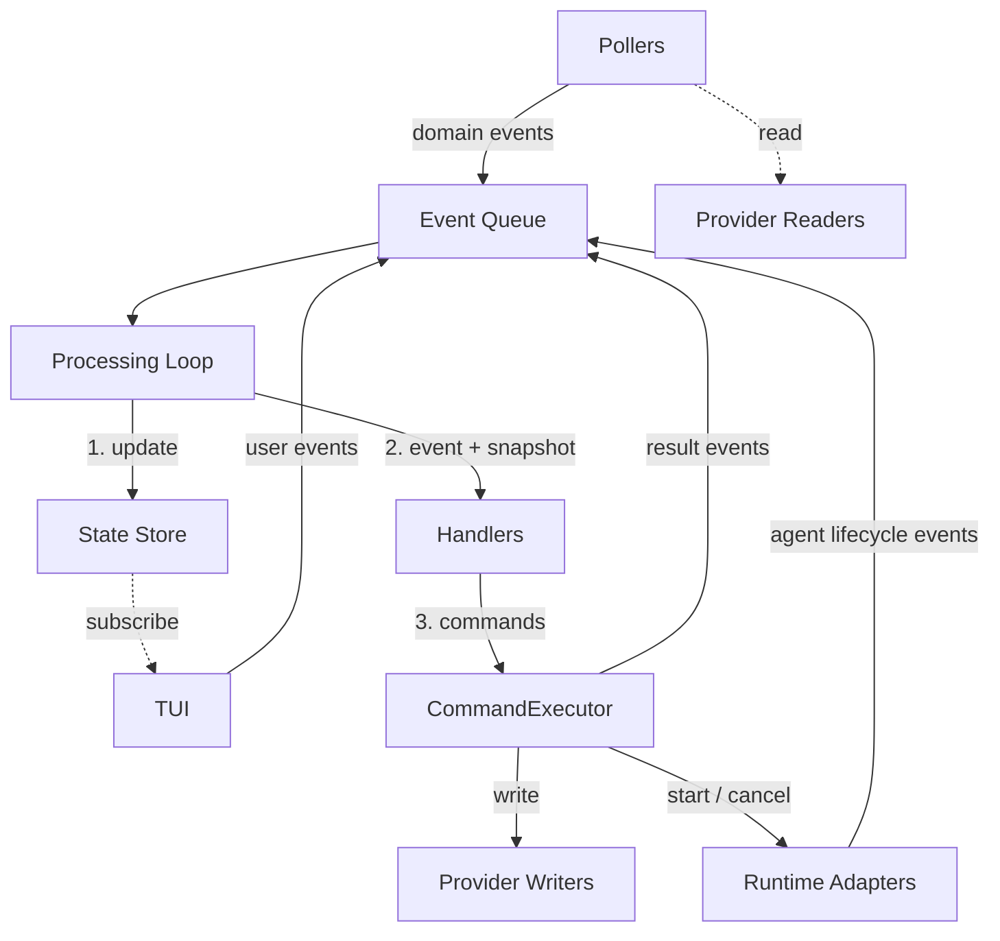

# Control Plane Engine

## Overview

The engine is the core module of the control plane. It wires together all v2 components — state
store, providers, pollers, handlers, command executor, and runtime adapters — into a sequential
event-processing loop. The engine owns the event queue and processing loop; all other behavior is
delegated to component modules. It exposes a public interface consumed by the TUI for state
subscription, event enqueuing, detail queries, and agent output streams.

## Constraints

- Must not import or reference the TUI module.
- All external mutations must flow through the CommandExecutor — no component bypasses the broker
  boundary.
- Events are processed sequentially — each event is fully processed (state update, handlers, command
  execution) before the next is dequeued.
- The state store is the single source of truth for all domain state. No parallel state systems.
- Provider-specific types must not appear outside the provider module. The engine operates on domain
  types defined in [002-architecture.md](./v2/002-architecture.md).
- Must not crash on transient errors. Provider-internal retry handles transient failures; the engine
  handles persistent failures via `CommandFailed` events through normal event processing.
- Handlers are pure functions — they never mutate state, call providers, or produce side effects.
- Agent execution produces structured artifacts only. Runtime adapters must not perform external
  writes.

## Specification

### Architecture



Three categories of components surround the engine core:

- **Event sources** (pollers, runtime adapters, user actions) produce domain events into the queue.
- **External systems** (provider writers, runtime adapters) are reached only through the
  CommandExecutor.
- **Subscribers** (TUI) read engine state via store subscription but do not modify it directly.

### Event Queue

FIFO buffer. `enqueue` appends to the tail; the processing loop dequeues from the head. Commands
executed during event processing may produce new events — these are appended to the queue and
processed after the current event's full cycle completes. Handler logic never interleaves with the
effects of its own commands.

Events enqueued after shutdown begins are rejected (see [Shutdown](#shutdown)).

### Processing Loop

Events are processed sequentially. Each event is fully processed before the next is dequeued.

```
processEvent(engine, event):
  applyStateUpdate(engine.store, event)
  snapshot = engine.store.getState()
  commands = runHandlers(engine.handlers, event, snapshot)
  for command in commands:
    resultEvents = await engine.executor.execute(command, snapshot)
    for resultEvent in resultEvents:
      engine.queue.enqueue(resultEvent)

runHandlers(handlers, event, state):
  commands = []
  for handler in handlers:
    commands.push(...handler(event, state))
  return commands
```

The processing loop passes a single state snapshot to all handlers for a given event. Handlers
cannot observe each other's commands within the same event cycle — all commands are collected first,
then executed in sequence. Commands that produce result events append those events to the queue for
processing in subsequent cycles.

> **Rationale:** Sequential processing with a single snapshot eliminates concurrency hazards. The
> independence invariant (defined in
> [002-architecture.md: Domain Commands](./v2/002-architecture.md#domain-commands)) ensures commands
> from one cycle cannot depend on effects of other commands in the same cycle.

### Engine Public Interface

```ts
interface Engine {
  store: StoreApi<EngineState>;
  start(): Promise<void>;
  stop(): Promise<void>;
  enqueue(event: EngineEvent): void;
  getState(): EngineState;
  subscribe(listener: (state: EngineState) => void): Unsubscribe;
  getWorkItemBody(id: string): Promise<string>;
  getRevisionFiles(id: string): Promise<RevisionFile[]>;
  getAgentStream(sessionID: string): AsyncIterable<string> | null;
  refresh(): void;
}

type Unsubscribe = () => void;
```

| Method                      | Description                                                                                                                                                       |
| --------------------------- | ----------------------------------------------------------------------------------------------------------------------------------------------------------------- |
| `store`                     | Direct Zustand store reference. The TUI subscribes via `useStore(engine.store, selector)` for React/Ink binding.                                                  |
| `start()`                   | Runs the first poll cycle of all pollers (direct, awaited), begins interval polling, starts the processing loop. Resolves after first poll cycles.                |
| `stop()`                    | Graceful shutdown. See [Shutdown](#shutdown).                                                                                                                     |
| `enqueue(event)`            | Appends a domain event to the queue. Used by pollers, runtime adapter monitors, and the TUI (for user actions).                                                   |
| `getState()`                | Returns the current `EngineState` snapshot from the state store.                                                                                                  |
| `subscribe(listener)`       | Subscribes to state changes via the Zustand store. Returns an unsubscribe function.                                                                               |
| `getWorkItemBody(id)`       | Delegates to `provider.workItemReader.getWorkItemBody(id)`. On-demand detail fetch — the store holds summary data only.                                           |
| `getRevisionFiles(id)`      | Delegates to `provider.revisionReader.getRevisionFiles(id)`. On-demand detail fetch.                                                                              |
| `getAgentStream(sessionID)` | Looks up the `AgentRunHandle` in the private handle map. Returns the `output` stream, or `null` if no handle exists (session ended, invalid, or not yet started). |
| `refresh()`                 | Triggers an immediate poll cycle on all pollers (outside the regular interval).                                                                                   |

The TUI enqueues user actions as domain events (`UserRequestedImplementorRun`, `UserCancelledRun`,
`UserTransitionedStatus`) — it does not dispatch commands directly. User events flow through the
standard pipeline: state update → handlers → command execution, subject to the same concurrency
guards and policy checks as automated dispatch.

### Engine Wiring

`createEngine(config)` assembles all components and returns the `Engine` interface. The engine
receives pre-built provider interfaces as injected dependencies, and a factory function for runtime
adapters. It does not know or care what implementations back the interfaces.

```
createEngine(config: EngineConfig): Engine

  // 1. Create state store
  store = createEngineStore()

  // 2. Create event queue
  queue = createEventQueue()

  // 3. Create runtime adapters (engine provides deps the adapters need)
  runtimeAdapters = config.createRuntimeAdapters({
    workItemReader:   config.provider.workItemReader,
    revisionReader:   config.provider.revisionReader,
    getState:         store.getState,
    getReviewHistory: buildReviewHistoryFetcher(config.provider.revisionReader),
  })

  // 4. Create command executor
  executor = createCommandExecutor({
    workItemWriter:  config.provider.workItemWriter,
    revisionWriter:  config.provider.revisionWriter,
    runtimeAdapters,
    policy:          config.policy ?? defaultPolicy,
    getState:        store.getState,
    enqueue:         queue.enqueue,
  })

  // 5. Create handlers
  handlers = createHandlers()

  // 6. Create pollers
  workItemPoller = createWorkItemPoller({
    reader:   config.provider.workItemReader,
    getState: store.getState,
    enqueue:  queue.enqueue,
    interval: config.workItemPoller?.pollInterval ?? 30,
  })
  revisionPoller = createRevisionPoller({
    reader:   config.provider.revisionReader,
    getState: store.getState,
    enqueue:  queue.enqueue,
    interval: config.revisionPoller?.pollInterval ?? 30,
  })
  specPoller = createSpecPoller({
    reader:   config.provider.specReader,
    getState: store.getState,
    enqueue:  queue.enqueue,
    interval: config.specPoller?.pollInterval ?? 60,
  })

  pollers = [workItemPoller, revisionPoller, specPoller]

  // 7. Return Engine
  return { store, start, stop, enqueue, getState, subscribe,
           getWorkItemBody, getRevisionFiles, getAgentStream, refresh }
```

`refresh()` calls `poll()` on each poller directly, outside the interval timer. The pollers enqueue
events as usual — the processing loop handles them in order.

`createEngine` is a synchronous factory. Asynchronous initialization (first poll cycles) happens in
`start()`.

> **Rationale:** Synchronous construction allows the TUI to set up subscriptions before any events
> are processed. The TUI creates the engine, subscribes to the store, then calls `start()`. No race
> between subscription and startup events.

**Read/write enforcement.** Provider readers are passed to pollers; provider writers are passed to
the CommandExecutor. No component receives both a reader and writer for the same entity type. This
is enforced through wiring and TypeScript types — `WorkProviderReader` and `WorkProviderWriter` are
distinct interfaces.

### Agent Run Handle Map

The engine maintains a private `Map<string, AgentRunHandle>` keyed by `sessionID`. The
CommandExecutor's `startAgentAsync` function registers handles with the engine when the runtime
adapter returns them. Entries are removed when the run reaches a terminal state (`completed`,
`failed`, `timed-out`, `cancelled`) or on shutdown.

`getAgentStream(sessionID)` looks up the handle and returns its `output` stream. Returns `null` if
no handle exists — the session has ended, the session ID is invalid, or the agent has not yet
started (still in `requested` state, before `startAgent` resolves).

### Startup Sequence

`start()` performs the following steps in order:

1. Run the first poll cycle of all three pollers (direct invocation, awaited). This populates the
   state store with current external state.
2. Begin interval-based polling for all pollers.
3. Start the processing loop (draining the event queue).

`start()` resolves after step 1 completes. The TUI can begin rendering immediately — all
current-state entities are in the store.

> **Rationale:** The first poll cycle is awaited so the store is populated before the TUI renders.
> Events from the initial poll drive recovery naturally — work items in `in-progress` with no active
> agent run are transitioned to `pending` through normal event processing. No separate bootstrap or
> recovery phase is needed.

### Shutdown

`stop()` performs the following steps in order:

1. Mark the engine as shutting down — `enqueue` rejects new events after this point (except terminal
   events from agent monitors in step 3).
2. Cancel all active agent runs (via `runtimeAdapter.cancelAgent`).
3. Wait for async agent monitors to drain their terminal events, up to `shutdownTimeout` seconds. If
   timeout is reached, abandon remaining monitors.
4. Stop all pollers (no new cycles).
5. Drain the event queue (process remaining events, which include terminal events from step 3).
6. Stop the processing loop.

> **Rationale:** New events are rejected after step 1 to prevent heisenbugs where external sources
> enqueue events into a draining queue. Agent monitors are exempted so their terminal events can be
> processed during the drain phase. Cancelling runs (step 2) before stopping pollers (step 4)
> ensures agent processes are terminated before the engine becomes unresponsive.

### Configuration

```ts
interface EngineConfig {
  // Injected components — engine operates on interfaces, not implementations
  provider: {
    workItemReader: WorkProviderReader;
    workItemWriter: WorkProviderWriter;
    revisionReader: RevisionProviderReader;
    revisionWriter: RevisionProviderWriter;
    specReader: SpecProviderReader;
  };
  createRuntimeAdapters: (deps: RuntimeAdapterDeps) => Record<AgentRole, RuntimeAdapter>;
  policy?: Policy; // default: allow all commands

  // Engine-owned config
  logLevel?: "debug" | "info" | "error"; // default: 'info'
  shutdownTimeout?: number; // seconds, default: 300
  workItemPoller?: {
    pollInterval?: number; // seconds, default: 30
  };
  revisionPoller?: {
    pollInterval?: number; // seconds, default: 30
  };
  specPoller?: {
    pollInterval?: number; // seconds, default: 60
  };
}
```

The engine's configuration contains only engine-owned concerns: polling intervals, shutdown timeout,
and log level. All implementation-specific configuration — GitHub credentials, repository path,
runtime adapter settings, agent names, logging directories — is the caller's responsibility. The
caller constructs providers with their implementation-specific config and passes the resulting
interfaces to the engine.

`provider` carries five interfaces that the engine threads to pollers (readers) and the
CommandExecutor (writers). `createRuntimeAdapters` is a factory function that receives
`RuntimeAdapterDeps` (defined in
[control-plane-engine-runtime-adapter.md](./control-plane-engine-runtime-adapter.md)) and returns
per-role adapters. The engine calls this factory during construction, after the state store exists,
providing `getState`, provider readers, and `getReviewHistory`. The caller's factory closure
captures adapter-specific config (e.g. `ClaudeAdapterConfig`). Both `provider` and
`createRuntimeAdapters` are required — the engine cannot operate without them.

`policy` is optional — when omitted, the engine uses a default policy that allows all commands.

Config validation is performed at construction time — missing required fields or invalid values
cause the engine to throw.

### Component Cross-References

Each component's behavior, interfaces, type definitions, and acceptance criteria are defined in its
dedicated spec. The engine spec defines only how components are wired together.

| Component        | Spec                                                                                   | Engine wiring role                                                     |
| ---------------- | -------------------------------------------------------------------------------------- | ---------------------------------------------------------------------- |
| State Store      | [control-plane-engine-state-store.md](./control-plane-engine-state-store.md)           | `createEngineStore()` — loop calls `applyStateUpdate` and `getState`   |
| WorkItem Poller  | [control-plane-engine-issue-poller.md](./control-plane-engine-issue-poller.md)         | `createWorkItemPoller(config)` — enqueues `WorkItemChanged` events     |
| Revision Poller  | [control-plane-engine-pr-poller.md](./control-plane-engine-pr-poller.md)               | `createRevisionPoller(config)` — enqueues `RevisionChanged` events     |
| Spec Poller      | [control-plane-engine-spec-poller.md](./control-plane-engine-spec-poller.md)           | `createSpecPoller(config)` — enqueues `SpecChanged` events             |
| Handlers         | [control-plane-engine-handlers.md](./control-plane-engine-handlers.md)                 | `createHandlers()` — loop passes events and state snapshots            |
| Command Executor | [control-plane-engine-command-executor.md](./control-plane-engine-command-executor.md) | `createCommandExecutor(deps)` — loop executes handler-emitted commands |
| Runtime Adapter  | [control-plane-engine-runtime-adapter.md](./control-plane-engine-runtime-adapter.md)   | Core contract — `RuntimeAdapter` interface and `AgentRunHandle`        |

### Logging

| Event                    | Level   | Content                                                                                                        |
| ------------------------ | ------- | -------------------------------------------------------------------------------------------------------------- |
| Startup                  | `info`  | Configuration summary (polling intervals, log level, adapter roles)                                            |
| Processing loop event    | `debug` | Event type, identifying fields (workItemID, sessionID, filePath)                                               |
| Agent dispatch           | `info`  | Agent role, workItemID or specPaths, sessionID                                                                 |
| Agent dispatch rejected  | `info`  | Agent role, rejection reason (concurrency guard or policy)                                                     |
| Agent completed          | `info`  | Agent role, workItemID or specPaths, sessionID                                                                 |
| Agent failed             | `error` | Agent role, error details, sessionID                                                                           |
| Command execution failed | `error` | Command type, error details                                                                                    |
| Poller cycle start       | `debug` | Poller name, cycle number                                                                                      |
| Change detected          | `info`  | Poller name, change type, entity identifier                                                                    |
| No changes detected      | `debug` | Poller name, cycle number                                                                                      |
| Provider API error       | `error` | Provider method, error details                                                                                 |
| Shutdown initiated       | `info`  | Reason                                                                                                         |
| Shutdown complete        | `info`  | Active runs cancelled count                                                                                    |
| Agent session transcript | (file)  | See [control-plane-engine-runtime-adapter-claude.md](./control-plane-engine-runtime-adapter-claude.md#logging) |

### Error Handling

Error handling follows the architecture defined in
[002-architecture.md: Error Handling](./v2/002-architecture.md#error-handling).

| Error                                 | Behavior                                                                                                             |
| ------------------------------------- | -------------------------------------------------------------------------------------------------------------------- |
| Provider call failure (after retries) | CommandExecutor emits `CommandFailed`. Normal event processing handles it.                                           |
| Concurrency guard violation           | CommandExecutor emits `CommandRejected`. Normal event processing logs it.                                            |
| Policy rejection                      | CommandExecutor emits `CommandRejected`. Normal event processing logs it.                                            |
| Agent definition missing / malformed  | Runtime adapter throws during `startAgent`. The `startAgentAsync` monitor catches it and enqueues a `*Failed` event. |
| Invalid or incomplete EngineConfig    | `createEngine` throws. Missing provider interfaces, runtime adapters, or required config fields.                     |

The engine does not retry failed commands. Recovery from persistent failures is handled through the
normal event pipeline — handlers reacting to state changes (e.g. detecting in-progress work items
with no active run and transitioning them to `pending`). See
[002-architecture.md: Recovery](./v2/002-architecture.md#recovery).

### Type Definitions

Domain types (`EngineEvent`, `EngineCommand`, `WorkItem`, `Revision`, `Spec`, `AgentResult`,
`AgentStartParams`) are defined in [002-architecture.md](./v2/002-architecture.md). Component types
are defined in their respective component specs.

The engine spec owns `EngineConfig` (see [Configuration](#configuration)) and `Engine` (see
[Engine Public Interface](#engine-public-interface)). The `Policy` type is defined in the
[CommandExecutor spec](./control-plane-engine-command-executor.md).

**Module location:** `engine/create-engine.ts` — the engine factory. Internal helpers
(`createEventQueue`, `buildReviewHistoryFetcher`) are implementation details that live alongside or
under the engine module.

> **v2 module.** This is new v2 code implemented alongside the v1 engine (`engine/create-engine.ts`,
> `engine/dispatch/`, `engine/recovery/`, `engine/planner-cache/`). The v1 control plane remains the
> running system until the full v2 stack (engine, TUI, agents, workflow) ships as a single cutover,
> at which point v2 replaces v1 and the old modules are deleted — see
> [003-migration-plan.md: Implementation phasing](./v2/003-migration-plan.md#implementation-phasing).
> Do not modify or delete v1 modules when implementing this spec.

## Acceptance Criteria

### Processing Loop

- [ ] Given two events in the queue, when the processing loop runs, then the first event is fully
      processed (state update, handlers, command execution) before the second event is dequeued.
- [ ] Given a command produces result events during execution, when those events are enqueued, then
      they are processed in subsequent cycles — not within the current event's cycle.
- [ ] Given handlers emit multiple commands for a single event, when the commands are executed, then
      they all receive the same state snapshot (captured once after the state update, not re-read
      between command executions).
- [ ] Given a `UserRequestedImplementorRun` event is enqueued, when it is processed, then it flows
      through the full pipeline (state update → handlers → commands) including concurrency guards
      and policy checks.

### Startup

- [ ] Given `start()` is called, when it resolves, then all three pollers have completed their first
      cycle and the state store contains all detected entities.
- [ ] Given the store is empty at startup and the first poll detects a work item in `in-progress`
      with no active agent run, when the `WorkItemChanged` event is processed, then it is
      transitioned to `pending` through normal event processing — no separate recovery phase.
- [ ] Given `start()` resolves, when the TUI queries `getState()`, then the store reflects the
      current external state (not empty).

### Shutdown

- [ ] Given `stop()` is called while agent runs are active, when shutdown proceeds, then all active
      runs are cancelled before pollers are stopped.
- [ ] Given `stop()` is called and `shutdownTimeout` is reached before monitors drain, when the
      timeout fires, then remaining monitors are abandoned and the processing loop terminates.
- [ ] Given the engine is shutting down (after `stop()` marks the engine), when `enqueue` is called
      with a new event, then the event is rejected.
- [ ] Given active agent runs exist at shutdown, when their monitors produce terminal events within
      the timeout, then those events are processed normally (draining the queue) before the loop
      stops.

### Agent Run Handles

- [ ] Given an agent run starts successfully (runtime adapter returns a handle), when the handle is
      registered, then `getAgentStream(sessionID)` returns the handle's `output` stream.
- [ ] Given an agent run reaches a terminal state, when the handle is cleaned up, then
      `getAgentStream(sessionID)` returns `null`.
- [ ] Given `getAgentStream` is called for a session in `requested` state (before `startAgent`
      resolves), when the handle does not yet exist, then it returns `null`.

### Wiring

- [ ] Given the engine is created, when component dependencies are inspected, then provider readers
      are passed to pollers and provider writers are passed to the CommandExecutor — no component
      receives both a reader and writer for the same entity type.
- [ ] Given the engine is created, when `engine.store` is accessed, then it returns the Zustand
      store instance for `useStore` binding.
- [ ] Given `getWorkItemBody` is called, when it executes, then it delegates to
      `provider.workItemReader.getWorkItemBody` without caching.
- [ ] Given `getRevisionFiles` is called, when it executes, then it delegates to
      `provider.revisionReader.getRevisionFiles` without caching.

### Configuration

- [ ] Given `createEngine` is called with `config.provider` missing any of the five interfaces, when
      validation runs, then it throws.
- [ ] Given `createEngine` is called without `createRuntimeAdapters`, when validation runs, then it
      throws.
- [ ] Given `createEngine` is called with a valid `createRuntimeAdapters` factory, when the engine
      constructs, then the factory receives `RuntimeAdapterDeps` containing `getState` from the
      engine's store and provider readers from `config.provider`.
- [ ] Given `createEngine` is called with injected provider interfaces, when pollers and the
      CommandExecutor are created, then readers are threaded to pollers and writers are threaded to
      the CommandExecutor.
- [ ] Given `createEngine` is called with no `policy`, when the engine initializes, then it uses a
      default policy that allows all commands.
- [ ] Given `refresh()` is called, when it executes, then all three pollers perform an immediate
      poll cycle outside their regular interval.

## Dependencies

- [control-plane-engine-state-store.md](./control-plane-engine-state-store.md) —
  `createEngineStore`, `applyStateUpdate`, selectors.
- [control-plane-engine-issue-poller.md](./control-plane-engine-issue-poller.md) —
  `createWorkItemPoller`, work item change detection.
- [control-plane-engine-pr-poller.md](./control-plane-engine-pr-poller.md) — `createRevisionPoller`,
  revision and pipeline change detection.
- [control-plane-engine-spec-poller.md](./control-plane-engine-spec-poller.md) — `createSpecPoller`,
  spec file change detection.
- [control-plane-engine-handlers.md](./control-plane-engine-handlers.md) — `createHandlers`, seven
  handler functions.
- [control-plane-engine-command-executor.md](./control-plane-engine-command-executor.md) —
  `createCommandExecutor`, broker boundary, `Policy` type.
- [control-plane-engine-runtime-adapter.md](./control-plane-engine-runtime-adapter.md) —
  `RuntimeAdapter` interface, `AgentRunHandle`, `AgentStartParams`, `RuntimeAdapterDeps`.
- [002-architecture.md](./v2/002-architecture.md) — Domain model, event/command unions, agent role
  contracts, error handling, recovery.
- [workflow.md](./workflow.md) — Status transition table, quality gates.

## References

- [002-architecture.md](./v2/002-architecture.md) — Target architecture, domain model, component
  contracts.
- [001-plan.md](./v2/001-plan.md) — Architectural decisions motivating the v2 design.
- [control-plane-tui.md](./control-plane-tui.md) — TUI specification (consumes the engine's public
  interface).
- [agent-planner.md](./agent-planner.md) — Planner agent definition.
- [agent-implementor.md](./agent-implementor.md) — Implementor agent definition.
- [agent-reviewer.md](./agent-reviewer.md) — Reviewer agent definition.
