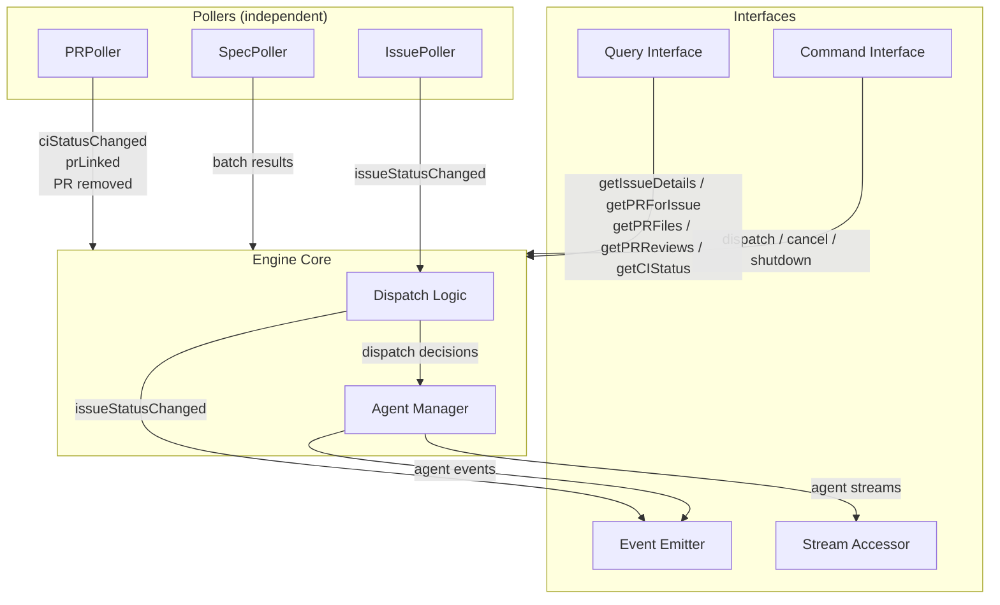

# Control Plane Engine

## Overview

The engine is the core module of the control plane. It orchestrates independent pollers that monitor
GitHub for state changes, classifies detected changes into dispatch tiers, manages agent sessions,
and handles recovery. The engine has no knowledge of the TUI — it exposes four interfaces (event
emitter, command interface, query interface, and stream accessor) that the TUI (or any other
consumer) can use.

## Constraints

- Must not import or reference the TUI module.
- Must not crash on transient errors (GitHub API failures, network errors). Log and retry next
  cycle.
- Must not dispatch more than one agent per task issue at a time.
- Must not auto-dispatch the Planner for specs without `status: approved` in frontmatter.
- Must reset `status:in-progress` issues to `status:pending` when no agent is running for them
  (startup recovery and crash recovery).
- Must use `@octokit/rest` with `@octokit/auth-app` as the authentication strategy for all GitHub
  API interactions. Octokit is an implementation detail of the GitHub Client adapter — all engine
  code interacts with the `GitHubClient` interface, never with Octokit directly. No type assertions
  (`as`) are permitted at the adapter boundary or anywhere `GitHubClient` is consumed.
- Must use `@anthropic-ai/claude-agent-sdk` (≥0.2.x) for all agent invocations via the v1 `query()`
  API.
- Must detect spec changes remotely (via GitHub API), not from the local filesystem.
- GitHub write operations are limited to recovery (status label resets) and completion-dispatch
  (setting `status:review`). All other writes are performed by agents.

## Specification

### Architecture

The engine consists of three layers:



- **Pollers** — Independent units that each monitor a single data source on their own interval.
  Pollers are pure sensors — they detect state changes and report results. IssuePoller and PR Poller
  report changes via callbacks; SpecPoller returns batched results to the Engine Core. They do not
  make dispatch decisions.
- **Engine Core** — Receives poller events, classifies them by dispatch tier, and manages agent
  sessions. Owns dispatch policy and agent lifecycle. Engine Core sub-components are specified in
  dedicated sub-specs: Agent Manager
  ([control-plane-engine-agent-manager.md](./control-plane-engine-agent-manager.md)), Recovery
  ([control-plane-engine-recovery.md](./control-plane-engine-recovery.md)), Planner Cache
  ([control-plane-engine-planner-cache.md](./control-plane-engine-planner-cache.md)).
- **Interfaces** — Event emitter (outbound state changes), command interface (inbound user actions),
  query interface (on-demand data fetching), and stream accessor (live agent output). All consumed
  by the TUI.

Each poller maintains its own snapshot slice. A failure in one poller does not affect others.

### GitHub Client

The engine accesses GitHub through a `GitHubClient` interface — a narrow, explicitly-typed contract
covering only the API methods the engine uses. The `createGitHubClient` factory constructs an
Octokit instance internally and returns a thin adapter that satisfies `GitHubClient` without type
assertions.

> **Rationale:** Octokit's deeply generic types do not structurally match a narrow interface, even
> when the methods are compatible at runtime. Casting (`as unknown as GitHubClient`) would hide real
> mismatches. Instead, each adapter method explicitly calls the corresponding Octokit method and
> returns the result through a properly-typed function signature. The wrappers are 1:1 delegations —
> no transformation, no error mapping, no retry logic. They exist solely to bridge the type gap.

**Factory:** `createGitHubClient(config: GitHubClientConfig): GitHubClient`

The factory:

1. Creates an `Octokit` instance with `createAppAuth` as the auth strategy, using the provided
   `appID`, `privateKey`, and `installationID`.
2. Returns an object satisfying `GitHubClient` where each method delegates to the corresponding
   Octokit method.

**Module location:** `engine/github-client/`. The module contains:

- `types.ts` — `GitHubClientConfig`, `GitHubClient`, and all param/result types.
- `create-github-client.ts` — The adapter factory. Imports `Octokit` from `@octokit/rest` and
  `createAppAuth` from `@octokit/auth-app`. This is the only file in the engine that imports from
  `@octokit/*`.

**Octokit isolation:** No file outside `engine/github-client/` may import from `@octokit/rest` or
`@octokit/auth-app`.

> **Rationale:** This ensures Octokit is a swappable implementation detail.

**Caller responsibility:** The caller reads the private key from disk and passes the PEM content as
a string. The adapter does not perform filesystem I/O.

**Auth validation:** `@octokit/auth-app` validates credentials lazily — the first API call triggers
JWT creation and token exchange, not the `createGitHubClient` call itself. If credentials are
invalid (bad key, wrong app ID, etc.), the first poller cycle will fail. The engine's error handling
(log and retry next cycle) applies, but since invalid credentials never self-heal, this will fail
indefinitely (see [Known Limitations](#known-limitations)).

> **Rationale:** This is acceptable for v1 — invalid credentials are a deployment misconfiguration,
> caught immediately on first cycle. The operator must fix the config and restart.

### Pollers

The engine uses independent pollers, each monitoring a single data source on its own interval with
its own snapshot:

- **IssuePoller** — Monitors GitHub Issues for `status:*` label changes. See
  [control-plane-engine-issue-poller.md](./control-plane-engine-issue-poller.md) for poll cycle
  behavior, snapshot state, change detection, closed issue detection, startup burst, first-cycle
  execution, and type definitions.
- **SpecPoller** — Monitors the specs directory on the default branch for file changes via the
  GitHub Trees API. See [control-plane-engine-spec-poller.md](./control-plane-engine-spec-poller.md)
  for poll cycle behavior, snapshot state, snapshot seeding, first-cycle execution, and type
  definitions.
- **PR Poller** — Monitors all open pull requests for metadata changes and CI pipeline status. See
  [control-plane-engine-pr-poller.md](./control-plane-engine-pr-poller.md) for poll cycle behavior,
  snapshot state, CI status monitoring, skip optimization, change reporting, and type definitions.

### Dispatch Logic

The engine core listens to poller events and classifies each into a dispatch tier. Dispatch logic is
centralized — pollers never dispatch agents.

#### Auto-dispatch

The engine invokes the agent automatically with no user action.

| Poller Event  | Agent   | Condition                               |
| ------------- | ------- | --------------------------------------- |
| `specChanged` | Planner | Spec frontmatter `status` is `approved` |

The Planner is invoked once per SpecPoller cycle with all changed (and approved) spec paths batched
into a single invocation. The Engine Core receives the full batch from the SpecPoller synchronously
and passes approved paths to a single Planner dispatch. Before dispatching, the Engine Core builds
an enriched trigger prompt containing the full content of each changed spec, existing open task
issues, and commit SHAs for diff support. See
[control-plane-engine-context-precomputation.md: Planner Context Pre-computation](./control-plane-engine-context-precomputation.md#planner-context-pre-computation)
for the prompt format and data sources.

**Planner concurrency guard:** Only one Planner session may run at a time. If a SpecPoller cycle
detects changes while a Planner is already running, the engine logs the skip at `info` level and
defers the batch. The Engine Core maintains a deferred paths buffer (a set of file paths,
deduplicated) for this purpose. On each subsequent SpecPoller cycle, the Engine Core merges the
deferred buffer with the new cycle's results (union, deduplicated). The approval filter
(`status: approved`) is applied to the merged set at dispatch time — paths whose frontmatter status
changed to non-approved since deferral are dropped. The deferred buffer is cleared when the Planner
is successfully dispatched. If the Planner session fails, the Engine Core re-adds the dispatched
spec paths to the deferred buffer so they are included in the next dispatch attempt rather than
being lost until restart.

**Planner idempotency:** The engine does not prevent re-dispatch for the same spec (e.g., a
whitespace-only change to an approved spec will re-trigger the Planner). The Planner agent
definition is responsible for idempotency — checking existing issues before creating new ones. See
`agent-planner.md`.

#### Completion-dispatch

The Reviewer is dispatched when an Implementor agent session completes, not when a status label
changes.

> **Rationale:** This eliminates the race condition where a `status:review` label is set before the
> PR exists.

**Trigger:** When the Agent Manager reports an Implementor `agentCompleted` event, the Engine Core:

1. Calls `getPRForIssue(issueNumber, { includeDrafts: false })` to check for a linked non-draft PR.
2. **PR found:** Sets `status:review` on the issue (via `GitHubClient`), updates the IssuePoller
   snapshot entry to `status:review` (via `updateEntry()`) to prevent a duplicate
   `issueStatusChanged` on the next poll cycle, emits a synthetic `issueStatusChanged` event (with
   `isEngineTransition: true`), builds an enriched Reviewer trigger prompt (see
   [control-plane-engine-context-precomputation.md: Reviewer Context Pre-computation](./control-plane-engine-context-precomputation.md#reviewer-context-pre-computation)),
   and dispatches the Reviewer.
3. **No PR found:** Takes no action. The issue remains `status:in-progress`. Crash recovery detects
   this (no running agent + `status:in-progress`) and resets to `status:pending`.

This flow also handles re-reviews after `needs-changes`: the Implementor is re-dispatched, pushes
fixes to the existing PR, and completes. The engine finds the existing non-draft PR and dispatches
the Reviewer.

**`status:review` is not a dispatch trigger.** The IssuePoller tracks `status:review` for TUI
display, but it does not trigger Reviewer dispatch. If `status:review` is set externally (e.g.,
manual label change), no Reviewer is dispatched. The user can manually dispatch a Reviewer via the
TUI's retry mechanism if needed.

**Implementor failure:** When the Agent Manager reports an Implementor `agentFailed` event, no PR
check or Reviewer dispatch occurs. Crash recovery handles the issue status.

The Reviewer is invoked per issue — one Reviewer per issue where the Implementor completed with a
linked PR.

#### User-dispatch

The following statuses require user confirmation before dispatch. The `issueStatusChanged` event
alone surfaces the issue to the TUI — no separate dispatch event is emitted. The user decides when
(or whether) to dispatch.

| Poller Event                                   | Agent       |
| ---------------------------------------------- | ----------- |
| `issueStatusChanged` to `status:pending`       | Implementor |
| `issueStatusChanged` to `status:unblocked`     | Implementor |
| `issueStatusChanged` to `status:needs-changes` | Implementor |

User-dispatch items are surfaced on first detection (status differs from snapshot). They are not
re-surfaced on subsequent polls if the status has not changed again.

#### No-dispatch statuses

The following statuses trigger no agent dispatch. The `issueStatusChanged` event is sufficient — the
TUI derives the task's display state from the status value directly.

| Status                    | TUI Behavior                                                                                |
| ------------------------- | ------------------------------------------------------------------------------------------- |
| `status:needs-refinement` | Task displayed with `REFINE` status; issue detail view on pin (see `control-plane-tui.md`)  |
| `status:blocked`          | Task displayed with `BLOCKED` status; issue detail view on pin (see `control-plane-tui.md`) |
| `status:approved`         | Task displayed with `APPROVED` status; PR summary view on pin (see `control-plane-tui.md`)  |

**Dispatch fallthrough:** Status changes to values not listed in any dispatch tier (e.g.,
`in-progress`, `review`, `blocked`, `needs-refinement`, `approved`) trigger no dispatch action. The
`issueStatusChanged` event is still emitted so the TUI can update the issue's state indicator.

> **Rationale:** `status:review` falls through because Reviewer dispatch is completion-driven (see
> [Completion-dispatch](#completion-dispatch)), not label-driven. Notification statuses (`blocked`,
> `needs-refinement`, `approved`) fall through because the TUI handles display logic — the engine
> does not emit separate notification events for these.

**Removed issue orchestration:** When the IssuePoller reports that an issue has been removed (closed
or `task:implement` label removed), the Engine Core handles the response: (1) if an agent is running
for the issue, cancel the agent session and emit `agentFailed` (treated as cancellation — worktree
cleaned up, branch preserved); then (2) emit `issueStatusChanged` with `newStatus: null`. This
ordering guarantees `agentFailed` is emitted before `issueStatusChanged(newStatus: null)` for the
same issue.

> **Rationale:** This ordering lets the TUI process the failure before the issue is removed from its
> store.

#### CI Failure Handling

The Engine Core processes PR Poller callbacks to correlate CI status changes with tracked issues and
emit `ciStatusChanged` events. The PR Poller is a pure sensor — all correlation logic lives in the
Engine Core. The TUI handles CI failure display (see `control-plane-tui.md`).

**Issue↔PR correlation:** When the PR Poller reports a CI status change (via `onCIStatusChanged`),
the Engine Core resolves the affected PR to a tracked issue. It reads the PR's `body` field from the
PR Poller snapshot and applies the same closing-keyword matching used by `getPRForIssue` (see
[Query Interface](#query-interface)). If the PR body matches a tracked issue in the IssuePoller
snapshot, the CI status change is associated with that issue. If no match is found (PR not linked to
a tracked issue, or linked to an untracked issue), the Engine Core emits `ciStatusChanged` with no
`issueNumber` (for TUI display only — no dispatch or notification action).

**CI status events:** The Engine Core emits `ciStatusChanged` for every CI status transition
reported by the PR Poller, regardless of issue linkage. This ensures the TUI can update CI
indicators on all tracked issues.

**PR removal:** When the PR Poller reports a PR removal (via `onPRRemoved`), the Engine Core clears
any CI state associated with the PR's linked issue (if any).

**PR linkage detection:** When the PR Poller reports a new PR via `onPRDetected`, the Engine Core
reads the PR's `body` field from the PR Poller snapshot and applies closing-keyword matching against
the IssuePoller snapshot. If a match is found, the Engine Core emits `prLinked` with the issue
number, PR number, PR URL, and current CI status from the PR Poller snapshot. If no match is found
(PR not linked to any tracked issue), no event is emitted.

### Event Emitter

The engine emits typed events for discrete state changes. Events drive reactive updates in the TUI's
Zustand store. Streaming agent output is handled separately via the stream accessor (see below).

| Event                | Payload                                                                                                                                                                                                                                                                                                                    | Emitted By                                                                                |
| -------------------- | -------------------------------------------------------------------------------------------------------------------------------------------------------------------------------------------------------------------------------------------------------------------------------------------------------------------------- | ----------------------------------------------------------------------------------------- |
| `issueStatusChanged` | Issue number, title, old status, new status (`null` when the issue is removed), priority label, creation date, `isRecovery` flag (true for synthetic events from recovery), `isEngineTransition` flag (true only for the synthetic event from completion-dispatch — engine sets `status:review` on Implementor completion) | IssuePoller (or Engine Core for synthetic events: recovery, completion-dispatch, removal) |
| `specChanged`        | File path, frontmatter status, change type (added/modified), commit SHA                                                                                                                                                                                                                                                    | Engine Core (from SpecPoller results)                                                     |
| `agentStarted`       | Agent type, issue number or spec paths, session ID, branch name (Implementor and Reviewer), log file path (when logging enabled)                                                                                                                                                                                           | Agent Manager                                                                             |
| `agentCompleted`     | Agent type, issue number or spec paths, session ID, log file path (when logging enabled)                                                                                                                                                                                                                                   | Agent Manager                                                                             |
| `agentFailed`        | Agent type, issue number or spec paths, error details, session ID, branch name (Implementor and Reviewer — the branch persists after worktree cleanup for inspection), log file path (when logging enabled)                                                                                                                | Agent Manager                                                                             |
| `prLinked`           | Issue number, PR number, PR URL, CI status at detection time                                                                                                                                                                                                                                                               | Engine Core (from PR Poller callback)                                                     |
| `ciStatusChanged`    | PR number, issue number (if linked to a tracked issue, otherwise absent), old CI status, new CI status                                                                                                                                                                                                                     | Engine Core (from PR Poller callback)                                                     |

### Command Interface

The engine accepts commands that trigger side effects.

| Command               | Parameters   | Effect                                                                                                                                                                                                                                                                                                                                                                                                                                                                                                                                                                                                                                                                                                                                                                                                                                                                                                                                                                                                                                                                                                                                                                                                                                                                                                                                                                                                                                     |
| --------------------- | ------------ | ------------------------------------------------------------------------------------------------------------------------------------------------------------------------------------------------------------------------------------------------------------------------------------------------------------------------------------------------------------------------------------------------------------------------------------------------------------------------------------------------------------------------------------------------------------------------------------------------------------------------------------------------------------------------------------------------------------------------------------------------------------------------------------------------------------------------------------------------------------------------------------------------------------------------------------------------------------------------------------------------------------------------------------------------------------------------------------------------------------------------------------------------------------------------------------------------------------------------------------------------------------------------------------------------------------------------------------------------------------------------------------------------------------------------------------------ |
| `dispatchImplementor` | Issue number | Creates an Implementor agent session for the given issue (if no agent is already running for it). No-op if the issue number is not in the IssuePoller snapshot, or if an agent is already running for the issue. Accepted when the issue's status is in the user-dispatch set (`pending`, `unblocked`, `needs-changes`) or `in-progress` with no running agent (transient state before crash recovery resets it). Worktree strategy is selected based on whether a linked PR exists. See [control-plane.md: Worktree Isolation](./control-plane.md#worktree-isolation) for strategy overview and [control-plane-engine-agent-manager.md: Agent Lifecycle](./control-plane-engine-agent-manager.md#agent-lifecycle) for implementation. Before creating the session, the Engine Core builds an enriched trigger prompt via `getIssueDetails` and — when a linked PR exists — additionally via `getPRFiles` and `getPRReviews` (see [control-plane-engine-context-precomputation.md: Implementor Context Pre-computation](./control-plane-engine-context-precomputation.md#implementor-context-pre-computation)). The Engine Core reads the issue's `complexity:*` label from the IssuePoller snapshot and passes a `modelOverride` to the `QueryFactory`: `complexity:simple` → `'sonnet'`, `complexity:complex` → `'opus'`. If no complexity label is present, no override is passed (the Implementor's agent definition default applies). |
| `dispatchReviewer`    | Issue number | Creates a Reviewer agent session for the given issue (if no agent is already running for it). No-op if the issue number is not in the IssuePoller snapshot, if the issue's status is not `review`, or if no linked open PR is found (the Reviewer requires a PR branch to check out). Before creating the session, the Engine Core calls `getPRForIssue(issueNumber, { includeDrafts: false })` to obtain the PR's `headRefName` for the worktree, then builds an enriched trigger prompt via `getIssueDetails`, `getPRFiles`, and `getPRReviews` (see [control-plane-engine-context-precomputation.md: Reviewer Context Pre-computation](./control-plane-engine-context-precomputation.md#reviewer-context-pre-computation)). The Agent Manager fetches the branch from the remote and creates a worktree at `origin/<headRefName>`. See [control-plane.md: Worktree Isolation](./control-plane.md#worktree-isolation). No transient-state exception is needed (unlike `dispatchImplementor`) — Reviewers do not change the issue status to `in-progress`. Used for manual retry after Reviewer failure.                                                                                                                                                                                                                                                                                                                                  |
| `cancelAgent`         | Issue number | Cancels the running agent session for the given issue. The engine determines agent-specific behavior (recovery, worktree handling) from its internal tracking of which agent type is running. For Implementors: performs crash recovery if the issue is still `status:in-progress`, removes the worktree (branch preserved for inspection). For Reviewers: no recovery needed (issue stays `status:review`; user can retry via `dispatchReviewer`), removes the worktree (branch preserved for inspection). Emits `agentFailed` with a cancellation error. No-op if no agent is running.                                                                                                                                                                                                                                                                                                                                                                                                                                                                                                                                                                                                                                                                                                                                                                                                                                                   |
| `cancelPlanner`       | None         | Cancels the running Planner session if one exists. Emits `agentFailed` with a cancellation error. No-op if no Planner is running. Not exposed in the TUI (see [Known Limitations](#known-limitations)).                                                                                                                                                                                                                                                                                                                                                                                                                                                                                                                                                                                                                                                                                                                                                                                                                                                                                                                                                                                                                                                                                                                                                                                                                                    |
| `shutdown`            | None         | Initiates graceful shutdown                                                                                                                                                                                                                                                                                                                                                                                                                                                                                                                                                                                                                                                                                                                                                                                                                                                                                                                                                                                                                                                                                                                                                                                                                                                                                                                                                                                                                |

### Query Interface

The engine provides on-demand data fetching for display purposes. Queries are read-only and fetch
data via `GitHubClient` when called. Results are not cached by the engine — the TUI manages its own
caching in the Zustand store.

| Query             | Parameters                                               | Returns                                                                                                                                                                                                                                                                                 |
| ----------------- | -------------------------------------------------------- | --------------------------------------------------------------------------------------------------------------------------------------------------------------------------------------------------------------------------------------------------------------------------------------- |
| `getIssueDetails` | Issue number                                             | Issue body (objective, spec reference, scope, acceptance criteria), labels, creation date                                                                                                                                                                                               |
| `getPRForIssue`   | Issue number, `includeDrafts` (boolean, default `false`) | PR number, title, changed files count, CI status, URL, `isDraft`, `headRefName`. Returns `null` if no linked PR exists. When `includeDrafts` is `false`, draft PRs are excluded from results. When `true`, draft PRs are included (used by the engine for worktree strategy selection). |
| `getPRFiles`      | PR number                                                | Array of changed files with filename, status (added/modified/removed/renamed/copied/changed/unchanged), and patch (unified diff per file). Returns empty array if the PR has no changed files.                                                                                          |
| `getPRReviews`    | PR number                                                | Review submissions (id, author, state, body) and inline comments (id, author, body, path, line) in separate arrays. Returns empty arrays if no reviews exist.                                                                                                                           |
| `getCIStatus`     | PR number                                                | Overall CI status (`pending`, `success`, `failure`) and individual check runs (name, status, conclusion, details URL). Called at Implementor dispatch time for prompt enrichment and by the TUI detail pane on-demand for failed check names display.                                   |

PR linkage is determined by searching for a PR whose body contains a closing keyword referencing the
issue number. The match is case-insensitive and supports GitHub's closing keywords: `Closes`,
`Fixes`, `Resolves` (and their conjugations: `Close`, `Closed`, `Fix`, `Fixed`, `Resolve`,
`Resolved`). The issue number must be followed by whitespace, punctuation, or end of line — not
additional digits (word-boundary match). If multiple open PRs match, the first match (by PR number,
ascending) is used.

**Pagination:** `getIssueDetails` fetches the issue directly via `issues.get` (no pagination
concern). `getPRForIssue` lists open PRs via `pulls.list` with `per_page: 100` without pagination.
`getPRFiles` calls `pulls.listFiles` with `per_page: 100` without pagination (GitHub hard limit:
3000 files per PR). `getPRReviews` calls `pulls.listReviews` and `pulls.listReviewComments`, both
with `per_page: 100` without pagination. The IssuePoller's `issues.listForRepo` call also uses
`per_page: 100` without pagination. Results are silently truncated beyond 100 items per call (see
[Known Limitations](#known-limitations)).

**Query normalization:** The `GitHubClient` param/result types mirror Octokit's response shapes
(e.g., `IssueData.body` is `string | null`, `IssueData.labels` is `(string | { name?: string })[]`).
The query functions normalize these into the cleaner result types consumed by the TUI:

- `getIssueDetails` — Coerces `body` from `string | null` to `string` (empty string for `null`).
  Extracts label names from the `labels` array: for each entry, uses the string directly if it is a
  bare string, or extracts the `name` property if it is an object with a `name` string. Entries that
  are objects without a `name` property are discarded.
- `getPRForIssue` — Lists open PRs (`per_page: 100`), finds the one whose body matches a closing
  keyword for `#<N>`, then fetches the full PR via `pulls.get` to obtain `head.sha`. Uses `head.sha`
  to query CI status via `repos.getCombinedStatusForRef` and `checks.listForRef`. Combines both into
  the `ciStatus` field using the following logic:
  - `'failure'` — if `getCombinedStatusForRef` reports `state: 'failure'`, or any check run has
    `conclusion` of `'failure'`, `'cancelled'`, or `'timed_out'`.
  - `'pending'` — if any check run has `status` other than `'completed'` (i.e., `'queued'` or
    `'in_progress'`), or if `getCombinedStatusForRef` reports `state: 'pending'`, or if both
    endpoints report `total_count: 0` (no CI configured).
  - `'success'` — if `getCombinedStatusForRef` reports `state: 'success'` (or `total_count: 0`) and
    all check runs have `status: 'completed'` with `conclusion: 'success'`.
- `getPRFiles` — Calls `pulls.listFiles({ owner, repo, pull_number, per_page: 100 })`. Each entry is
  normalized to `{ filename, status, patch }`. The `patch` field is `string | undefined` — GitHub
  omits it for binary files and files exceeding the diff size limit. Entries with no `patch` are
  included (the Reviewer sees the filename and status, but no diff content).
- `getPRReviews` — Calls `pulls.listReviews` and `pulls.listReviewComments` (both `per_page: 100`).
  Reviews are normalized to `{ id, author, state, body }` where `author` is extracted from
  `user.login` (empty string if absent) and `body` is coerced from `string | null` to `string`.
  Inline comments are normalized to `{ id, author, body, path, line }`. Reviews and comments are
  returned in separate arrays in API order (chronological).
- `getCIStatus` — Fetches CI status for a specific PR at dispatch time (not on every poll cycle).
  Calls `repos.getCombinedStatusForRef` and `checks.listForRef` using the PR's `head.sha` (obtained
  via `pulls.get`). Returns the overall status (using the same derivation logic as `getPRForIssue`)
  plus individual check runs. Only check runs with `conclusion` of `'failure'`, `'cancelled'`, or
  `'timed_out'` are included in the `failedCheckRuns` array.

### Agent Manager

The Agent Manager handles agent session lifecycle — creating sessions via the Claude Agent SDK,
tracking active sessions, monitoring completion, managing worktrees, exposing live agent output
streams, and handling session logging. See
[control-plane-engine-agent-manager.md](./control-plane-engine-agent-manager.md) for agent lifecycle
steps, agent definition loading, programmatic hooks (bash validator), SDK session configuration,
stream accessor, and related type definitions. See
[control-plane-engine-agent-session-logging.md](./control-plane-engine-agent-session-logging.md) for
log file lifecycle, format, and error handling. The `AgentManagerConfig` type (defined in the
sub-spec) carries `repoRoot`, `maxAgentDuration`, and logging settings derived from `EngineConfig`.

### Recovery

The engine performs recovery to ensure no issue is permanently stuck in `status:in-progress`.
Recovery resets stale issues to `status:pending` and emits synthetic events. See
[control-plane-engine-recovery.md](./control-plane-engine-recovery.md) for startup recovery, crash
recovery, and Reviewer failure behavior.

### Planner Cache

The engine persists a lightweight cache to prevent redundant Planner runs across restarts. See
[control-plane-engine-planner-cache.md](./control-plane-engine-planner-cache.md) for cache format,
startup seeding, cache write behavior, deferred paths interaction, and error handling.

### Repository Root Resolution

The engine must resolve the git repository root at startup. This path is used for:

- Worktree creation (`.worktrees/<branchName>` is relative to repo root)
- Agent definition loading (`.claude/agents/<name>.md` is read from repo root)
- Planner cache file location (`.agentic-workflow-cache.json` at repo root)
- Relative `logsDir` resolution

**Resolution:** The `createEngine` factory resolves the repository root using
`git rev-parse --show-toplevel` (via `execFileSync`). This is a synchronous call that runs once at
engine construction time.

> **Rationale:** `process.cwd()` is not used because in a Yarn workspace it resolves to the package
> directory (e.g., `agentic-workflow/`), not the repository root. Using it would create worktrees
> inside the package directory and fail to find `.claude/agents/` for agent definition loading.

**Override:** The `createEngine` factory accepts an optional `repoRoot` dependency injection for
testing. When not provided, it uses `git rev-parse --show-toplevel`.

### Configuration

The engine reads configuration from a TypeScript config file (`agentic-workflow.config.ts`):

#### Engine

| Setting                   | Type     | Description                                  | Default  |
| ------------------------- | -------- | -------------------------------------------- | -------- |
| `repository`              | `string` | GitHub repository in `owner/repo` format     | Required |
| `githubAppID`             | `number` | GitHub App numeric ID                        | Required |
| `githubAppPrivateKeyPath` | `string` | Path to the PEM private key file             | Required |
| `githubAppInstallationID` | `number` | Installation ID for the target repository    | Required |
| `logLevel`                | `string` | Logging verbosity (`debug`, `info`, `error`) | `info`   |
| `shutdownTimeout`         | `number` | Seconds to wait for agents during shutdown   | `300`    |

At startup, the engine parses `repository` into `owner` and `repo` strings (split on `/`). It reads
the private key file from `githubAppPrivateKeyPath` and passes the PEM content string to
`createGitHubClient` along with `githubAppID` and `githubAppInstallationID`. The returned
`GitHubClient` instance, along with `owner` and `repo`, is then passed to all pollers, queries, and
recovery as dependencies. Authentication is handled internally by `@octokit/auth-app` (JWT creation,
installation token exchange, automatic token refresh) — no manual token management is needed. The
App must have `issues:write` (for recovery label resets) and `contents:read` (for tree/file access)
permissions.

#### IssuePoller

| Setting        | Type     | Description                 | Default |
| -------------- | -------- | --------------------------- | ------- |
| `pollInterval` | `number` | Seconds between poll cycles | `30`    |

#### SpecPoller

| Setting         | Type     | Description                                         | Default       |
| --------------- | -------- | --------------------------------------------------- | ------------- |
| `pollInterval`  | `number` | Seconds between poll cycles                         | `60`          |
| `specsDir`      | `string` | Path to the specs directory (relative to repo root) | `docs/specs/` |
| `defaultBranch` | `string` | Branch to monitor for spec changes                  | `main`        |

#### PR Poller

| Setting        | Type     | Description                 | Default |
| -------------- | -------- | --------------------------- | ------- |
| `pollInterval` | `number` | Seconds between poll cycles | `30`    |

#### Agents

| Setting            | Type     | Description                                                                                                                                                             | Default         |
| ------------------ | -------- | ----------------------------------------------------------------------------------------------------------------------------------------------------------------------- | --------------- |
| `agentPlanner`     | `string` | Agent name for the Planner. The engine reads `.claude/agents/<name>.md` from the repository root, parses it, and passes the definition inline to the SDK.               | `'planner'`     |
| `agentImplementor` | `string` | Agent name for the Implementor. The engine reads `.claude/agents/<name>.md` from the repository root, parses it, and passes the definition inline to the SDK.           | `'implementor'` |
| `agentReviewer`    | `string` | Agent name for the Reviewer. The engine reads `.claude/agents/<name>.md` from the repository root, parses it, and passes the definition inline to the SDK.              | `'reviewer'`    |
| `maxAgentDuration` | `number` | Maximum seconds an agent session can run before being cancelled. Applies to all agent types. When exceeded, the engine cancels the session and performs crash recovery. | `1800` (30 min) |

#### Logging

| Setting         | Type      | Description                                                                                                                                                                                     | Default |
| --------------- | --------- | ----------------------------------------------------------------------------------------------------------------------------------------------------------------------------------------------- | ------- |
| `agentSessions` | `boolean` | Enable writing agent session transcripts to disk. When enabled, the Agent Manager writes one log file per agent session capturing the full SDK message stream.                                  | `false` |
| `logsDir`       | `string`  | Directory for agent session log files. Absolute paths are used as-is. Relative paths are resolved from `repoRoot` (see Repository Root Resolution). Created automatically if it does not exist. | `logs`  |

When `agentSessions` is `false` (default), no log files are created and agent events do not include
`logFilePath`. The `logsDir` setting is ignored when `agentSessions` is disabled.

### Logging

The engine logs structured events at the following levels:

| Event                           | Level   | Content                                                                                                                                                     |
| ------------------------------- | ------- | ----------------------------------------------------------------------------------------------------------------------------------------------------------- |
| Startup                         | `info`  | Configuration summary, initial state counts                                                                                                                 |
| Poller cycle start              | `debug` | Poller name, cycle number                                                                                                                                   |
| Change detected                 | `info`  | Poller name, change type, issue number or file path                                                                                                         |
| Agent invoked                   | `info`  | Agent type, issue number or file path, session ID                                                                                                           |
| Agent skipped (already running) | `info`  | Agent type, issue number                                                                                                                                    |
| Agent completed                 | `info`  | Agent type, issue number                                                                                                                                    |
| Agent failed                    | `error` | Agent type, issue number, error details                                                                                                                     |
| No changes detected             | `debug` | Poller name, cycle number                                                                                                                                   |
| GitHub API error                | `error` | Poller name, error details                                                                                                                                  |
| CI status changed               | `info`  | PR number, old CI status, new CI status, linked issue number (if any)                                                                                       |
| Recovery performed              | `info`  | Issue number, old status, new status                                                                                                                        |
| Shutdown initiated              | `info`  | Reason                                                                                                                                                      |
| Shutdown complete               | `info`  | Agents terminated count                                                                                                                                     |
| Planner cache loaded            | `debug` | Loaded tree SHA and file count, or "cache miss — cold start"                                                                                                |
| Planner cache write failed      | `error` | Error details                                                                                                                                               |
| Agent session transcript        | (file)  | Full SDK message stream written to `{logsDir}/{timestamp}-{agentType}[-{context}].log`. One file per session. Only when `logging.agentSessions` is enabled. |

Entries with level `(file)` represent disk writes handled by the Agent Manager, not the structured
logger. See
[control-plane-engine-agent-session-logging.md](./control-plane-engine-agent-session-logging.md) for
format details.

### Error Handling

The engine must not crash on transient errors. Each error type has a defined recovery behavior:

| Error                                                        | Behavior                                                                                                                                                                                                             |
| ------------------------------------------------------------ | -------------------------------------------------------------------------------------------------------------------------------------------------------------------------------------------------------------------- |
| GitHub API error (in any poller)                             | Log at `error` level. Skip this cycle for the affected poller only. Other pollers continue unaffected. Retry next cycle.                                                                                             |
| GitHub API rate limit (HTTP 403/429)                         | Treated as a GitHub API error — same log-and-skip behavior. The poll interval provides natural backoff (see [Known Limitations](#known-limitations)).                                                                |
| Agent definition file missing, unreadable, or malformed YAML | Treated as agent session creation failure — the error propagates before the session is created. Logged at `error` level. Not a transient error (requires fixing the agent file), but the engine continues operating. |
| Repository root resolution failure (`git rev-parse` fails)   | Log at `error` level and exit. The engine cannot operate without a valid repository root. This is a deployment misconfiguration (not running inside a git repository).                                               |
| Agent session creation failure                               | Log at `error` level. Do not mark agent as running. Next cycle will re-detect the state and retry dispatch.                                                                                                          |
| Agent session failure                                        | Log at `error` level with error details. Perform crash recovery if applicable.                                                                                                                                       |
| Config file missing or invalid                               | Log at `error` level and exit. This is not a transient error.                                                                                                                                                        |
| Planner cache read error                                     | Log at `debug` level. Treat as cold start — SpecPoller starts with empty snapshot. Non-fatal.                                                                                                                        |
| Planner cache write error                                    | Log at `error` level. Engine continues — next restart cannot skip Planner. Non-fatal.                                                                                                                                |

### Graceful Shutdown

When a shutdown command is received:

1. Log shutdown initiation.
2. Stop all pollers (no new cycles).
3. Wait for all running agent sessions to complete, up to `shutdownTimeout` seconds.
4. If timeout is reached, cancel remaining agent sessions (using `cancelAgent` for task agents and
   `cancelPlanner` for the Planner internally).
5. Log shutdown completion and exit.

### Type Definitions

Reference types for the engine's public interfaces. These define the contracts that the TUI (or any
consumer) relies on.

#### GitHub Client

```ts
type GitHubClientConfig = {
  appID: number;
  privateKey: string; // PEM file content (caller reads from disk)
  installationID: number;
};

// createGitHubClient(config: GitHubClientConfig): GitHubClient

type GitHubClient = {
  issues: {
    get(params: IssuesGetParams): Promise<IssuesGetResult>;
    listForRepo(params: IssuesListForRepoParams): Promise<IssuesListForRepoResult>;
    addLabels(params: IssuesAddLabelsParams): Promise<IssuesAddLabelsResult>;
    removeLabel(params: IssuesRemoveLabelParams): Promise<IssuesRemoveLabelResult>;
  };
  pulls: {
    list(params: PullsListParams): Promise<PullsListResult>;
    get(params: PullsGetParams): Promise<PullsGetResult>;
    listFiles(params: PullsListFilesParams): Promise<PullsListFilesResult>;
    listReviews(params: PullsListReviewsParams): Promise<PullsListReviewsResult>;
    listReviewComments(
      params: PullsListReviewCommentsParams,
    ): Promise<PullsListReviewCommentsResult>;
  };
  repos: {
    getCombinedStatusForRef(
      params: ReposGetCombinedStatusParams,
    ): Promise<ReposGetCombinedStatusResult>;
    getContent(params: ReposGetContentParams): Promise<ReposGetContentResult>;
  };
  checks: {
    listForRef(params: ChecksListForRefParams): Promise<ChecksListForRefResult>;
  };
  git: {
    getTree(params: GitGetTreeParams): Promise<GitGetTreeResult>;
    getRef(params: GitGetRefParams): Promise<GitGetRefResult>;
  };
};

// Param/result types (e.g., IssuesGetParams, PullsGetResult) are defined
// in engine/github-client/types.ts. Each is a named type with only the
// fields the engine uses — narrower than Octokit's full response shapes.
```

#### Events

```ts
type IssueStatusChangedEvent = {
  type: "issueStatusChanged";
  issueNumber: number;
  title: string;
  oldStatus: string | null; // null on first detection
  newStatus: string | null; // null when the issue is removed (closed or task:implement label removed)
  priorityLabel: string;
  createdAt: string; // ISO 8601
  isRecovery?: boolean; // true when emitted as synthetic event from crash recovery
  isEngineTransition?: boolean; // true when emitted as the synthetic event from completion-dispatch (engine sets status:review on Implementor completion)
  // isRecovery and isEngineTransition are mutually exclusive — at most one is true on any given event.
};

type SpecChangedEvent = {
  type: "specChanged";
  filePath: string;
  frontmatterStatus: string;
  changeType: "added" | "modified";
  commitSHA: string; // Always non-empty — events are only emitted when changes are detected. HEAD commit on default branch (for diff URLs).
};

type AgentType = "planner" | "implementor" | "reviewer";

type AgentStartedEvent = {
  type: "agentStarted";
  agentType: AgentType;
  issueNumber?: number; // present for Implementor, Reviewer
  specPaths?: string[]; // guaranteed present when agentType is 'planner'
  sessionID: string;
  branchName?: string; // present for Implementor and Reviewer
  logFilePath?: string; // present when logging.agentSessions is enabled
};

type AgentCompletedEvent = {
  type: "agentCompleted";
  agentType: AgentType;
  issueNumber?: number;
  specPaths?: string[];
  sessionID: string;
  logFilePath?: string; // present when logging.agentSessions is enabled
};

type AgentFailedEvent = {
  type: "agentFailed";
  agentType: AgentType;
  issueNumber?: number;
  specPaths?: string[];
  error: string;
  sessionID: string;
  branchName?: string; // present for Implementor and Reviewer — the branch persists after worktree cleanup for inspection
  logFilePath?: string; // present when logging.agentSessions is enabled
};

type PRLinkedEvent = {
  type: "prLinked";
  issueNumber: number;
  prNumber: number;
  url: string; // PR URL
  ciStatus: "pending" | "success" | "failure" | null; // current CI status at detection time
};

type CIStatusChangedEvent = {
  type: "ciStatusChanged";
  prNumber: number;
  issueNumber?: number; // present when the PR is linked to a tracked issue
  oldCIStatus: "pending" | "success" | "failure" | null; // null on first detection
  newCIStatus: "pending" | "success" | "failure";
};

type EngineEvent =
  | IssueStatusChangedEvent
  | SpecChangedEvent
  | AgentStartedEvent
  | AgentCompletedEvent
  | AgentFailedEvent
  | PRLinkedEvent
  | CIStatusChangedEvent;
```

#### Commands

```ts
type DispatchImplementorCommand = {
  command: "dispatchImplementor";
  issueNumber: number;
};

type DispatchReviewerCommand = {
  command: "dispatchReviewer";
  issueNumber: number;
};

type CancelAgentCommand = {
  command: "cancelAgent";
  issueNumber: number;
};

type CancelPlannerCommand = {
  command: "cancelPlanner";
};

type ShutdownCommand = {
  command: "shutdown";
};

type EngineCommand =
  | DispatchImplementorCommand
  | DispatchReviewerCommand
  | CancelAgentCommand
  | CancelPlannerCommand
  | ShutdownCommand;
```

#### Query Results

```ts
// Normalized from GitHubClient response shapes:
// - body: coerced from string | null to string (empty string for null)
// - labels: from (string | { name?: string })[] — bare strings kept as-is,
//   objects yield their name property, objects without name are discarded
type IssueDetailsResult = {
  number: number;
  title: string;
  body: string;
  labels: string[];
  createdAt: string; // ISO 8601
};

// ciStatus derived from pulls.get → head.sha → repos.getCombinedStatusForRef + checks.listForRef
type PRDetailsResult = {
  number: number;
  title: string;
  changedFilesCount: number;
  ciStatus: "pending" | "success" | "failure";
  url: string;
  isDraft: boolean;
  headRefName: string; // branch name — used by engine for worktree strategy (resume from PR branch)
} | null;

// Normalized from pulls.listFiles response:
// - patch: absent for binary files or files exceeding diff size limit
type PRFileEntry = {
  filename: string;
  status: "added" | "modified" | "removed" | "renamed" | "copied" | "changed" | "unchanged";
  patch?: string;
};

// Normalized from pulls.listReviews + pulls.listReviewComments:
// - author: extracted from user.login (empty string if absent)
// - body: coerced from string | null to string (empty string for null)
type PRReview = {
  id: number;
  author: string;
  state: "APPROVED" | "CHANGES_REQUESTED" | "COMMENTED" | "DISMISSED" | "PENDING";
  body: string;
};

// - line: null for outdated comments where the line no longer exists
type PRInlineComment = {
  id: number;
  author: string;
  body: string;
  path: string;
  line: number | null;
};

type PRReviewsResult = {
  reviews: PRReview[];
  comments: PRInlineComment[];
};

type CICheckRun = {
  name: string;
  status: "queued" | "in_progress" | "completed";
  conclusion:
    | "success"
    | "failure"
    | "cancelled"
    | "timed_out"
    | "action_required"
    | "neutral"
    | "skipped"
    | "stale"
    | null; // null when status is not 'completed'
  detailsURL: string;
};

type CIStatusResult = {
  overall: "pending" | "success" | "failure";
  failedCheckRuns: CICheckRun[]; // only check runs with conclusion 'failure', 'cancelled', or 'timed_out'
};
```

#### Stream / Agent Manager

See
[control-plane-engine-agent-manager.md: Type Definitions](./control-plane-engine-agent-manager.md#type-definitions)
for `AgentStream`, `QueryFactoryParams`, `QueryFactory`, `QueryFactoryConfig`, `AgentManagerConfig`,
and `HookCallback`. See
[control-plane-engine-agent-manager.md: SDK Session Configuration](./control-plane-engine-agent-manager.md#sdk-session-configuration)
for `AgentDefinition`.

#### SpecPoller

See
[control-plane-engine-spec-poller.md: Type Definitions](./control-plane-engine-spec-poller.md#type-definitions)
for `SpecPollerFileEntry`, `SpecPollerSnapshot`, `SpecChange`, and `SpecPollerBatchResult`.

#### Configuration

```ts
type EngineConfig = {
  repository: string; // owner/repo format
  githubAppID: number;
  githubAppPrivateKeyPath: string;
  githubAppInstallationID: number;
  logLevel?: "debug" | "info" | "error"; // default: 'info'
  shutdownTimeout?: number; // seconds, default: 300
  issuePoller?: {
    pollInterval?: number; // seconds, default: 30
  };
  specPoller?: {
    pollInterval?: number; // seconds, default: 60
    specsDir?: string; // default: 'docs/specs/'
    defaultBranch?: string; // default: 'main'
  };
  prPoller?: {
    pollInterval?: number; // seconds, default: 30
  };
  agents?: {
    agentPlanner?: string; // agent name, default: 'planner'
    agentImplementor?: string; // agent name, default: 'implementor'
    agentReviewer?: string; // agent name, default: 'reviewer'
    maxAgentDuration?: number; // seconds, default: 1800
  };
  logging?: {
    agentSessions?: boolean; // default: false
    logsDir?: string; // default: 'logs'
  };
};
```

#### Engine Interface

The public interface consumed by the TUI's `useEngine()` hook.

```ts
type StartupResult = {
  issueCount: number;
  recoveriesPerformed: number;
};

type Engine = {
  start(): Promise<StartupResult>; // resolves after planner cache load, startup recovery, and first IssuePoller, SpecPoller, and PR Poller cycles complete
  on(handler: (event: EngineEvent) => void): () => void; // returns unsubscribe function
  send(command: EngineCommand): void;
  getIssueDetails(issueNumber: number): Promise<IssueDetailsResult>;
  getPRForIssue(
    issueNumber: number,
    options?: { includeDrafts?: boolean },
  ): Promise<PRDetailsResult>;
  getPRFiles(prNumber: number): Promise<PRFileEntry[]>;
  getPRReviews(prNumber: number): Promise<PRReviewsResult>;
  getCIStatus(prNumber: number): Promise<CIStatusResult>;
  getAgentStream(sessionID: string): AgentStream;
};

// Startup contract: Callers MUST subscribe to the event emitter (via `on()`)
// before calling `start()`. Events emitted during startup recovery are
// delivered synchronously within the `start()` call. If the caller subscribes
// after `start()` resolves, startup recovery events are lost.
```

## Acceptance Criteria

### GitHub Client

- [ ] Given valid `GitHubClientConfig` values, when `createGitHubClient` is called, then it returns
      an object satisfying the `GitHubClient` interface with no type assertions in the adapter
      implementation.
- [ ] Given the engine codebase, when inspected, then no file outside `engine/github-client/`
      imports from `@octokit/rest` or `@octokit/auth-app`.

### Pollers

See `control-plane-engine-issue-poller.md`, `control-plane-engine-spec-poller.md`, and
`control-plane-engine-pr-poller.md` for all poller acceptance criteria.

### Dispatch

- [ ] Given a spec's frontmatter status is `draft` and its blob SHA changed, when the Engine Core
      processes the batch, then the Planner is not dispatched for that spec.
- [ ] Given the `dispatchImplementor` command is received for an issue with no complexity label,
      when the Implementor session is created, then no `modelOverride` is passed (agent definition
      default applies).
- [ ] Given the engine sets `status:review` on an issue via completion-dispatch, when the
      IssuePoller snapshot is updated to match, then the next IssuePoller cycle does not emit a
      duplicate `issueStatusChanged` for that issue.
- [ ] Given an Implementor `agentCompleted` event fires for issue N, when no non-draft PR is found,
      then no Reviewer is dispatched and no status change occurs.
- [ ] Given an Implementor `agentFailed` event fires for issue N, when the Engine Core processes the
      failure, then no PR check or Reviewer dispatch occurs.
- [ ] Given `status:review` is detected by the IssuePoller (set externally or by the engine on a
      previous cycle), when the dispatch logic processes the change, then no Reviewer is
      auto-dispatched.
- [ ] Given the `dispatchReviewer` command is received for issue N, when no linked open PR is found,
      then the dispatch is a no-op.
- [ ] Given the `dispatchReviewer` command is received for an issue whose status is not `review`,
      when the command is processed, then it is a no-op.
- [ ] Given the `dispatchReviewer` command is received for an issue not in the IssuePoller snapshot,
      when the command is processed, then it is a no-op.

### CI and PR Linkage

- [ ] Given the PR Poller reports a CI status change for a PR linked to a tracked issue, when the
      Engine Core processes the callback, then `ciStatusChanged` is emitted with the `issueNumber`.
- [ ] Given the PR Poller reports a CI status change for a PR not linked to any tracked issue, when
      the Engine Core processes the callback, then `ciStatusChanged` is emitted with no
      `issueNumber`.
- [ ] Given a PR body contains a closing keyword matching a tracked issue, when the Engine Core
      resolves the PR→issue correlation, then the same closing-keyword matching logic used by
      `getPRForIssue` is applied.
- [ ] Given the PR Poller reports a new PR via `onPRDetected` whose body matches a tracked issue,
      when the Engine Core processes the callback, then `prLinked` is emitted with the issue number,
      PR number, PR URL, and current CI status.
- [ ] Given the PR Poller reports a new PR via `onPRDetected` whose body does not match any tracked
      issue, when the Engine Core processes the callback, then no `prLinked` event is emitted.
- [ ] Given the PR Poller reports a PR removal, when the Engine Core processes the callback, then
      any CI state associated with the PR's linked issue is cleared.

### Agent Lifecycle

See `control-plane-engine-agent-manager.md` for all agent lifecycle, definition loading,
programmatic hooks, SDK session configuration, and stream accessor acceptance criteria.

### Recovery

See `control-plane-engine-recovery.md` for all recovery acceptance criteria.

### Planner Cache

See `control-plane-engine-planner-cache.md` for all planner cache acceptance criteria.

### Queries and Streams

- [ ] Given `getIssueDetails` is called for an issue with a `null` body, when the result is
      returned, then `body` is an empty string.
- [ ] Given `getIssueDetails` is called for an issue with labels in mixed format (bare strings and
      `{ name }` objects), when the result is returned, then `labels` contains extracted name
      strings from both formats.
- [ ] Given `getPRForIssue` is called with `includeDrafts: false`, when only a draft PR is linked,
      then it returns `null`.
- [ ] Given `getPRForIssue` is called with an issue number, when no linked PR exists, then it
      returns `null`.
- [ ] Given `getPRFiles` is called with a PR number, when a changed file is binary or exceeds the
      diff size limit, then the entry's `patch` field is absent and the entry is still included.
- [ ] Given `getPRFiles` is called with a PR number, when the PR has no changed files, then it
      returns an empty array.
- [ ] Given `getPRReviews` is called with a PR number, when no reviews or comments exist, then it
      returns empty arrays for both `reviews` and `comments`.
- [ ] Given `getPRReviews` encounters a review with `null` body, when the result is returned, then
      `body` is an empty string.
- [ ] Given `getPRReviews` encounters a review with no `user` object, when the result is returned,
      then `author` is an empty string.
- [ ] Given `getCIStatus` is called for a PR, when the overall CI status is `'failure'`, then
      `failedCheckRuns` contains only check runs with conclusion `'failure'`, `'cancelled'`, or
      `'timed_out'`.
- [ ] Given `getCIStatus` is called for a PR, when the overall CI status is `'success'`, then
      `failedCheckRuns` is an empty array.

Stream accessor (`getAgentStream`) acceptance criteria are in
[control-plane-engine-agent-manager.md](./control-plane-engine-agent-manager.md).

### Context Pre-computation

See `control-plane-engine-context-precomputation.md` for all planner, implementor, and reviewer
context pre-computation acceptance criteria.

### Agent Session Logging

See `control-plane-engine-agent-session-logging.md` for all agent session logging acceptance
criteria.

### Operational

- [ ] Given the `cancelAgent` command is received for issue N, when no agent is running for it, then
      the command is a no-op.
- [ ] Given the `cancelPlanner` command is received, when no Planner is running, then the command is
      a no-op.
- [ ] Given deferred spec paths include a path whose frontmatter status changed to non-approved
      since deferral, when the merged set is dispatched, then the non-approved path is dropped from
      the batch.
- [ ] Given an agent is running for issue N, when issue N is removed from the poll results (closed
      or label removed), then the agent session is cancelled, `agentFailed` is emitted before
      `issueStatusChanged(newStatus: null)`.
- [ ] Given a Planner session fails, when the failure is detected, then the dispatched spec paths
      are re-added to the deferred buffer for the next dispatch attempt.

### Repository Root

- [ ] Given `createEngine` is called with an explicit `repoRoot` dependency, when the engine
      initializes, then it uses the provided value without running `git rev-parse`.
- [ ] Given the agent definition file does not exist at the expected path or contains malformed
      YAML, when the engine attempts to dispatch the agent, then the dispatch fails with an error
      (treated as agent session creation failure).
- [ ] Given `git rev-parse --show-toplevel` fails (not inside a git repository), when the engine
      initializes, then it logs an error and exits.

## Known Limitations

- **Pagination capped at 100 items per call.** All list endpoints (`issues.listForRepo`,
  `pulls.list`, `pulls.listFiles`, `pulls.listReviews`, `pulls.listReviewComments`) use
  `per_page: 100` without pagination. Repositories with more than 100 open task issues, 100 open
  PRs, 100 changed files per PR, or 100 reviews/comments per PR will have results silently
  truncated. Acceptable for the expected scale of managed repositories.
- **No Planner cancel keybinding in the TUI.** `cancelPlanner` is not exposed in the TUI — there is
  no keybinding to cancel the Planner. A hung Planner can be stopped by quitting the control plane
  (which triggers the graceful shutdown sequence, cancelling all agents after `shutdownTimeout`) or
  by waiting for `maxAgentDuration` timeout.
- **GitHub App rate limits handled by natural poll interval backoff only.** No explicit rate limit
  tracking or adaptive throttling. GitHub App installation tokens have a 5,000 request/hour limit;
  with default poll intervals (30s issues, 60s specs, 30s PRs), steady-state usage is well within
  this budget.
- **Auth credentials validated lazily.** `@octokit/auth-app` validates credentials on the first API
  call, not at construction time. Invalid credentials (bad key, wrong app ID) cause the first poller
  cycle to fail and will fail indefinitely since invalid credentials never self-heal. The operator
  must fix the config and restart.

## Dependencies

- `@octokit/rest` — GitHub REST API client. Wrapped by the `GitHubClient` adapter; not imported
  directly outside `engine/github-client/`.
- `@octokit/auth-app` — GitHub App authentication strategy for `@octokit/rest`. Handles JWT
  creation, installation token exchange, and automatic token refresh.
- `@anthropic-ai/claude-agent-sdk` (≥0.2.x) — The v1 `query()` API is used for all agent
  invocations. Agent definitions are loaded inline by the engine (see
  [control-plane-engine-agent-manager.md: Agent Definition Loading](./control-plane-engine-agent-manager.md#agent-definition-loading))
  and passed via the `agents` option. The bash validator hook is passed via the `hooks` option (see
  [control-plane-engine-agent-manager.md: Programmatic Hooks](./control-plane-engine-agent-manager.md#programmatic-hooks)).
  `settingSources` is set to `[]` (empty) due to a worktree resolution bug — project context
  (CLAUDE.md) is injected manually via `contextPaths` (see
  [control-plane-engine-agent-manager.md: Project Context Injection](./control-plane-engine-agent-manager.md#project-context-injection)).
  See
  [control-plane-engine-agent-manager.md: SDK Session Configuration](./control-plane-engine-agent-manager.md#sdk-session-configuration)
  for the full call signature and option details.
- `gray-matter` — YAML frontmatter parser. Used by the `QueryFactory` to parse agent definition
  files (`.claude/agents/<name>.md`) into structured frontmatter + markdown body. Imported only in
  `engine/agent-manager/`.
- `agent-hook-bash-validator.md` — Normative validation rules for the Bash tool hook (blocklist,
  allowlist, segmentation). The engine provides a TypeScript implementation; see
  [control-plane-engine-agent-manager.md: Programmatic Hooks](./control-plane-engine-agent-manager.md#programmatic-hooks).
- `control-plane-engine-issue-poller.md` — IssuePoller sub-spec
- `control-plane-engine-spec-poller.md` — SpecPoller sub-spec
- [control-plane-engine-pr-poller.md](./control-plane-engine-pr-poller.md) — PR Poller sub-spec (CI
  status monitoring, PR snapshot, change reporting)
- `control-plane-engine-agent-manager.md` — Agent Manager sub-spec (lifecycle, SDK sessions,
  definition loading, hooks, streams)
- [control-plane-engine-context-precomputation.md](./control-plane-engine-context-precomputation.md)
  — Planner, Implementor, and Reviewer enriched trigger prompts
- [control-plane-engine-agent-session-logging.md](./control-plane-engine-agent-session-logging.md) —
  Agent session transcript logging
- `control-plane-engine-recovery.md` — Recovery sub-spec (startup and crash recovery)
- `control-plane-engine-planner-cache.md` — Planner Cache sub-spec
- `control-plane.md` — Parent architecture spec (dispatch tiers, worktree isolation, recovery
  policy)
- `workflow.md` — Status transition table, quality gates, escalation protocol
- `agent-planner.md` — Planner agent definition (invoked by auto-dispatch)
- `agent-implementor.md` — Implementor agent definition (invoked by user-dispatch)
- `agent-reviewer.md` — Reviewer agent definition (invoked by auto-dispatch)

## References

- `control-plane-engine-issue-poller.md` — IssuePoller behavior, snapshot state, change detection,
  type definitions
- `control-plane-engine-spec-poller.md` — SpecPoller behavior, snapshot state, snapshot seeding,
  type definitions
- [control-plane-engine-pr-poller.md](./control-plane-engine-pr-poller.md) — PR Poller behavior,
  snapshot state, CI status monitoring, type definitions
- `control-plane-engine-agent-manager.md` — Agent lifecycle, SDK session configuration, stream
  accessor
- [control-plane-engine-context-precomputation.md](./control-plane-engine-context-precomputation.md)
  — Planner, Implementor, and Reviewer enriched trigger prompt formats, data sources
- [control-plane-engine-agent-session-logging.md](./control-plane-engine-agent-session-logging.md) —
  Log file lifecycle, format, message formatting
- `control-plane-engine-recovery.md` — Startup and crash recovery behavior
- `control-plane-engine-planner-cache.md` — Planner cache format, seeding, write behavior
- `control-plane-tui.md` — TUI specification (consumes the engine's four interfaces: events,
  commands, queries, streams)
