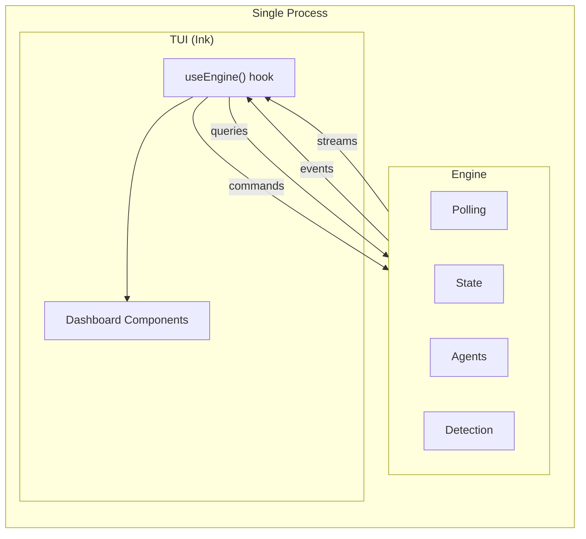

# Agentic Workflow Control Plane

## Overview

The control plane is an interactive, long-running TUI application that operates the development
workflow defined in `workflow.md`. It monitors GitHub Issues and spec files for state changes,
automatically dispatches agents where policy allows, surfaces actionable items to the user, and
provides on-demand agent invocation for tasks requiring human judgment.

It is the single interface through which the Human role interacts with the automated workflow —
observing state, dispatching agents, and responding to notifications.

## Constraints

- Must be manually started. Does not auto-start or run as a system service.
- Must remain interactive while agents run. The user can observe, dispatch, and respond at any time.
- Must not invoke agents concurrently for the same task issue. One agent per issue at a time.
- Must auto-recover stale `status:in-progress` issues when no agent is running for them (reset to
  `status:pending`).
- Must only auto-dispatch the Planner for specs with `status: approved` in frontmatter.
- Must use `@octokit/rest` with `@octokit/auth-app` for all GitHub API interactions.
- Must use `@anthropic-ai/claude-agent-sdk` for all agent invocations.

## Specification

### Architecture

The control plane consists of two co-located modules in a single process:

- **Engine** — Polling, state management, change detection, agent lifecycle, and dispatch logic.
  Owns all workflow state. Has no knowledge of the TUI.
- **TUI** — Ink-based (React for terminal) dashboard that renders engine state and captures user
  input. Consumes the engine; never imported by it.

Both modules live in the `@decree/control-plane` workspace package at `packages/control-plane/` in
the repository root. They are separate modules with explicit exports, not separate packages.

### Data Flow

The engine exposes four interfaces:

1. **Event emitter** — The engine emits typed events when state changes occur (issue status changed,
   agent started, agent completed, change detected, etc.). The TUI subscribes to these events for
   reactive state updates.
2. **Command interface** — The engine accepts commands (dispatch implementor for issue N, cancel
   agent for issue N, shutdown, etc.). The TUI invokes these in response to user input.
3. **Query interface** — The engine provides on-demand data fetching (issue details, PR summaries).
   The TUI calls these when the user selects an issue that needs additional data not tracked by
   pollers.
4. **Stream accessor** — The engine exposes live agent output streams, keyed by session ID. All
   agent types (Implementor, Reviewer, Planner) are accessible — the session ID is provided in the
   `agentStarted` event. The TUI subscribes to these directly for streaming agent output in the
   detail pane, separate from the event emitter.

The TUI bridges these interfaces to React via a Zustand store initialized by a `useEngine()` hook:

- The store subscribes to engine events in its initializer and updates state reactively.
- Store actions wrap engine commands.
- Components use `useStore()` with selectors to subscribe to specific state slices.
- This hook is the only coupling point between engine and TUI.

### Dispatch Tiers

The control plane categorizes state changes into three tiers that determine how they are handled:

| Tier                    | Behavior                                                      | Triggers                                                                                    |
| ----------------------- | ------------------------------------------------------------- | ------------------------------------------------------------------------------------------- |
| **Auto-dispatch**       | Agent invoked automatically, no user action needed            | Spec changes (approved only) → Planner                                                      |
| **Completion-dispatch** | Agent invoked automatically after a preceding agent completes | Implementor completes + linked non-draft PR exists → Reviewer (engine sets `status:review`) |
| **User-dispatch**       | Surfaced in TUI, user chooses when to invoke                  | Issues with `status:pending`, `status:unblocked`, `status:needs-changes` → Implementor      |
| **Notify-only**         | Surfaced in TUI as informational, no agent dispatch           | `status:needs-refinement`, `status:blocked`, `status:approved` (ready to merge)             |

Dispatch decisions are based on status labels, dispatch tier classification, and agent completion
signals. The engine does not enforce task dependencies (e.g., "Blocked by #X" references in issue
bodies). Dependency ordering is the Human's responsibility when deciding which user-dispatch tasks
to invoke.

The engine determines the tier. The TUI renders accordingly — auto-dispatched and
completion-dispatched agents appear as running, user-dispatch items appear as actionable, and
no-dispatch statuses are reflected in-place on task rows.

### Agent Invocation

Agents are invoked programmatically using the `@anthropic-ai/claude-agent-sdk`. Each agent is
configured with a system prompt from its agent definition file (`.claude/agents/<agent>.md`) and
receives trigger-specific context (issue number, changed spec file paths, etc.). The SDK provides
structured lifecycle management — the engine creates agent sessions, monitors their progress, and
handles completion without subprocess coordination.

See [control-plane-engine.md: Auto-dispatch](./control-plane-engine.md#auto-dispatch) for Planner
batching and concurrency guard behavior. See
[control-plane-engine.md: Completion-dispatch](./control-plane-engine.md#completion-dispatch) for
Reviewer dispatch flow and `status:review` semantics.

### Recovery

The engine resets stale `status:in-progress` issues to `status:pending` on startup (no running agent
tracked) and after agent completion (issue still `status:in-progress`). Reviewers do not change
issue status to `in-progress`, so crash recovery does not apply to Reviewer failures. See
[control-plane-engine-recovery.md](./control-plane-engine-recovery.md) for startup recovery, crash
recovery, and Reviewer failure behavior.

The engine writes to GitHub Issues in two cases: recovery (status label resets) and Reviewer
dispatch (setting `status:review`). All other GitHub writes are performed by the agents themselves.

### Technology

| Choice               | Detail                                               |
| -------------------- | ---------------------------------------------------- |
| Language             | TypeScript                                           |
| Execution            | `tsx` (no build step)                                |
| Package              | `@decree/control-plane` at `packages/control-plane/` |
| Run command          | `yarn control-plane`                                 |
| TUI framework        | Ink (React for terminal)                             |
| TUI state management | Zustand                                              |
| GitHub API           | `@octokit/rest`                                      |
| GitHub Auth          | `@octokit/auth-app`                                  |
| Agent invocation     | `@anthropic-ai/claude-agent-sdk`                     |
| Configuration        | TypeScript config file                               |

### API Duality

Agents and the engine use different GitHub API clients by design:

- **Agents** use the `gh` CLI via `scripts/workflow/gh.sh`, which handles authentication and token
  caching automatically.
- **Engine** uses `@octokit/rest` with `@octokit/auth-app`, authenticated via GitHub App credentials
  in config. Token refresh is handled automatically.

Consequences for implementors:

- No code sharing for GitHub operations between engine and agents.
- Different error shapes and retry patterns — `gh` returns exit codes and stderr; `@octokit/rest`
  throws typed errors.
- The control plane never uses `gh` CLI; agents never use `@octokit/rest`.

### Worktree Isolation

Implementor and Reviewer agents run in dedicated git worktrees, isolating them from each other and
from the main working tree. The Planner operates on the main working tree (it reads specs and
creates issues, never modifying code).

**Strategy overview:**

| Agent       | Condition        | Strategy                                |
| ----------- | ---------------- | --------------------------------------- |
| Implementor | No linked PR     | Fresh branch from `main`                |
| Implementor | Linked PR exists | Resume on PR branch                     |
| Reviewer    | Always           | Fetch and checkout remote PR branch tip |

See
[control-plane-engine-agent-manager.md: Agent Lifecycle](./control-plane-engine-agent-manager.md#agent-lifecycle)
for worktree creation, fetch, cleanup procedures, and per-strategy git commands.

**Naming:**

| Artifact               | Convention                             | Example                                       |
| ---------------------- | -------------------------------------- | --------------------------------------------- |
| Branch (new)           | `issue-<number>-<timestamp>`           | `issue-42-1739000000`                         |
| Branch (resume/review) | PR's `headRefName`                     | `issue-42-1739000000` (from previous attempt) |
| Worktree directory     | `<repo-root>/.worktrees/<branch-name>` | `.worktrees/issue-42-1739000000`              |

**Constraints:**

- The `.worktrees/` directory must be added to `.gitignore`.
- Only the Planner operates on the main working tree. Implementors and Reviewers always use
  worktrees.
- The Implementor pushes on the branch it starts on. It does not rename the branch.
- The Reviewer is read-only — it does not modify files or push to the branch.

## Acceptance Criteria

- [ ] Given the control plane is started, when startup completes, then the TUI renders and the
      engine begins polling.
- [ ] Given a spec with `status: approved` is committed, when the next poll cycle runs, then the
      Planner is auto-dispatched without user interaction.
- [ ] Given an Implementor agent session completes for issue N, when a linked non-draft PR exists,
      then the engine sets `status:review` on the issue and dispatches the Reviewer.
- [ ] Given an Implementor agent session completes for issue N, when no linked non-draft PR exists,
      then no Reviewer is dispatched and the issue remains `status:in-progress` (crash recovery
      resets to `status:pending`).
- [ ] Given a task issue is `status:pending`, when the TUI displays it, then the user can dispatch
      an Implementor for it on demand.
- [ ] Given a task issue moves to `status:needs-refinement`, when the TUI displays it, then the task
      row shows `REFINE` status and the detail pane shows the issue body on pin.
- [ ] Given an agent is running, when the user presses a key, then the TUI processes the keypress
      and re-renders within one render cycle (no blocking on agent I/O).
- [ ] Given the engine emits an event, when the TUI is subscribed, then the TUI re-renders to
      reflect the new state.

## Known Limitations

Cross-spec index of intentional v1 capability gaps. Each limitation is described in the referenced
spec's own Known Limitations section.

| Limitation                                                            | Spec                                                                             | Section           |
| --------------------------------------------------------------------- | -------------------------------------------------------------------------------- | ----------------- |
| Pagination capped at 100 items per call (issues, PRs, files, reviews) | [control-plane-engine.md](./control-plane-engine.md)                             | Known Limitations |
| No Planner cancel keybinding in the TUI                               | [control-plane-engine.md](./control-plane-engine.md)                             | Known Limitations |
| No dependency graph enforcement — dispatch is label-driven            | [workflow.md](./workflow.md)                                                     | Known Limitations |
| `settingSources` SDK workaround (worktree `.git` file issue)          | [control-plane-engine-agent-manager.md](./control-plane-engine-agent-manager.md) | Known Limitations |
| SpecPoller commit SHA is HEAD, not per-file                           | [control-plane-engine-spec-poller.md](./control-plane-engine-spec-poller.md)     | Known Limitations |
| Null PR results not cached (re-fetched each view)                     | [control-plane-tui.md](./control-plane-tui.md)                                   | Known Limitations |

## Dependencies

- `control-plane-engine.md` — Engine specification (polling, state, dispatch logic, agent lifecycle)
- `control-plane-tui.md` — TUI specification (layout, interactions, rendering)
- `workflow.md` — Development workflow definition (roles, phases, status transitions)
- `agent-planner.md` — Planner agent definition
- `agent-implementor.md` — Implementor agent definition
- `agent-reviewer.md` — Reviewer agent definition
