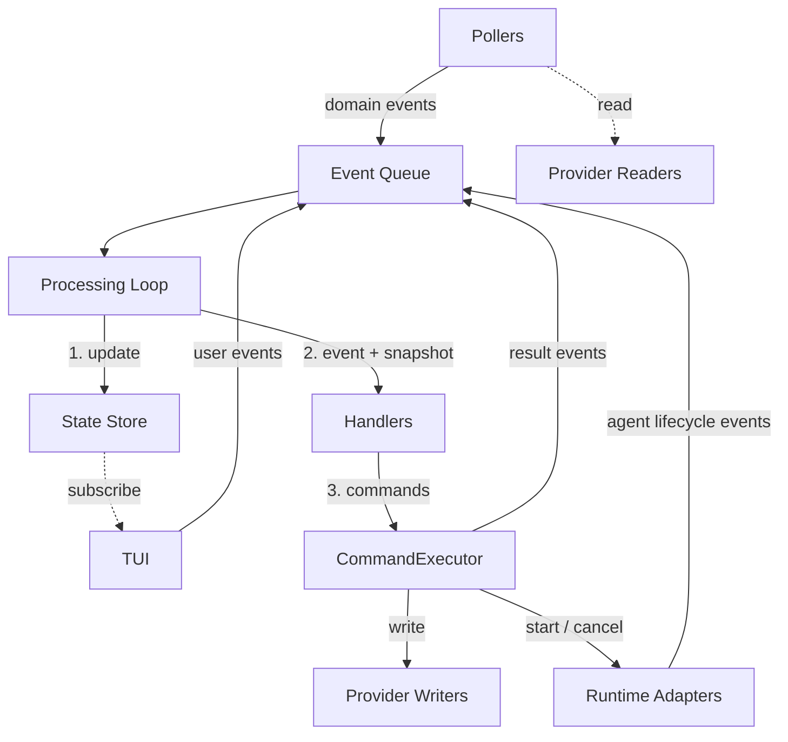

# Agentic Workflow Control Plane

## Overview

The control plane is an interactive, long-running TUI application that operates the development
workflow defined in `workflow.md`. It monitors work items, revisions, and spec files for state
changes via provider interfaces, dispatches agents through handler-based workflow logic, and
provides a dashboard for observing and acting on development tasks.

It is the single interface through which the Human role interacts with the automated workflow —
observing state, dispatching agents, and responding to notifications.

## Constraints

- Must be manually started. Does not auto-start or run as a system service.
- Must remain interactive while agents run. The user can observe, dispatch, and respond at any time.
- Must not invoke agents concurrently for the same work item. One agent per work item at a time.
- Must auto-recover orphaned `in-progress` work items when no agent is running for them (transition
  to `pending`).
- Must only auto-dispatch the Planner for specs with `status: approved` in frontmatter.
- All external mutations must flow through the CommandExecutor — no component bypasses this
  boundary.
- The engine must operate on normalized domain types only — no provider-specific types leak past
  provider boundaries.
- Agents must produce structured artifacts only — they must not perform external writes (no GitHub
  operations, no branch pushing, no status changes).

## Specification

### Architecture

The control plane consists of two co-located modules in a single process:

- **Engine** — Event processing, state management, handler-based dispatch, agent lifecycle, and
  provider integration. Owns all workflow state. Has no knowledge of the TUI.
- **TUI** — Ink-based (React for terminal) dashboard that renders engine state and captures user
  input. Consumes the engine; never imported by it.

Both modules live in the `@decree/control-plane` workspace package at `packages/control-plane/` in
the repository root. They are separate modules with explicit exports, not separate packages.

### Component Architecture



Three categories of components surround the engine core:

| Category             | Components                              | Role                                            |
| -------------------- | --------------------------------------- | ----------------------------------------------- |
| **Event sources**    | Pollers, runtime adapters, user actions | Produce domain events into the queue            |
| **External systems** | Provider writers, runtime adapters      | Reached only through the CommandExecutor        |
| **Subscribers**      | TUI                                     | Read engine state but do not modify it directly |

See [control-plane-engine.md: Engine Wiring](./control-plane-engine.md#engine-wiring) for the full
`createEngine(config)` assembly.

### Engine Public Interface

The engine exposes a store-based interface consumed by the TUI:

| Method                      | Purpose                                              |
| --------------------------- | ---------------------------------------------------- |
| `store`                     | Zustand vanilla store — TUI subscribes via selectors |
| `start()`                   | Start pollers, begin processing                      |
| `stop()`                    | Cancel active runs, drain queue, shut down           |
| `enqueue(event)`            | Add domain event to queue                            |
| `getState()`                | Current state snapshot                               |
| `subscribe(listener)`       | State change subscription                            |
| `getWorkItemBody(id)`       | On-demand work item detail (delegates to provider)   |
| `getRevisionFiles(id)`      | On-demand revision detail (delegates to provider)    |
| `getAgentStream(sessionID)` | Live agent output stream for TUI display             |
| `refresh()`                 | Trigger immediate poll cycle                         |

The TUI subscribes to the engine's Zustand store via `useStore(engine.store, selector)`. User
actions produce domain events enqueued via `engine.enqueue()` — the TUI never sends commands
directly.

See [control-plane-engine.md](./control-plane-engine.md) for the full engine specification. See
[control-plane-tui.md](./control-plane-tui.md) for the TUI specification.

### Data Flow

Events are processed sequentially. Each event is fully processed before the next is dequeued:

1. **State update** — `applyStateUpdate` applies the event to the store.
2. **Handler evaluation** — All handlers receive the event and a post-update state snapshot,
   returning domain commands.
3. **Command execution** — The CommandExecutor processes each command, producing result events that
   are appended to the queue for subsequent processing.

Commands emitted by handlers in a single event cycle must be independent — no command may depend on
the effects of another command in the same cycle. Dependent operations are expressed as compound
commands (`ApplyPlannerResult`, `ApplyImplementorResult`, `ApplyReviewerResult`) that the
CommandExecutor executes as a single sequenced unit (no interleaving with other command executions,
but no rollback on partial failure).

See [control-plane-engine.md: Processing Loop](./control-plane-engine.md#processing-loop) for
pseudocode and ordering guarantees.

### Handler-Based Dispatch

Workflow logic is organized as handler functions — pure functions with the shape
`(event, state) → commands[]`. Handlers receive a read-only state snapshot and return domain
commands. They never mutate state, call providers, or produce side effects.

| Handler                      | Trigger summary                                                             | Response summary                                                     |
| ---------------------------- | --------------------------------------------------------------------------- | -------------------------------------------------------------------- |
| `handlePlanning`             | Approved spec changed (`blobSHA` differs from `lastPlannedSHAs`)            | Request planner run; apply planner results on completion             |
| `handleReadiness`            | Work item enters `pending`                                                  | Promote to `ready` when all `blockedBy` items are in terminal status |
| `handleImplementation`       | Work item enters `ready`; implementor completes                             | Request implementor run; apply result on completion                  |
| `handleReview`               | Revision pipeline succeeds; reviewer completes                              | Request reviewer run; apply result on completion                     |
| `handleDependencyResolution` | Work item reaches terminal status (`closed`, `approved`)                    | Promote pending dependents whose blockers are all resolved           |
| `handleOrphanedWorkItem`     | Work item `in-progress` with no active agent run                            | Transition to `pending` (crash recovery)                             |
| `handleUserDispatch`         | `UserRequestedImplementorRun`, `UserCancelledRun`, `UserTransitionedStatus` | Translate user events into domain commands                           |

Handler order does not affect correctness — all commands are collected before execution, and
handlers cannot observe each other's commands within the same event cycle.

See [control-plane-engine-handlers.md](./control-plane-engine-handlers.md) for full handler
specifications, guard conditions, and event coverage.

### Provider Abstraction

The engine operates on three domain types (`WorkItem`, `Revision`, `Spec`) through five provider
interfaces — three readers and two writers:

| Interface                | Direction | Consumer        |
| ------------------------ | --------- | --------------- |
| `WorkProviderReader`     | Read      | WorkItem poller |
| `WorkProviderWriter`     | Write     | CommandExecutor |
| `RevisionProviderReader` | Read      | Revision poller |
| `RevisionProviderWriter` | Write     | CommandExecutor |
| `SpecProviderReader`     | Read      | Spec poller     |

**Read/write enforcement.** The engine setup function threads each interface to the component that
needs it — readers go to pollers, writers go to the CommandExecutor. TypeScript types enforce the
separation at compile time.

**GitHub implementation.** A single `createGitHubProvider(config)` factory returns all five
interfaces. It normalizes GitHub API types (issues, PRs, tree entries) into domain types at the
boundary. No GitHub-specific types leak past the provider.

See [control-plane-engine-github-provider.md](./control-plane-engine-github-provider.md) for the
full provider specification, domain type mapping, and retry strategy.

### Broker Boundary

The CommandExecutor is the single path for all external mutations — the "broker" between domain
commands and provider operations. It receives domain commands from handlers, validates them,
translates them into provider calls, and emits result events.

The execution pipeline has three stages:

1. **Concurrency guards** — One planner at a time (global). One agent per work item. Rejected
   commands produce `CommandRejected` events.
2. **Policy gate** — An injected `Policy` function that returns `allowed` or a rejection reason.
   Policy does not modify commands.
3. **Translation and execution** — Domain commands are translated into provider writer calls or
   runtime adapter invocations. Provider failures produce `CommandFailed` events.

Agent request commands produce an immediate `*Requested` event and kick off an async lifecycle
manager that enqueues `*Started`, `*Completed`, or `*Failed` events as the agent progresses.

See [control-plane-engine-command-executor.md](./control-plane-engine-command-executor.md) for the
full command translation table, compound command execution, and error semantics.

### Runtime Adapter

Agent execution is mediated by a `RuntimeAdapter` interface — the engine programs against this
contract, and the runtime implementation is pluggable per role.

```
RuntimeAdapter {
  startAgent(params: AgentStartParams): Promise<AgentRunHandle>
  cancelAgent(sessionID):               void
}

AgentRunHandle {
  output:    AsyncIterable<string>      // live log stream for TUI
  result:    Promise<AgentResult>       // resolves on completion, rejects on failure
}
```

**Artifact-based model.** Agents produce structured output only (`PlannerResult`,
`ImplementorResult`, `ReviewerResult`). The runtime adapter validates output against per-role
schemas. All external mutations (creating revisions, posting reviews, transitioning statuses) are
performed by the CommandExecutor after processing agent results — agents never perform side effects.

**Pluggable per role.** The engine holds a per-role adapter map. Swapping a role's runtime is a
configuration change — the caller provides a different factory function.

See [control-plane-engine-runtime-adapter.md](./control-plane-engine-runtime-adapter.md) for the
core contract and
[control-plane-engine-runtime-adapter-claude.md](./control-plane-engine-runtime-adapter-claude.md)
for the Claude SDK implementation (worktree management, context assembly, structured output
validation).

### Recovery

Recovery flows through the normal event pipeline — there is no separate recovery module or bootstrap
phase.

When the engine restarts after a crash, pollers run their initial poll immediately, populating the
state store with current external state. Work items detected as `in-progress` with no active agent
run trigger `handleOrphanedWorkItem`, which transitions them to `pending`. The `handleReadiness`
handler then promotes eligible items to `ready`, re-entering normal dispatch.

See
[control-plane-engine-handlers.md: handleOrphanedWorkItem](./control-plane-engine-handlers.md#handleorphanedworkitem)
for the recovery handler specification.

### Technology

| Choice           | Detail                                               |
| ---------------- | ---------------------------------------------------- |
| Language         | TypeScript                                           |
| Execution        | `tsx` (no build step)                                |
| Package          | `@decree/control-plane` at `packages/control-plane/` |
| Run command      | `yarn control-plane`                                 |
| TUI framework    | Ink (React for terminal)                             |
| State management | Zustand (vanilla store + React binding)              |
| GitHub API       | `@octokit/rest` with `@octokit/auth-app`             |
| Agent invocation | `@anthropic-ai/claude-agent-sdk`                     |
| Configuration    | TypeScript config file                               |

> **Rationale:** GitHub API and agent SDK libraries are isolated behind provider and runtime adapter
> boundaries respectively. They are not imported outside their boundary modules.

### Testing Strategy

The architecture is designed for testability. Handlers, selectors, and state updates are pure
functions — test them with direct calls. Providers and runtime adapters are behind interfaces — mock
them at the boundary. All component dependencies are injected, never imported directly.

#### Test Utility Catalog

Test utilities live in `src/test-utils/`, one per file, following the standard file organization
rules. Every component test imports from this shared set — no inline mocks, no per-test-file mock
factories.

**Entity Builders** — Factory functions that return domain entities with sensible defaults. Accept
an optional overrides parameter for test-specific values.

```
test-utils/build-work-item.ts         → buildWorkItem(overrides?)
test-utils/build-revision.ts          → buildRevision(overrides?)
test-utils/build-spec.ts              → buildSpec(overrides?)
test-utils/build-planner-run.ts       → buildPlannerRun(overrides?)
test-utils/build-implementor-run.ts   → buildImplementorRun(overrides?)
test-utils/build-reviewer-run.ts      → buildReviewerRun(overrides?)
```

**State Builders** — Build `EngineState` snapshots from entity builders.

```
test-utils/build-engine-state.ts      → buildEngineState(overrides?)
```

`buildEngineState` is the primary test setup tool for handlers and selectors. It composes the entity
builders — pass work items, revisions, specs, and agent runs as needed:

```
state = buildEngineState({
  workItems: [buildWorkItem({ id: '1', status: 'ready' })],
  revisions: [buildRevision({ id: '10', workItemID: '1' })],
  agentRuns: [buildImplementorRun({ workItemID: '1', status: 'running' })],
})
```

**Event Builders** — Factory functions for domain events.

```
test-utils/build-work-item-changed.ts       → buildWorkItemChanged(overrides?)
test-utils/build-revision-changed.ts        → buildRevisionChanged(overrides?)
test-utils/build-spec-changed.ts            → buildSpecChanged(overrides?)
test-utils/build-planner-completed.ts       → buildPlannerCompleted(overrides?)
test-utils/build-implementor-completed.ts   → buildImplementorCompleted(overrides?)
test-utils/build-reviewer-completed.ts      → buildReviewerCompleted(overrides?)
```

**Mock Providers** — Mock implementations of provider interfaces. Readers accept initial data;
writers record calls for assertion.

```
test-utils/create-mock-work-provider-reader.ts     → createMockWorkProviderReader(config?)
test-utils/create-mock-work-provider-writer.ts     → createMockWorkProviderWriter()
test-utils/create-mock-revision-provider-reader.ts → createMockRevisionProviderReader(config?)
test-utils/create-mock-revision-provider-writer.ts → createMockRevisionProviderWriter()
test-utils/create-mock-spec-provider-reader.ts     → createMockSpecProviderReader(config?)
```

Mock readers return configured data. Mock writers expose `calls` arrays for assertion:

```
writer = createMockWorkProviderWriter()
// ... execute commands ...
expect(writer.transitionStatus.calls).toContainEqual({ workItemID: '1', newStatus: 'in-progress' })
```

**Mock Runtime and Infrastructure:**

```
test-utils/create-mock-runtime-adapter.ts   → createMockRuntimeAdapter(config?)
test-utils/create-mock-policy.ts            → createMockPolicy(config?)
test-utils/create-mock-enqueue.ts           → createMockEnqueue()
```

`createMockRuntimeAdapter` returns an adapter whose `startAgent` produces a controllable
`AgentRunHandle` — tests can resolve or reject the result promise to simulate completion or failure.

`createMockPolicy` defaults to allowing all commands. Pass overrides to reject specific command
types.

`createMockEnqueue` captures enqueued events in an array for assertion.

#### Testing Patterns by Component

| Component                | Pattern                                                                                                                                                       | Key utilities                                                         |
| ------------------------ | ------------------------------------------------------------------------------------------------------------------------------------------------------------- | --------------------------------------------------------------------- |
| **Handlers**             | Pure function test. Call `handler(event, state)`, assert returned commands.                                                                                   | `buildEngineState`, event builders                                    |
| **Selectors**            | Pure function test. Call `selector(state)`, assert derived value.                                                                                             | `buildEngineState`                                                    |
| **State updates**        | Call `applyStateUpdate(store, event)`, assert state changes via `store.getState()`.                                                                           | Event builders, fresh Zustand store                                   |
| **CommandExecutor**      | Inject mock providers + adapters + policy. Call `execute(command, state)`, assert provider calls and returned events.                                         | Mock providers, mock runtime adapter, mock policy, `buildEngineState` |
| **Pollers**              | Inject mock reader + `getState` + mock enqueue. Trigger a poll cycle, assert enqueued events match the diff between reader data and store state.              | Mock provider readers, `buildEngineState`, `createMockEnqueue`        |
| **Engine (integration)** | Wire real handlers and store with mock providers and adapters. Enqueue events, let the processing loop run, assert resulting state and provider interactions. | All mock utilities, `buildEngineState`                                |

#### Testing Principles

- **No inline mocks.** All mocks come from `test-utils/`. If a test needs a mock that doesn't exist,
  add it to `test-utils/` — don't create it locally.
- **Builders over literals.** Use `buildWorkItem({ status: 'ready' })` instead of spelling out full
  object literals. Builders provide sensible defaults and insulate tests from entity shape changes.
- **Assert commands, not side effects.** Handler tests assert the returned `EngineCommand[]`. They
  never assert provider calls — that's the CommandExecutor's concern.
- **One layer per test.** Handler tests don't involve the CommandExecutor. CommandExecutor tests
  don't involve handlers. Integration tests are separate and deliberate.

## Acceptance Criteria

- [ ] Given the control plane is started, when startup completes, then the first poll cycle
      completes before the TUI receives its first state update — ensuring the store is populated
      before rendering.
- [ ] Given a user presses the dispatch key in the TUI, when the event reaches `handleUserDispatch`,
      then it flows through the same concurrency guards and policy checks as automated dispatch.
- [ ] Given a work item is `in-progress` with no active agent run after a crash, when the engine
      restarts and the first poll completes, then `handleOrphanedWorkItem` transitions it to
      `pending` through normal event processing — no dedicated recovery phase.
- [ ] Given a handler emits a `RequestImplementorRun` command for a work item that already has an
      active agent, when the CommandExecutor checks concurrency guards, then the command is rejected
      with a `CommandRejected` event — not silently dropped.
- [ ] Given a planner completes and its result includes work items with `tempID` references in
      `blockedBy`, when the CommandExecutor processes `ApplyPlannerResult`, then creates are
      processed in order, `tempID` values are resolved to real work item IDs, and `blockedBy`
      references on subsequently created items use the resolved IDs.
- [ ] Given a work item with unresolved `blockedBy` dependencies enters `pending`, when
      `handleReadiness` evaluates it, then it remains `pending` until all blockers reach terminal
      status — `handleDependencyResolution` promotes it when the last blocker completes.

## Known Limitations

Cross-spec index of intentional capability gaps. Each limitation is described in the referenced
spec's own Known Limitations section.

| Limitation                                                             | Spec                                                                                               |
| ---------------------------------------------------------------------- | -------------------------------------------------------------------------------------------------- |
| Pagination capped at 100 items per call (work items, revisions, files) | [control-plane-engine-github-provider.md](./control-plane-engine-github-provider.md)               |
| SpecPoller commit SHA is HEAD, not per-file                            | [control-plane-engine-spec-poller.md](./control-plane-engine-spec-poller.md)                       |
| `settingSources: []` SDK workaround (worktree `.git` file issue)       | [control-plane-engine-runtime-adapter-claude.md](./control-plane-engine-runtime-adapter-claude.md) |
| Run cancellation and manual status transitions not surfaced in TUI     | [control-plane-tui.md](./control-plane-tui.md)                                                     |

## Dependencies

- [control-plane-engine.md](./control-plane-engine.md) — Engine specification (event processing,
  component wiring, public interface)
- [control-plane-engine-state-store.md](./control-plane-engine-state-store.md) — State store
  (canonical state shape, selectors, update functions)
- [control-plane-engine-github-provider.md](./control-plane-engine-github-provider.md) — Provider
  interfaces and GitHub implementation
- [control-plane-engine-issue-poller.md](./control-plane-engine-issue-poller.md) — WorkItem poller
- [control-plane-engine-pr-poller.md](./control-plane-engine-pr-poller.md) — Revision poller
- [control-plane-engine-spec-poller.md](./control-plane-engine-spec-poller.md) — Spec poller
- [control-plane-engine-handlers.md](./control-plane-engine-handlers.md) — Handler catalog (dispatch
  logic, recovery, dependency resolution)
- [control-plane-engine-command-executor.md](./control-plane-engine-command-executor.md) — Command
  execution (broker boundary, concurrency guards, policy gate)
- [control-plane-engine-runtime-adapter.md](./control-plane-engine-runtime-adapter.md) — Runtime
  adapter core contract
- [control-plane-engine-runtime-adapter-claude.md](./control-plane-engine-runtime-adapter-claude.md)
  — Claude SDK adapter implementation
- [control-plane-tui.md](./control-plane-tui.md) — TUI specification (layout, interactions,
  rendering)
- [workflow.md](./workflow.md) — Development workflow definition (roles, phases, status transitions)
- [workflow-contracts.md](./workflow-contracts.md) — Shared data formats and templates
- [agent-planner.md](./agent-planner.md) — Planner agent behavior
- [agent-implementor.md](./agent-implementor.md) — Implementor agent behavior
- [agent-reviewer.md](./agent-reviewer.md) — Reviewer agent behavior

## References

- `docs/specs/decree/domain-model.md` — Domain model (types, events, commands, agent results)
