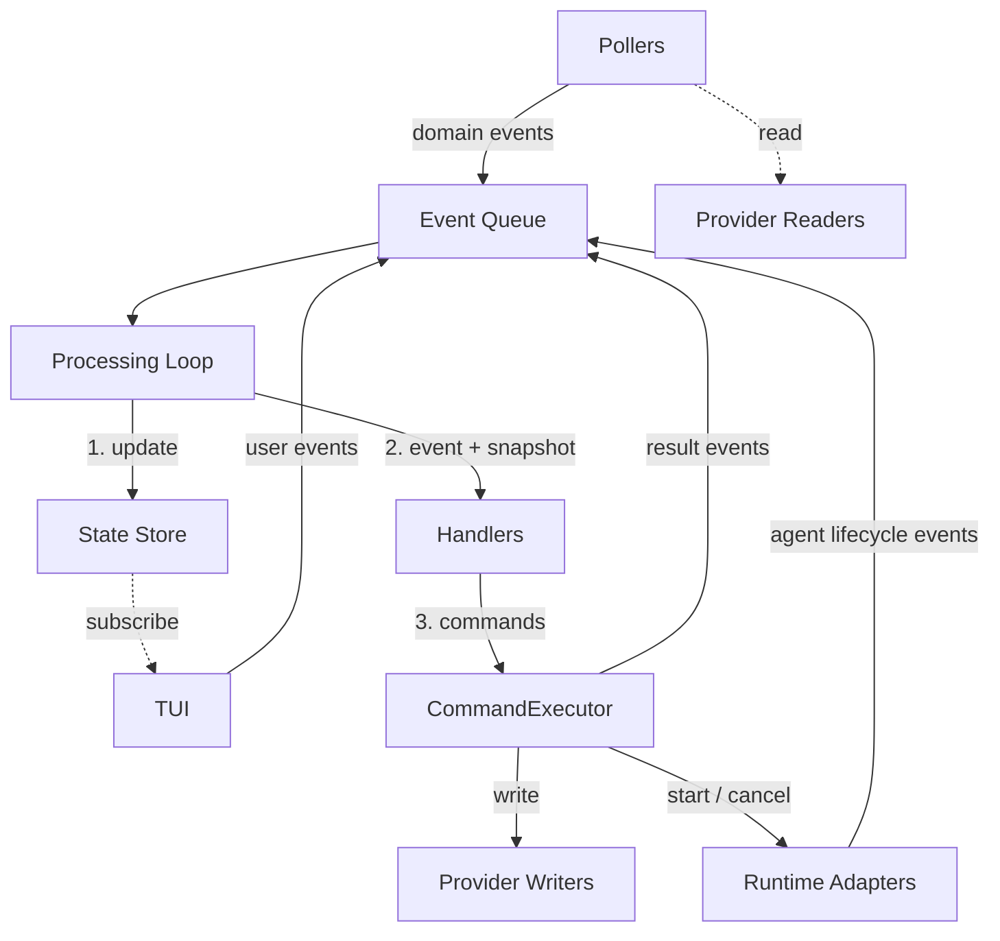

# Domain Model

## Overview

Canonical reference for the domain types, events, commands, and structured output types that the
control plane operates on. Component specs reference this document for type definitions and
behavioral contracts that cross component boundaries.

The control plane is built on four structural pillars:

1. **Provider abstraction.** The engine operates on normalized domain types, not GitHub-specific
   types. GitHub becomes one provider implementation behind interfaces.
2. **Broker boundary.** All external mutations flow through a CommandExecutor backed by a policy
   layer. No component bypasses this boundary.
3. **Handler-based dispatch.** Workflow logic is organized as handler functions with a consistent
   shape, replacing scattered dispatch code.
4. **Artifact-based runtime interface.** Agent execution produces structured artifacts. The engine
   programs against this contract; the runtime implementation is pluggable.

### Relationship to other documents

- [control-plane.md](./control-plane.md) — top-level control plane specification.
- Component specs — define individual modules in detail; this document defines the boundaries,
  contracts, and invariants that all components must respect.

## Constraints

- All domain types (`WorkItem`, `Revision`, `Spec`) are provider-agnostic — the engine never imports
  provider-specific types.
- All external mutations flow through the CommandExecutor (broker boundary). No component bypasses
  this boundary.
- Commands emitted by a handler in a single event cycle must be independent — no command may depend
  on the effects of another command in the same cycle (independence invariant).
- Agent events, commands, and results are per-role. Each role carries exactly the data it needs — no
  nullable fields gated on context.

## Specification

Domain IDs are strings — providers map their native ID types (e.g. GitHub issue numbers) to strings
at the boundary.

The engine operates on three domain concepts. These are provider-agnostic — the engine never imports
provider-specific types.

### WorkItem

A unit of work tracked by the system. Normalized from issues, tickets, or equivalent work-tracking
entities.

```
WorkItem {
  id:             string
  title:          string
  status:         WorkItemStatus
  priority:       Priority | null
  complexity:     Complexity | null
  blockedBy:      string[]                // WorkItem ids that must complete first
  createdAt:      string                  // ISO 8601
  linkedRevision: string | null           // Revision id, if one exists
}
```

`blockedBy` is the original dependency list — it always contains all declared blocker IDs,
regardless of whether those items have completed. The provider reports relationships as-is; the
engine resolves completion status. `handleDependencyResolution` scans pending items when a blocker
completes and promotes them to `ready` when all blockers are in terminal status (`closed` or
`approved` — see `WorkItemStatus` above for the full enum).

`WorkItemStatus` is the domain-level status, normalized from provider-specific representations (e.g.
GitHub status labels):

```
WorkItemStatus =
  | 'pending'
  | 'ready'
  | 'in-progress'
  | 'review'
  | 'approved'
  | 'closed'
  | 'needs-refinement'
  | 'blocked'
```

`Priority`:

```
Priority = 'high' | 'medium' | 'low'
```

`Complexity`:

```
Complexity = 'trivial' | 'low' | 'medium' | 'high'
```

### Revision

A proposed code change associated with a WorkItem. Normalized from pull requests, merge requests, or
equivalent.

```
Revision {
  id:             string
  title:          string
  url:            string
  headSHA:        string
  headRef:        string                  // branch name
  author:         string
  body:           string
  isDraft:        boolean
  workItemID:     string | null           // linked WorkItem, if detected
  pipeline:       PipelineResult | null
  reviewID:       string | null           // engine-posted review
}
```

`PipelineStatus` and `PipelineResult`:

```
PipelineStatus = 'pending' | 'success' | 'failure'

PipelineResult {
  status: PipelineStatus
  url:    string | null              // link to the CI run
  reason: string | null              // failure summary, if any
}
```

### Spec

A specification document tracked by the system. Lightweight compared to WorkItem and Revision — the
engine needs only enough information to detect changes and drive planning.

```
Spec {
  filePath:           string
  blobSHA:            string
  frontmatterStatus:  SpecFrontmatterStatus
}

SpecFrontmatterStatus = 'draft' | 'approved' | 'deprecated'
```

### Domain Events

Events are the primary input to the engine. Pollers produce them by comparing provider state against
the canonical store. Other sources (agent completion, user actions) also produce events.

```
WorkItemChanged {
  type:       'workItemChanged'
  workItemID: string
  workItem:   WorkItem                    // full normalized entity snapshot
  title:      string
  oldStatus:  WorkItemStatus | null       // null on first detection
  newStatus:  WorkItemStatus | null       // null on removal
  priority:   Priority | null
}

RevisionChanged {
  type:             'revisionChanged'
  revisionID:       string
  workItemID:       string | null
  revision:         Revision              // full normalized entity snapshot
  oldPipelineStatus: PipelineStatus | null
  newPipelineStatus: PipelineStatus | null
}

SpecChanged {
  type:              'specChanged'
  filePath:          string
  blobSHA:           string
  frontmatterStatus: SpecFrontmatterStatus
  changeType:        'added' | 'modified'
  commitSHA:         string
}

PlannerRequested {
  type:        'plannerRequested'
  specPaths:   string[]
  sessionID:   string
}

PlannerStarted {
  type:        'plannerStarted'
  sessionID:   string
  logFilePath: string | null
}

PlannerCompleted {
  type:        'plannerCompleted'
  specPaths:   string[]
  sessionID:   string
  result:      PlannerResult
  logFilePath: string | null
}

PlannerFailed {
  type:        'plannerFailed'
  specPaths:   string[]
  sessionID:   string
  reason:      FailureReason
  error:       string
  logFilePath: string | null
}

ImplementorRequested {
  type:        'implementorRequested'
  workItemID:  string
  sessionID:   string
  branchName:  string
}

ImplementorStarted {
  type:        'implementorStarted'
  sessionID:   string
  logFilePath: string | null
}

ImplementorCompleted {
  type:        'implementorCompleted'
  workItemID:  string
  sessionID:   string
  branchName:  string
  result:      ImplementorResult
  logFilePath: string | null
}

ImplementorFailed {
  type:        'implementorFailed'
  workItemID:  string
  sessionID:   string
  branchName:  string
  reason:      FailureReason
  error:       string
  logFilePath: string | null
}

ReviewerRequested {
  type:        'reviewerRequested'
  workItemID:  string
  revisionID:  string
  sessionID:   string
}

ReviewerStarted {
  type:        'reviewerStarted'
  sessionID:   string
  logFilePath: string | null
}

ReviewerCompleted {
  type:        'reviewerCompleted'
  workItemID:  string
  revisionID:  string
  sessionID:   string
  result:      ReviewerResult
  logFilePath: string | null
}

ReviewerFailed {
  type:        'reviewerFailed'
  workItemID:  string
  revisionID:  string
  sessionID:   string
  reason:      FailureReason
  error:       string
  logFilePath: string | null
}

CommandRejected {
  type:    'commandRejected'
  command: EngineCommand
  reason:  string
}

CommandFailed {
  type:    'commandFailed'
  command: EngineCommand
  error:   string
}

UserRequestedImplementorRun {
  type:        'userRequestedImplementorRun'
  workItemID:  string
}

UserCancelledRun {
  type:        'userCancelledRun'
  sessionID:   string
}

UserTransitionedStatus {
  type:        'userTransitionedStatus'
  workItemID:  string
  newStatus:   WorkItemStatus
}

EngineEvent =
  | WorkItemChanged
  | RevisionChanged
  | SpecChanged
  | PlannerRequested
  | PlannerStarted
  | PlannerCompleted
  | PlannerFailed
  | ImplementorRequested
  | ImplementorStarted
  | ImplementorCompleted
  | ImplementorFailed
  | ReviewerRequested
  | ReviewerStarted
  | ReviewerCompleted
  | ReviewerFailed
  | CommandRejected
  | CommandFailed
  | UserRequestedImplementorRun
  | UserCancelledRun
  | UserTransitionedStatus
```

Notes:

- `*Requested` events create the `AgentRun` entry in the store with all identifying fields
  (workItemID, branchName, specPaths, revisionID — whatever the role needs). `*Started` events only
  transition the run status from `requested` to `running` and record `logFilePath`. `*Completed` and
  `*Failed` events carry role-specific results and may repeat identifiers for convenience.
- Pollers emit events carrying the full normalized entity snapshot. State updates replace the stored
  entity wholesale from the event payload. Change-specific fields (`oldStatus`, `newStatus`) are
  carried additionally for handler decision-making — they are derived by the poller when diffing
  provider state against the store.
- Agent events, commands, and results are per-role rather than unified with optional fields. Each
  role carries exactly the data it needs — no nullable fields gated on context. This eliminates
  representable-but-invalid states and aligns with the roles being first-class domain concepts.
- `*Failed` events carry a `reason` discriminator (`error`, `timeout`, `cancelled`) that the state
  store uses to set the correct terminal `AgentRunStatus`. The `error` field provides the
  human-readable description regardless of reason.
- Revision operations are granular: `PostRevisionReview` / `UpdateRevisionReview` for structured
  reviews, `CommentOnRevision` for one-off comments, `UpdateRevision` for editing the revision body.
  `reviewID` on Revision enables review updates — populated when the poller detects a review posted
  by the engine, read by selectors when a handler needs to emit `UpdateRevisionReview`.
- `PlannerResult` carries create/close/update intents with dependency ordering. `ApplyPlannerResult`
  encapsulates the entire fan-out. See
  [CommandExecutor: ApplyPlannerResult](./control-plane-engine-command-executor.md#applyplannerresult)
  for tempID resolution and execution sequence.
- `ImplementorResult` carries a three-way outcome (`completed`, `blocked`, `validation-failure`).
  See
  [CommandExecutor: ApplyImplementorResult](./control-plane-engine-command-executor.md#applyimplementorresult)
  for outcome-dependent operations.
- `ApplyReviewerResult` encapsulates review posting (or updating) and the verdict-dependent status
  transition. See
  [CommandExecutor: ApplyReviewerResult](./control-plane-engine-command-executor.md#applyreviewerresult)
  for execution details.
- Compound `Apply*Result` commands exist because these operations are multi-step and interdependent
  — they cannot be expressed as independent commands in the same event cycle (see independence
  invariant).

### AgentRole

```
AgentRole = 'planner' | 'implementor' | 'reviewer'
```

### FailureReason

```
FailureReason = 'error' | 'timeout' | 'cancelled'
```

- `error` — agent process crashed, produced invalid output, or provisioning failed.
- `timeout` — agent session exceeded `maxAgentDuration`.
- `cancelled` — agent run was cancelled via `cancelAgent` (user-initiated or shutdown).

The `startAgentAsync` monitor in the CommandExecutor sets this field based on the cause of the
`handle.result` rejection.

### Domain Commands

Commands are the output of handlers. They express intent in domain terms. The CommandExecutor
translates them into provider operations.

**Independence invariant.** Commands emitted by a handler in a single event cycle must be
independent — no command may depend on the effects of another command in the same cycle. The
processing loop passes a single state snapshot to all handlers and does not re-read state between
command executions. Dependent operations must be expressed as a single compound command that the
CommandExecutor executes atomically.

```
TransitionWorkItemStatus {
  command:    'transitionWorkItemStatus'
  workItemID: string
  newStatus:  WorkItemStatus
}

CreateWorkItem {
  command:   'createWorkItem'
  title:     string
  body:      string
  labels:    string[]
  blockedBy: string[]                    // resolved WorkItem ids
}

UpdateWorkItem {
  command:    'updateWorkItem'
  workItemID: string
  body:       string | null              // null = no change
  labels:     string[] | null            // null = no change
}

RequestPlannerRun {
  command:   'requestPlannerRun'
  specPaths: string[]
}

RequestImplementorRun {
  command:    'requestImplementorRun'
  workItemID: string
}

RequestReviewerRun {
  command:    'requestReviewerRun'
  workItemID: string
  revisionID: string
}

CancelPlannerRun {
  command: 'cancelPlannerRun'
}

CancelImplementorRun {
  command:    'cancelImplementorRun'
  workItemID: string
}

CancelReviewerRun {
  command:    'cancelReviewerRun'
  workItemID: string
}

CreateRevisionFromPatch {
  command:    'createRevisionFromPatch'
  workItemID: string
  patch:      string
  branchName: string
}

UpdateRevision {
  command:    'updateRevision'
  revisionID: string
  body:       string | null              // null = no change
}

PostRevisionReview {
  command:    'postRevisionReview'
  revisionID: string
  review:     AgentReview
}

UpdateRevisionReview {
  command:    'updateRevisionReview'
  revisionID: string
  review:     AgentReview
}

CommentOnRevision {
  command:    'commentOnRevision'
  revisionID: string
  body:       string
}

ApplyPlannerResult {
  command:    'applyPlannerResult'
  result:     PlannerResult
}

ApplyImplementorResult {
  command:    'applyImplementorResult'
  workItemID: string
  branchName: string
  result:     ImplementorResult
}

ApplyReviewerResult {
  command:    'applyReviewerResult'
  workItemID: string
  revisionID: string
  result:     ReviewerResult
}

EngineCommand =
  | TransitionWorkItemStatus
  | CreateWorkItem
  | UpdateWorkItem
  | RequestPlannerRun
  | RequestImplementorRun
  | RequestReviewerRun
  | CancelPlannerRun
  | CancelImplementorRun
  | CancelReviewerRun
  | CreateRevisionFromPatch
  | UpdateRevision
  | PostRevisionReview
  | UpdateRevisionReview
  | CommentOnRevision
  | ApplyPlannerResult
  | ApplyImplementorResult
  | ApplyReviewerResult
```

### Agent Results

Structured output from agent runs. Each role produces a distinct result type — the engine processes
these artifacts and does not rely on agents having performed side effects.

```
PlannerResult {
  role:    'planner'
  create:  PlannedWorkItem[]
  close:   string[]                       // existing WorkItem ids to close
  update:  PlannedWorkItemUpdate[]
}

PlannedWorkItem {
  tempID:    string                       // planner-assigned, unique within this result
  title:     string
  body:      string
  labels:    string[]
  blockedBy: string[]                     // tempIDs (from this result) or existing WorkItem ids
}

PlannedWorkItemUpdate {
  workItemID: string                      // existing WorkItem id
  body:       string | null               // null = no change
  labels:     string[] | null             // null = no change
}

ImplementorResult {
  role:     'implementor'
  outcome:  'completed' | 'blocked' | 'validation-failure'
  patch:    string | null                 // present only when outcome is completed
  summary:  string                        // what was done, or why it couldn't be done
}

ReviewerResult {
  role:   'reviewer'
  review: AgentReview
}

AgentResult = PlannerResult | ImplementorResult | ReviewerResult
```

The planner assigns `tempID` values to new work items and references them in `blockedBy`. The engine
processes creates in order, builds a tempID → real WorkItem id map, and resolves all `blockedBy`
references. IDs not present in any `create[].tempID` are treated as existing WorkItem ids.

```
AgentReview {
  verdict:     'approve' | 'needs-changes'
  summary:     string
  comments:    AgentReviewComment[]
}

AgentReviewComment {
  path:        string
  line:        number | null
  body:        string
}
```

### ReviewHistory

Review data for a revision, used by runtime adapters during context assembly. Provider-agnostic —
maps from provider-specific review representations at the boundary.

```
ReviewHistory {
  reviews:        ReviewSubmission[]
  inlineComments: ReviewInlineComment[]
}

ReviewSubmission {
  author: string
  state:  string
  body:   string
}

ReviewInlineComment {
  path:   string
  line:   number | null
  author: string
  body:   string
}
```

## Component Architecture



Three categories of components surround the engine core:

- **Event sources** (pollers, runtime adapters, user actions) produce domain events into the queue.
- **External systems** (provider writers, runtime adapters) are reached only through the
  CommandExecutor.
- **Subscribers** (TUI) read engine state but do not modify it directly.

## Agent Run Lifecycle

Agent runs progress through defined states:

```
AgentRunStatus = 'requested' | 'running' | 'completed' | 'failed' | 'timed-out' | 'cancelled'
```

Valid transitions are enforced via a transition table:

```
validTransitions: Record<AgentRunStatus, AgentRunStatus[]> {
  requested:  ['running', 'cancelled']
  running:    ['completed', 'failed', 'timed-out', 'cancelled']
  completed:  []
  failed:     []
  timed-out:  []
  cancelled:  []
}
```

Terminal states (`completed`, `failed`, `timed-out`, `cancelled`) have no outbound transitions. The
state store uses the `AgentRunStatus` transition table (see
[control-plane-engine-state-store.md](./control-plane-engine-state-store.md)) to enforce validity.
The state update step validates transitions before applying them — invalid transitions are logged
and rejected.

## Acceptance Criteria

- [ ] Given the `EngineEvent` union, when all variants are enumerated, then every variant has a
      corresponding entry in the state store's `applyStateUpdate` dispatch table — no event type is
      unhandled.
- [ ] Given the `EngineCommand` union, when all variants are enumerated, then every variant has a
      corresponding entry in the CommandExecutor's command translation table.
- [ ] Given the `WorkItemStatus` enum, when the workflow transition table is inspected, then every
      status value appears in at least one transition row (no orphan statuses).
- [ ] Given the `AgentRunStatus` transition table, when a terminal status is inspected, then it has
      no outbound transitions.
- [ ] Given any domain type used across component boundaries, when the type definition is located,
      then it is defined in this document — not duplicated in component specs.
- [ ] Given the independence invariant, when two handlers both emit commands for the same event,
      then each handler receives the same pre-update state snapshot regardless of handler execution
      order.

## Dependencies

This is the foundational domain model document. It has no normative dependencies on other specs —
component specs depend on it.

## References

- [workflow.md](./workflow.md) — Status transitions and lifecycle phases
- [control-plane-engine-state-store.md](./control-plane-engine-state-store.md) — `AgentRunStatus`
  transition enforcement, selectors
- [control-plane-engine-command-executor.md](./control-plane-engine-command-executor.md) — Command
  translation, compound command execution
- [control-plane-engine-handlers.md](./control-plane-engine-handlers.md) — Handler catalog consuming
  domain events and producing domain commands
