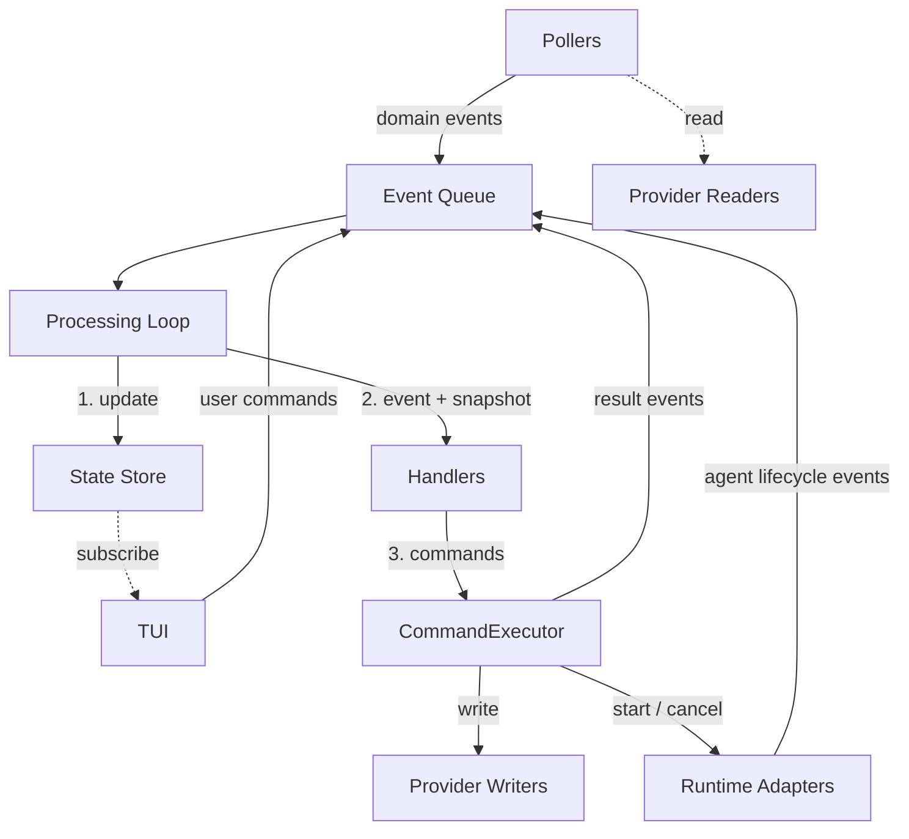

# Architecture v2

## Overview

This document defines the target architecture for the decree control plane after the v2 redesign. It
is the primary reference for all migration work — component specs describe individual modules in
detail, but this document defines the boundaries, contracts, and invariants that all components must
respect.

The redesign introduces four structural changes:

1. **Provider abstraction.** The engine operates on normalized domain types, not GitHub-specific
   types. GitHub becomes one provider implementation behind interfaces.
2. **Broker boundary.** All external mutations flow through a CommandExecutor backed by a policy
   layer. No component bypasses this boundary.
3. **Handler-based dispatch.** Workflow logic is organized as handler functions with a consistent
   shape, replacing scattered dispatch code.
4. **Artifact-based runtime interface.** Agent execution produces structured artifacts. The engine
   programs against this contract; the runtime implementation is pluggable.

### Relationship to other documents

- `001-plan.md` — captures the decisions that led to this architecture.
- Migration plan (phase 2) — sequences the incremental refactors to reach this target state.
- Component specs — define individual modules in detail; updated as each migration step completes.

## Domain Model

Domain IDs are strings — providers map their native ID types (e.g. GitHub issue numbers) to strings
at the boundary.

The engine operates on three domain concepts. These are provider-agnostic — the engine never imports
provider-specific types.

### WorkItem

A unit of work tracked by the system. Normalized from issues, tickets, or equivalent work-tracking
entities.

```
WorkItem {
  id:             string
  title:          string
  status:         WorkItemStatus
  priority:       Priority | null
  complexity:     Complexity | null
  blockedBy:      string[]                // WorkItem ids that must complete first
  createdAt:      string                  // ISO 8601
  linkedRevision: string | null           // Revision id, if one exists
}
```

`blockedBy` is the original dependency list — it always contains all declared blocker IDs,
regardless of whether those items have completed. The provider reports relationships as-is; the
engine resolves completion status. `handleDependencyResolution` scans pending items when a blocker
completes and promotes them to `ready` when all blockers are in terminal status.

`WorkItemStatus` is the domain-level status, normalized from provider-specific representations (e.g.
GitHub status labels):

```
WorkItemStatus =
  | 'pending'
  | 'ready'
  | 'in-progress'
  | 'review'
  | 'approved'
  | 'closed'
  | 'needs-refinement'
  | 'blocked'
```

`Priority`:

```
Priority = 'high' | 'medium' | 'low'
```

`Complexity`:

```
Complexity = 'trivial' | 'low' | 'medium' | 'high'
```

### Revision

A proposed code change associated with a WorkItem. Normalized from pull requests, merge requests, or
equivalent.

```
Revision {
  id:             string
  title:          string
  url:            string
  headSHA:        string
  headRef:        string                  // branch name
  author:         string
  body:           string
  isDraft:        boolean
  workItemID:     string | null           // linked WorkItem, if detected
  pipeline:       PipelineResult | null
  reviewID:       string | null           // engine-posted review
}
```

`PipelineStatus` and `PipelineResult`:

```
PipelineStatus = 'pending' | 'success' | 'failure'

PipelineResult {
  status: PipelineStatus
  url:    string | null              // link to the CI run
  reason: string | null              // failure summary, if any
}
```

### Spec

A specification document tracked by the system. Lightweight compared to WorkItem and Revision — the
engine needs only enough information to detect changes and drive planning.

```
Spec {
  filePath:           string
  blobSHA:            string
  frontmatterStatus:  SpecFrontmatterStatus
}

SpecFrontmatterStatus = 'draft' | 'approved' | 'deprecated'
```

### Domain Events

Events are the primary input to the engine. Pollers produce them by comparing provider state against
the canonical store. Other sources (agent completion, user actions) also produce events.

```
WorkItemChanged {
  type:       'workItemChanged'
  workItemID: string
  workItem:   WorkItem                    // full normalized entity snapshot
  title:      string
  oldStatus:  WorkItemStatus | null       // null on first detection
  newStatus:  WorkItemStatus | null       // null on removal
  priority:   Priority | null
}

RevisionChanged {
  type:             'revisionChanged'
  revisionID:       string
  workItemID:       string | null
  revision:         Revision              // full normalized entity snapshot
  oldPipelineStatus: PipelineStatus | null
  newPipelineStatus: PipelineStatus | null
}

SpecChanged {
  type:              'specChanged'
  filePath:          string
  blobSHA:           string
  frontmatterStatus: SpecFrontmatterStatus
  changeType:        'added' | 'modified'
  commitSHA:         string
}

PlannerRequested {
  type:        'plannerRequested'
  specPaths:   string[]
  sessionID:   string
}

PlannerStarted {
  type:        'plannerStarted'
  sessionID:   string
  logFilePath: string | null
}

PlannerCompleted {
  type:        'plannerCompleted'
  specPaths:   string[]
  sessionID:   string
  result:      PlannerResult
  logFilePath: string | null
}

PlannerFailed {
  type:        'plannerFailed'
  specPaths:   string[]
  sessionID:   string
  error:       string
  logFilePath: string | null
}

ImplementorRequested {
  type:        'implementorRequested'
  workItemID:  string
  sessionID:   string
  branchName:  string
}

ImplementorStarted {
  type:        'implementorStarted'
  sessionID:   string
  logFilePath: string | null
}

ImplementorCompleted {
  type:        'implementorCompleted'
  workItemID:  string
  sessionID:   string
  branchName:  string
  result:      ImplementorResult
  logFilePath: string | null
}

ImplementorFailed {
  type:        'implementorFailed'
  workItemID:  string
  sessionID:   string
  branchName:  string
  error:       string
  logFilePath: string | null
}

ReviewerRequested {
  type:        'reviewerRequested'
  workItemID:  string
  revisionID:  string
  sessionID:   string
}

ReviewerStarted {
  type:        'reviewerStarted'
  sessionID:   string
  logFilePath: string | null
}

ReviewerCompleted {
  type:        'reviewerCompleted'
  workItemID:  string
  revisionID:  string
  sessionID:   string
  result:      ReviewerResult
  logFilePath: string | null
}

ReviewerFailed {
  type:        'reviewerFailed'
  workItemID:  string
  revisionID:  string
  sessionID:   string
  error:       string
  logFilePath: string | null
}

CommandRejected {
  type:    'commandRejected'
  command: EngineCommand
  reason:  string
}

CommandFailed {
  type:    'commandFailed'
  command: EngineCommand
  error:   string
}

UserRequestedImplementorRun {
  type:        'userRequestedImplementorRun'
  workItemID:  string
}

UserCancelledRun {
  type:        'userCancelledRun'
  sessionID:   string
}

UserTransitionedStatus {
  type:        'userTransitionedStatus'
  workItemID:  string
  newStatus:   WorkItemStatus
}

EngineEvent =
  | WorkItemChanged
  | RevisionChanged
  | SpecChanged
  | PlannerRequested
  | PlannerStarted
  | PlannerCompleted
  | PlannerFailed
  | ImplementorRequested
  | ImplementorStarted
  | ImplementorCompleted
  | ImplementorFailed
  | ReviewerRequested
  | ReviewerStarted
  | ReviewerCompleted
  | ReviewerFailed
  | CommandRejected
  | CommandFailed
  | UserRequestedImplementorRun
  | UserCancelledRun
  | UserTransitionedStatus
```

Notes:

- `*Requested` events create the `AgentRun` entry in the store with all identifying fields
  (workItemID, branchName, specPaths, revisionID — whatever the role needs). `*Started` events only
  transition the run status from `requested` to `running` and record `logFilePath`. `*Completed` and
  `*Failed` events carry role-specific results and may repeat identifiers for convenience.
- Pollers emit events carrying the full normalized entity snapshot. State updates replace the stored
  entity wholesale from the event payload. Change-specific fields (`oldStatus`, `newStatus`) are
  carried additionally for handler decision-making — they are derived by the poller when diffing
  provider state against the store.
- `PRLinkedEvent` and `CIStatusChangedEvent` from v1 are replaced by `RevisionChanged`. Revision
  detection and pipeline status changes are both expressed as revision state changes.
- `AgentType` is renamed to `AgentRole` to reinforce that these are domain roles, not runtime types.
- Agent events, commands, and results are per-role rather than unified with optional fields. Each
  role carries exactly the data it needs — no nullable fields gated on context. This eliminates
  representable-but-invalid states and aligns with the roles being first-class domain concepts (plan
  decision 3).
- Revision operations are granular: `PostRevisionReview` / `UpdateRevisionReview` for structured
  reviews, `CommentOnRevision` for one-off comments, `UpdateRevision` for editing the revision body.
  `reviewID` on Revision enables review updates — populated when the poller detects a review posted
  by the engine, read by selectors when a handler needs to emit `UpdateRevisionReview`.
- `PlannerResult` carries create/close/update intents with dependency ordering. New work items use
  planner-assigned `tempID` values referenced in `blockedBy`. The `ApplyPlannerResult` command
  encapsulates the entire fan-out — the CommandExecutor resolves tempIDs, creates/closes/updates
  work items in sequence, and updates `lastPlannedSHAs`.
- `ImplementorResult` carries a three-way outcome (`completed`, `blocked`, `validation-failure`).
  `ApplyImplementorResult` encapsulates the outcome-dependent operations — creating a revision from
  the patch and transitioning status, or just transitioning status for non-completed outcomes.
- `ApplyReviewerResult` encapsulates review posting (or updating) and the verdict-dependent status
  transition.
- Compound `Apply*Result` commands exist because these operations are multi-step and interdependent
  — they cannot be expressed as independent commands in the same event cycle (see independence
  invariant).

### AgentRole

```
AgentRole = 'planner' | 'implementor' | 'reviewer'
```

### Domain Commands

Commands are the output of handlers. They express intent in domain terms. The CommandExecutor
translates them into provider operations.

**Independence invariant.** Commands emitted by a handler in a single event cycle must be
independent — no command may depend on the effects of another command in the same cycle. The
processing loop passes a single state snapshot to all handlers and does not re-read state between
command executions. Dependent operations must be expressed as a single compound command that the
CommandExecutor executes atomically.

```
TransitionWorkItemStatus {
  command:    'transitionWorkItemStatus'
  workItemID: string
  newStatus:  WorkItemStatus
}

CreateWorkItem {
  command:   'createWorkItem'
  title:     string
  body:      string
  labels:    string[]
  blockedBy: string[]                    // resolved WorkItem ids
}

UpdateWorkItem {
  command:    'updateWorkItem'
  workItemID: string
  body:       string | null              // null = no change
  labels:     string[] | null            // null = no change
}

RequestPlannerRun {
  command:   'requestPlannerRun'
  specPaths: string[]
}

RequestImplementorRun {
  command:    'requestImplementorRun'
  workItemID: string
}

RequestReviewerRun {
  command:    'requestReviewerRun'
  workItemID: string
  revisionID: string
}

CancelPlannerRun {
  command: 'cancelPlannerRun'
}

CancelImplementorRun {
  command:    'cancelImplementorRun'
  workItemID: string
}

CancelReviewerRun {
  command:    'cancelReviewerRun'
  workItemID: string
}

CreateRevisionFromPatch {
  command:    'createRevisionFromPatch'
  workItemID: string
  patch:      string
  branchName: string
}

UpdateRevision {
  command:    'updateRevision'
  revisionID: string
  body:       string | null              // null = no change
}

PostRevisionReview {
  command:    'postRevisionReview'
  revisionID: string
  review:     AgentReview
}

UpdateRevisionReview {
  command:    'updateRevisionReview'
  revisionID: string
  review:     AgentReview
}

CommentOnRevision {
  command:    'commentOnRevision'
  revisionID: string
  body:       string
}

ApplyPlannerResult {
  command:    'applyPlannerResult'
  result:     PlannerResult
}

ApplyImplementorResult {
  command:    'applyImplementorResult'
  workItemID: string
  result:     ImplementorResult
}

ApplyReviewerResult {
  command:    'applyReviewerResult'
  workItemID: string
  revisionID: string
  result:     ReviewerResult
}

EngineCommand =
  | TransitionWorkItemStatus
  | CreateWorkItem
  | UpdateWorkItem
  | RequestPlannerRun
  | RequestImplementorRun
  | RequestReviewerRun
  | CancelPlannerRun
  | CancelImplementorRun
  | CancelReviewerRun
  | CreateRevisionFromPatch
  | UpdateRevision
  | PostRevisionReview
  | UpdateRevisionReview
  | CommentOnRevision
  | ApplyPlannerResult
  | ApplyImplementorResult
  | ApplyReviewerResult
```

### Agent Results

Structured output from agent runs. Each role produces a distinct result type — the engine processes
these artifacts and does not rely on agents having performed side effects.

```
PlannerResult {
  role:    'planner'
  create:  PlannedWorkItem[]
  close:   string[]                       // existing WorkItem ids to close
  update:  PlannedWorkItemUpdate[]
}

PlannedWorkItem {
  tempID:    string                       // planner-assigned, unique within this result
  title:     string
  body:      string
  labels:    string[]
  blockedBy: string[]                     // tempIDs (from this result) or existing WorkItem ids
}

PlannedWorkItemUpdate {
  workItemID: string                      // existing WorkItem id
  body:       string | null               // null = no change
  labels:     string[] | null             // null = no change
}

ImplementorResult {
  role:     'implementor'
  outcome:  'completed' | 'blocked' | 'validation-failure'
  patch:    string | null                 // present only when outcome is completed
  summary:  string                        // what was done, or why it couldn't be done
}

ReviewerResult {
  role:   'reviewer'
  review: AgentReview
}

AgentResult = PlannerResult | ImplementorResult | ReviewerResult
```

The planner assigns `tempID` values to new work items and references them in `blockedBy`. The engine
processes creates in order, builds a tempID → real WorkItem id map, and resolves all `blockedBy`
references. IDs not present in any `create[].tempID` are treated as existing WorkItem ids.

```
AgentReview {
  verdict:     'approve' | 'needs-changes'
  summary:     string
  comments:    AgentReviewComment[]
}

AgentReviewComment {
  path:        string
  line:        number | null
  body:        string
}
```

## Component Architecture



Three categories of components surround the engine core:

- **Event sources** (pollers, runtime adapters, user actions) produce domain events into the queue.
- **External systems** (provider writers, runtime adapters) are reached only through the
  CommandExecutor.
- **Subscribers** (TUI) read engine state but do not modify it directly.

### Engine Core

#### Event Processing Loop

Events are processed sequentially. Each event is fully processed before the next is dequeued
(decision 9).

```
processEvent(engine, event):
  applyStateUpdate(engine.store, event)
  snapshot = engine.store.getState()
  commands = runHandlers(engine.handlers, event, snapshot)
  for command in commands:
    resultEvents = engine.executor.execute(command, snapshot)
    for resultEvent in resultEvents:
      engine.queue.enqueue(resultEvent)

runHandlers(handlers, event, state):
  commands = []
  for handler in handlers:
    commands.push(...handler(event, state))
  return commands
```

The engine's public interface:

```
Engine {
  start()                             // start pollers, begin processing
  stop()                              // stop pollers, drain queue, shut down
  enqueue(event: EngineEvent)         // add event to queue
  getState(): EngineState             // current state snapshot
  subscribe(listener): Unsubscribe    // state change subscription (TUI)

  // Query layer — on-demand detail fetches (decision 18)
  getWorkItemBody(id): string
  getRevisionFiles(id): RevisionFile[]

  // Agent streams — live output for TUI display
  getAgentStream(sessionID): AsyncIterable<string> | null

  // Operations
  refresh()                           // trigger immediate poll cycle
}
```

Query methods delegate to provider readers. The canonical state store holds summary data; full
details are fetched on demand when the TUI needs them (e.g. viewing an issue body or PR diff).

The engine retains a private `Map<string, AgentRunHandle>` keyed by sessionID. An entry is created
when `startAgentAsync` resolves (the runtime returns a handle) and removed when the run reaches a
terminal state or on shutdown. `getAgentStream(sessionID)` looks up the handle and returns its
`output` stream.

**Shutdown invariant.** `stop()` cancels all active agent runs, waits for async monitors to drain,
then stops pollers and the processing loop. Events enqueued after shutdown begins are rejected. This
prevents heisenbugs where monitors enqueue events into a draining queue.

#### Event Queue

FIFO buffer. `enqueue` appends; the processing loop dequeues from the front. Commands executed
during event processing may produce new events — these are appended to the queue and processed after
the current event's full cycle completes. Handler logic never interleaves with the effects of its
own commands.

#### State Store

Vanilla Zustand store (`zustand/vanilla`) — no React dependency. The TUI subscribes via Zustand's
React binding for Ink components. State is organized into slices:

```
EngineState {
  workItems:       Map<string, WorkItem>
  revisions:       Map<string, Revision>
  specs:           Map<string, Spec>            // keyed by filePath
  agentRuns:       Map<string, AgentRun>        // keyed by sessionID
  errors:          ErrorEntry[]                 // bounded, oldest evicted when full
  lastPlannedSHAs: Map<string, string>          // filePath → blobSHA of last planned version
}
```

Agent runs are per-role — each carries only the data relevant to its role:

```
PlannerRun {
  role:        'planner'
  sessionID:   string
  status:      AgentRunStatus
  specPaths:   string[]
  logFilePath: string | null
  startedAt:   string                      // ISO 8601
}

ImplementorRun {
  role:        'implementor'
  sessionID:   string
  status:      AgentRunStatus
  workItemID:  string
  branchName:  string
  logFilePath: string | null
  startedAt:   string
}

ReviewerRun {
  role:        'reviewer'
  sessionID:   string
  status:      AgentRunStatus
  workItemID:  string
  revisionID:  string
  logFilePath: string | null
  startedAt:   string
}

AgentRun = PlannerRun | ImplementorRun | ReviewerRun
AgentRunStatus = 'requested' | 'running' | 'completed' | 'failed' | 'timed-out' | 'cancelled'
```

The store contains only data. No actions, no methods. All mutations go through `applyStateUpdate`,
called exclusively by the processing loop.

#### State Updates

Each event type has a corresponding update function. The processing loop dispatches via pattern
matching:

```
applyStateUpdate(store, event):
  match(event)
    .with({ type: 'workItemChanged' },      (e) => applyWorkItemChanged(store, e))
    .with({ type: 'revisionChanged' },      (e) => applyRevisionChanged(store, e))
    .with({ type: 'specChanged' },          (e) => applySpecChanged(store, e))
    .with({ type: 'plannerRequested' },      (e) => applyPlannerRequested(store, e))
    .with({ type: 'plannerStarted' },       (e) => applyPlannerStarted(store, e))
    .with({ type: 'plannerCompleted' },     (e) => applyPlannerCompleted(store, e))
    .with({ type: 'plannerFailed' },        (e) => applyPlannerFailed(store, e))
    .with({ type: 'implementorRequested' }, (e) => applyImplementorRequested(store, e))
    .with({ type: 'implementorStarted' },   (e) => applyImplementorStarted(store, e))
    .with({ type: 'implementorCompleted' }, (e) => applyImplementorCompleted(store, e))
    .with({ type: 'implementorFailed' },    (e) => applyImplementorFailed(store, e))
    .with({ type: 'reviewerRequested' },    (e) => applyReviewerRequested(store, e))
    .with({ type: 'reviewerStarted' },      (e) => applyReviewerStarted(store, e))
    .with({ type: 'reviewerCompleted' },    (e) => applyReviewerCompleted(store, e))
    .with({ type: 'reviewerFailed' },       (e) => applyReviewerFailed(store, e))
    .with({ type: 'commandRejected' },      (e) => applyCommandRejected(store, e))
    .with({ type: 'commandFailed' },       (e) => applyCommandFailed(store, e))
    .with({ type: 'userRequestedImplementorRun' }, () => {})  // no state update — handled only by handlers
    .with({ type: 'userCancelledRun' },            () => {})
    .with({ type: 'userTransitionedStatus' },      () => {})
    .exhaustive()
```

Update functions call `store.setState()`. They do not produce events or commands.

#### Selectors

Named selector functions provide all read access to the store. Handlers, the TUI, and the
CommandExecutor use selectors — nothing reaches into the raw store shape.

Selectors live in a dedicated directory, one per file:

```
selectors/get-work-items-by-status.ts         → getWorkItemsByStatus(state, status)
selectors/get-active-agent-run.ts             → getActiveAgentRun(state, workItemID)
selectors/get-active-planner-run.ts           → getActivePlannerRun(state)
selectors/is-agent-running-for-work-item.ts   → isAgentRunningForWorkItem(state, workItemID)
selectors/get-revisions-by-pipeline-status.ts → getRevisionsByPipelineStatus(state, status)
selectors/get-work-item-with-revision.ts      → getWorkItemWithRevision(state, workItemID)
```

Selectors are pure functions — no side effects, no store mutations. They return derived values from
`EngineState`.

### Providers

#### Read Interfaces

```
WorkProviderReader {
  listWorkItems():              WorkItem[]
  getWorkItem(id):              WorkItem | null
  getWorkItemBody(id):          string         // on-demand detail (decision 18)
}

RevisionProviderReader {
  listRevisions():              Revision[]
  getRevision(id):              Revision | null
  getRevisionFiles(id):         RevisionFile[] // on-demand detail (decision 18)
}

SpecProviderReader {
  listSpecs():                  Spec[]
}
```

On-demand detail methods support the query layer split — the canonical store holds summary data;
full content is fetched through provider readers when the TUI requests it.

#### Write Interfaces

```
WorkProviderWriter {
  transitionStatus(workItemID, newStatus):        void
  createWorkItem(title, body, labels, blockedBy): WorkItem
  updateWorkItem(workItemID, body, labels):       void
}

RevisionProviderWriter {
  createFromPatch(workItemID, patch, branchName): Revision
  updateBody(revisionID, body):                   void
  postReview(revisionID, review: AgentReview):    string   // returns reviewID
  updateReview(revisionID, reviewID, review):     void
  postComment(revisionID, body):                  void
}
```

There is no `SpecProviderWriter` — the engine reads specs but does not write them.

`createFromPatch` applies an implementor's patch artifact, creates the branch, pushes, and opens a
revision. The executor looks up `branchName` from the `ImplementorRun` in the store (created by
`ImplementorRequested`) to ensure the runtime adapter and provider writer use the same branch. This
closes the loop on the artifact-based model — the implementor produces a patch, and the provider
turns it into a revision.

`createFromPatch` must be idempotent for a work item that already has an open revision. If a
revision already exists for the work item (detected via existing branch or linked revision), the
provider updates the existing revision rather than creating a duplicate. This keeps the trust
boundary clean — the agent stays dumb, the broker boundary handles edge cases.

#### Read/Write Enforcement

The split is enforced through wiring and TypeScript types — not module-level import restrictions.
The GitHub provider factory returns separate reader and writer objects:

```
createGitHubProvider(config) → {
  workItemReader:   WorkProviderReader
  workItemWriter:   WorkProviderWriter
  revisionReader:   RevisionProviderReader
  revisionWriter:   RevisionProviderWriter
  specReader:       SpecProviderReader
}
```

The engine setup function threads each interface to the component that needs it:

```
createEngine(config):
  provider = createGitHubProvider(config.github)

  executor = createCommandExecutor({
    workItemWriter:   provider.workItemWriter,
    revisionWriter:   provider.revisionWriter,
    runtimeAdapters:  config.runtimeAdapters,
    policy:           config.policy,
    getState:         store.getState,
    enqueue:          queue.enqueue,
  })

  pollers = [
    createWorkItemPoller({  reader: provider.workItemReader,  ... }),
    createRevisionPoller({ reader: provider.revisionReader, ... }),
    createSpecPoller({     reader: provider.specReader,     ... }),
  ]

  handlers = createHandlers()

  // readers → pollers. writers → executor only.
  // consumer types accept only their interface — passing a writer
  // where a reader is expected is a compile error.
```

#### GitHub Implementation

A single GitHub provider implementation composes all five interfaces. Internally it uses one Octokit
instance and maps between GitHub API types and domain types at the boundary. No GitHub-specific
types leak past the provider — consumers see only `WorkItem`, `Revision`, and `Spec`.

### CommandExecutor

The broker boundary. All external mutations flow through it (decision 13).

#### Pipeline

```
execute(command, state):
  guardResult = checkConcurrencyGuards(command, state)
  if not guardResult.allowed:
    return [CommandRejected { command, reason: guardResult.reason }]

  policyResult = policy(command, state)
  if not policyResult.allowed:
    return [CommandRejected { command, reason: policyResult.reason }]

  try:
    match(command)
      .with({ command: 'transitionWorkItemStatus' }, (c) =>
        workItemWriter.transitionStatus(c.workItemID, c.newStatus)
        return [WorkItemChanged { ... }]
      )
      .with({ command: 'requestPlannerRun' }, (c) =>
        sessionID = generateSessionID()
        startAgentAsync('planner', sessionID, buildPlannerParams(c))
        return [PlannerRequested { sessionID, specPaths: c.specPaths }]
      )
      .with({ command: 'requestImplementorRun' }, (c) =>
        sessionID = generateSessionID()
        branchName = buildBranchName(c)
        startAgentAsync('implementor', sessionID, buildImplementorParams(c, branchName))
        return [ImplementorRequested { sessionID, workItemID: c.workItemID, branchName }]
      )
      .with({ command: 'requestReviewerRun' }, (c) =>
        sessionID = generateSessionID()
        startAgentAsync('reviewer', sessionID, buildReviewerParams(c))
        return [ReviewerRequested { sessionID, workItemID: c.workItemID, revisionID: c.revisionID }]
      )
      .with({ command: 'postRevisionReview' }, (c) =>
        revisionWriter.postReview(c.revisionID, c.review)
        return []
      )
      .with({ command: 'commentOnRevision' }, (c) =>
        revisionWriter.postComment(c.revisionID, c.body)
        return []
      )
      // ... remaining command types
      .exhaustive()
  catch error:
    return [CommandFailed { command, error: error.message }]
```

Agent start commands produce an immediate `*Requested` event (creating the run in `requested` state)
and kick off an async lifecycle manager:

```
async startAgentAsync(role, sessionID, params):
  try:
    handle = await runtimeAdapters[role].startAgent(params)
    enqueue(buildStartedEvent(role, sessionID, handle))
    result = await handle.result
    enqueue(buildCompletedEvent(role, sessionID, result))
  catch error:
    enqueue(buildFailedEvent(role, sessionID, error))
```

`startAgent` may involve provisioning (worktree setup, sandbox allocation). When it resolves, a
`*Started` event is enqueued, transitioning the run from `requested` to `running`. When the agent
completes or fails, the corresponding `*Completed` or `*Failed` event is enqueued for normal
sequential processing.

#### Concurrency Guards

Checked before policy. They enforce operational constraints:

- **One planner at a time.** If a `PlannerRun` with status `requested` or `running` exists, reject
  `RequestPlannerRun`.
- **One agent per work item.** If any `AgentRun` with the given `workItemID` has status `requested`
  or `running`, reject the request.

Guards read from the state store via selectors (`getActivePlannerRun`, `isAgentRunningForWorkItem`).
Rejected commands produce a `CommandRejected` event — they are never silently dropped.

#### Policy Gate

```
Policy = (command: EngineCommand, state: EngineState) => PolicyResult

PolicyResult {
  allowed: boolean
  reason:  string | null              // populated when disallowed
}
```

Policy is a boolean gate — it does not modify commands. If disallowed, the CommandExecutor emits
`CommandRejected` with the reason. Policy is a dependency of the CommandExecutor, injected at setup.

#### Command Translation

| Domain Command             | Provider Operation                                                                                          |
| -------------------------- | ----------------------------------------------------------------------------------------------------------- |
| `TransitionWorkItemStatus` | `workItemWriter.transitionStatus`                                                                           |
| `CreateWorkItem`           | `workItemWriter.createWorkItem`                                                                             |
| `UpdateWorkItem`           | `workItemWriter.updateWorkItem`                                                                             |
| `RequestPlannerRun`        | `runtimeAdapters.planner.startAgent`                                                                        |
| `RequestImplementorRun`    | `runtimeAdapters.implementor.startAgent`                                                                    |
| `RequestReviewerRun`       | `runtimeAdapters.reviewer.startAgent`                                                                       |
| `CancelPlannerRun`         | `runtimeAdapters.planner.cancelAgent`                                                                       |
| `CancelImplementorRun`     | `runtimeAdapters.implementor.cancelAgent`                                                                   |
| `CancelReviewerRun`        | `runtimeAdapters.reviewer.cancelAgent`                                                                      |
| `CreateRevisionFromPatch`  | `revisionWriter.createFromPatch` (with `branchName`)                                                        |
| `UpdateRevision`           | `revisionWriter.updateBody`                                                                                 |
| `PostRevisionReview`       | `revisionWriter.postReview`                                                                                 |
| `UpdateRevisionReview`     | `revisionWriter.updateReview`                                                                               |
| `CommentOnRevision`        | `revisionWriter.postComment`                                                                                |
| `ApplyPlannerResult`       | `workItemWriter.createWorkItem` / `updateWorkItem` / `transitionStatus` (sequenced, with tempID resolution) |
| `ApplyImplementorResult`   | `revisionWriter.createFromPatch` + `workItemWriter.transitionStatus` (outcome-dependent)                    |
| `ApplyReviewerResult`      | `revisionWriter.postReview` or `updateReview` + `workItemWriter.transitionStatus` (verdict-dependent)       |

**Session resolution for cancel commands.** Cancel commands carry `workItemID`
(`CancelImplementorRun`, `CancelReviewerRun`) or nothing (`CancelPlannerRun`). The CommandExecutor
resolves these to `sessionID` via selectors (`getActiveAgentRun(state, workItemID)` for
per-work-item cancels, `getActivePlannerRun(state)` for planner cancels) before calling
`runtimeAdapter.cancelAgent(sessionID)`.

### Handlers

#### Shape

```
type Handler = (event: EngineEvent, state: EngineState) => EngineCommand[]
```

Handlers are pure functions. They receive a read-only state snapshot and return commands. They never
mutate state, call providers, or produce side effects. An empty array means no action for this
event.

#### Wiring

Handlers are wired explicitly in a setup function — no dynamic registry, no plugin framework
(decision 11):

```
createHandlers(): Handler[] {
  return [
    handlePlanning,
    handleReadiness,
    handleImplementation,
    handleReview,
    handleDependencyResolution,
    handleOrphanedWorkItem,
    handleUserDispatch,
  ]
}
```

The processing loop calls every handler for every event. Handlers that don't care about an event
return `[]`. The order of handlers in the list does not affect correctness — all commands are
collected and executed in sequence, but handlers cannot observe each other's commands within the
same event cycle.

#### Catalog

| Handler                      | Reacts to                                                                                             | Emits                                                                                |
| ---------------------------- | ----------------------------------------------------------------------------------------------------- | ------------------------------------------------------------------------------------ |
| `handlePlanning`             | `SpecChanged` with approved status where `blobSHA` differs from `lastPlannedSHAs`; `PlannerCompleted` | `RequestPlannerRun`, `ApplyPlannerResult`                                            |
| `handleReadiness`            | `WorkItemChanged` to pending                                                                          | `TransitionWorkItemStatus(ready)` when `blockedBy` is empty                          |
| `handleImplementation`       | `WorkItemChanged` to ready; `ImplementorCompleted`                                                    | `RequestImplementorRun`, `ApplyImplementorResult`                                    |
| `handleReview`               | `RevisionChanged` with success pipeline; `ReviewerCompleted`                                          | `RequestReviewerRun`, `ApplyReviewerResult`                                          |
| `handleDependencyResolution` | `WorkItemChanged` to terminal status (`closed`, `approved`)                                           | `TransitionWorkItemStatus(ready)` for pending items whose blockers are all completed |
| `handleOrphanedWorkItem`     | `WorkItemChanged` where in-progress, no active run                                                    | `TransitionWorkItemStatus(pending)`                                                  |
| `handleUserDispatch`         | `UserRequestedImplementorRun`, `UserCancelledRun`, `UserTransitionedStatus`                           | `RequestImplementorRun`, `Cancel*Run`, `TransitionWorkItemStatus`                    |

The catalog is not exhaustive at the architecture level — individual handler behavior is defined in
component specs.

### Runtime Adapter

#### Interface

```
RuntimeAdapter {
  startAgent(params: AgentStartParams): Promise<AgentRunHandle>   // may provision
  cancelAgent(sessionID):               void
}

AgentRunHandle {
  output:    AsyncIterable<string>     // live log stream for TUI
  result:    Promise<AgentResult>      // resolves on completion, rejects on failure
}
```

`AgentStartParams` is per-role:

```
PlannerStartParams {
  role:      'planner'
  specPaths: string[]
}

ImplementorStartParams {
  role:       'implementor'
  workItemID: string
  branchName: string
}

ReviewerStartParams {
  role:      'reviewer'
  workItemID: string
  revisionID: string
}

AgentStartParams = PlannerStartParams | ImplementorStartParams | ReviewerStartParams
```

**`branchName` generation.** The CommandExecutor generates `branchName` when building
`ImplementorStartParams` — it derives the name from the work item (e.g. convention-based branch
naming from the work item id and title). The runtime adapter receives `branchName` as part of the
start params and uses it when setting up the worktree. The engine's `ImplementorRequested` event and
`ImplementorRun` state both carry the `branchName` produced at this point.

The engine holds a per-role adapter map — each role's runtime is independently configurable:

```
runtimeAdapters: Record<AgentRole, RuntimeAdapter> {
  planner:     createClaudeAdapter(claudeConfig)
  implementor: createClaudeAdapter(claudeConfig)
  reviewer:    createCodexAdapter(codexConfig)
}
```

The CommandExecutor looks up the adapter by role when dispatching agent commands. Swapping a role's
runtime is a configuration change.

#### Mutation Boundary

Runtime adapters must not perform external writes. Agents produce structured artifacts only —
patches, issues, reviews. All external mutations (git push, label changes, PR reviews) are performed
by the CommandExecutor after processing agent results (decision 16).

Enforced through:

- **Structured output schema.** Agent prompts require JSON-schema-validated output matching the
  per-role result types.
- **Agent prompt constraints.** Agents are instructed not to perform GitHub operations or push code.
- **Result processing.** The engine processes result artifacts into domain commands — it does not
  rely on agents having performed side effects.

#### Worktree Management

Worktrees are a runtime adapter concern. The adapter manages the execution environment — creating
scratch worktrees, checking out branches, cleaning up after completion. The engine does not know
about worktrees. The artifact-based interface means the engine only sees the result (a patch), not
the workspace the agent used to produce it.

The runtime adapter may create and modify a local worktree for producing the patch, but it must not
create branches on the remote, push code, or open revisions. Those operations are performed by the
provider writer (`RevisionProviderWriter.createFromPatch`) when the CommandExecutor processes the
agent's result.

#### Agent Run Lifecycle

Agent runs progress through defined states:

```
AgentRunStatus = 'requested' | 'running' | 'completed' | 'failed' | 'timed-out' | 'cancelled'
```

Valid transitions are enforced via a transition table:

```
validTransitions: Record<AgentRunStatus, AgentRunStatus[]> {
  requested:  ['running', 'cancelled']
  running:    ['completed', 'failed', 'timed-out', 'cancelled']
  completed:  []
  failed:     []
  timed-out:  []
  cancelled:  []
}
```

Terminal states have no outbound transitions. The state update step validates transitions before
applying them — invalid transitions are logged and rejected.

### Pollers

#### Mechanism

Each poller:

1. Calls a provider reader on a configured interval.
2. Compares the result against the current state store (via `getState`).
3. Produces domain events for any differences (additions, removals, status changes).
4. Enqueues events via the engine's `enqueue` function.

Pollers do not write to the state store or bypass handlers. They are event sources, architecturally
identical to any other event producer (decision 7).

#### Types

```
createWorkItemPoller(config):   // → WorkItemChanged events
  config: { reader: WorkProviderReader, getState, enqueue, interval }

createRevisionPoller(config):   // → RevisionChanged events
  config: { reader: RevisionProviderReader, getState, enqueue, interval }

createSpecPoller(config):       // → SpecChanged events
  config: { reader: SpecProviderReader, getState, enqueue, interval }
```

Each poller diffs provider state against the store snapshot. Only differences produce events — if
nothing changed, no events are emitted.

#### Initial Poll

On startup, pollers perform their first poll immediately (not after waiting one interval). This
populates the state store with current external state and naturally feeds recovery — work items
detected as in-progress with no active agent run are handled by `handleOrphanedWorkItem` through
normal event processing (decision 12).

## Agent Role Contracts

Three agent roles are first-class domain concepts. The engine understands their dispatch rules,
concurrency constraints, and recovery behavior. The runtime is pluggable; the roles are not
(decision 3).

### Shared Patterns

**Status transitions are reactive.** Handlers transition work item status in response to agent
lifecycle events (`*Requested`, `*Started`, `*Completed`, `*Failed`), not on dispatch. When a
handler emits `RequestImplementorRun`, the work item remains in `ready` until `ImplementorRequested`
arrives and a handler transitions it to `in-progress`. This prevents status drift when commands are
rejected by concurrency guards or policy.

**`pending` and `ready` are distinct.** Work items are created in `pending` status. The
`handleReadiness` handler promotes them to `ready` when their `blockedBy` list is empty (all
dependencies completed). Recovery always transitions to `pending`, forcing a readiness check before
re-dispatch.

**Context assembly is a runtime adapter concern.** Domain commands carry minimal identifiers
(`workItemID`, `revisionID`, `specPaths`). The CommandExecutor builds `AgentStartParams` from these
identifiers, and the runtime adapter resolves the full context each agent needs (issue body, spec
content, diff, repository state). The engine does not prescribe how context is assembled — only what
the agent must produce.

### Planner

|                 |                                                                                                                                                      |
| --------------- | ---------------------------------------------------------------------------------------------------------------------------------------------------- |
| **Trigger**     | `SpecChanged` with approved frontmatter status. The planning handler collects all currently approved spec paths and dispatches a single planner run. |
| **Input**       | `PlannerStartParams { specPaths }` — all approved spec file paths.                                                                                   |
| **Output**      | `PlannerResult { create, close, update }` — work items to create, close, and update, with dependency ordering.                                       |
| **Context**     | Spec file contents, existing work items (to avoid duplicates), repository structure.                                                                 |
| **Concurrency** | One planner at a time (global). If a planner is running, `RequestPlannerRun` is rejected.                                                            |

**Status flow:** The planner does not operate on a specific work item — no work item status
transitions are tied to its lifecycle.

**Success:** `PlannerCompleted` → planning handler emits `ApplyPlannerResult`. The CommandExecutor
processes creates in order (resolving tempID dependencies to real ids), closes and updates existing
work items, and records planned SHAs in `lastPlannedSHAs`.

**Re-dispatch prevention:** When the planner completes, the planning handler records the `blobSHA`
of each planned spec in `lastPlannedSHAs`. On subsequent `SpecChanged` events, the handler compares
the incoming `blobSHA` against the stored SHA. If they match, the spec has not changed since it was
last planned — no re-dispatch. Only new or modified specs trigger a planner run.

**Failure/recovery:** If the planner fails or crashes, `lastPlannedSHAs` is not updated. The next
poll cycle detects approved specs whose `blobSHA` differs from the last planned version (or has no
entry), producing `SpecChanged` events that re-trigger dispatch.

### Implementor

|                 |                                                                                                                  |
| --------------- | ---------------------------------------------------------------------------------------------------------------- |
| **Trigger**     | `WorkItemChanged` to `ready` status.                                                                             |
| **Input**       | `ImplementorStartParams { workItemID, branchName }`                                                              |
| **Output**      | `ImplementorResult { outcome, patch, summary }` — outcome indicates completed, blocked, or validation-failure.   |
| **Context**     | Work item body, linked spec content, repository state, branch conventions. Needs a worktree for code generation. |
| **Concurrency** | One agent per work item. If any agent is running for the work item, `RequestImplementorRun` is rejected.         |

**Status flow:**

```
ready → RequestImplementorRun
     → ImplementorRequested              → transition to in-progress
     → ImplementorStarted               → (no status change, already in-progress)
     → ImplementorCompleted (completed)   → CreateRevisionFromPatch + transition to review
     → ImplementorCompleted (blocked)     → transition to blocked
     → ImplementorCompleted (validation-failure) → transition to needs-refinement
     → ImplementorFailed                  → transition to pending (re-enters readiness check)
```

**Completion:** `ImplementorCompleted` → implementation handler emits `ApplyImplementorResult`. The
CommandExecutor handles the outcome:

- `completed` → creates revision from patch, transitions work item to `review`
- `blocked` → transitions work item to `blocked` (awaits external resolution)
- `validation-failure` → transitions work item to `needs-refinement`

**Failure/recovery:** `ImplementorFailed` (agent crash, timeout) → handler emits
`TransitionWorkItemStatus(pending)`. The `handleReadiness` handler then checks `blockedBy` and
promotes to `ready` if eligible, re-entering the dispatch pool.

### Reviewer

|                 |                                                                                                               |
| --------------- | ------------------------------------------------------------------------------------------------------------- |
| **Trigger**     | `RevisionChanged` with `success` pipeline status (CI passed on linked revision).                              |
| **Input**       | `ReviewerStartParams { workItemID, revisionID }`                                                              |
| **Output**      | `ReviewerResult { review }` — structured verdict with optional line comments.                                 |
| **Context**     | Revision diff, work item body, linked spec content, existing review comments. Read-only — no worktree needed. |
| **Concurrency** | One agent per work item. Same guard as implementor.                                                           |

**Status flow:**

```
review → RequestReviewerRun
      → ReviewerRequested  → no status change (already in review)
      → ReviewerStarted    → no status change (already in review)
      → ReviewerCompleted  → transition to approved or needs-refinement
      → ReviewerFailed     → transition to pending (re-enters readiness check)
```

**Completion:** `ReviewerCompleted` → review handler emits `ApplyReviewerResult`. The
CommandExecutor posts a new review (or updates an existing one if a prior review exists) and
transitions the work item to `approved` or `needs-refinement` depending on the verdict.

**Failure/recovery:** Same pattern as implementor — recovery handler transitions work item back to
`pending`.

## Testing Strategy

The architecture is designed for testability. Handlers, selectors, and state updates are pure
functions — test them with direct calls. Providers and runtime adapters are behind interfaces — mock
them at the boundary. All component dependencies are injected, never imported directly.

### Test Utility Catalog

Test utilities live in `src/test-utils/`, one per file, following the standard file organization
rules. Every component test imports from this shared set — no inline mocks, no per-test-file mock
factories.

#### Entity Builders

Factory functions that return domain entities with sensible defaults. Accept an optional overrides
parameter for test-specific values.

```
test-utils/build-work-item.ts         → buildWorkItem(overrides?)
test-utils/build-revision.ts          → buildRevision(overrides?)
test-utils/build-spec.ts              → buildSpec(overrides?)
test-utils/build-planner-run.ts       → buildPlannerRun(overrides?)
test-utils/build-implementor-run.ts   → buildImplementorRun(overrides?)
test-utils/build-reviewer-run.ts      → buildReviewerRun(overrides?)
```

#### State Builders

Build `EngineState` snapshots from entity builders. Accept maps or arrays of entities and compose
them into the store shape.

```
test-utils/build-engine-state.ts      → buildEngineState(overrides?)
```

`buildEngineState` is the primary test setup tool for handlers and selectors. It composes the entity
builders — pass work items, revisions, specs, and agent runs as needed:

```
state = buildEngineState({
  workItems: [buildWorkItem({ id: '1', status: 'ready' })],
  revisions: [buildRevision({ id: '10', workItemID: '1' })],
  agentRuns: [buildImplementorRun({ workItemID: '1', status: 'running' })],
})
```

#### Event Builders

Factory functions for domain events. Mirror the entity builders pattern.

```
test-utils/build-work-item-changed.ts       → buildWorkItemChanged(overrides?)
test-utils/build-revision-changed.ts        → buildRevisionChanged(overrides?)
test-utils/build-spec-changed.ts            → buildSpecChanged(overrides?)
test-utils/build-planner-completed.ts       → buildPlannerCompleted(overrides?)
test-utils/build-implementor-completed.ts   → buildImplementorCompleted(overrides?)
test-utils/build-reviewer-completed.ts      → buildReviewerCompleted(overrides?)
```

#### Mock Providers

Mock implementations of provider interfaces. Readers accept initial data; writers record calls for
assertion.

```
test-utils/create-mock-work-provider-reader.ts     → createMockWorkProviderReader(config?)
test-utils/create-mock-work-provider-writer.ts     → createMockWorkProviderWriter()
test-utils/create-mock-revision-provider-reader.ts → createMockRevisionProviderReader(config?)
test-utils/create-mock-revision-provider-writer.ts → createMockRevisionProviderWriter()
test-utils/create-mock-spec-provider-reader.ts     → createMockSpecProviderReader(config?)
```

Mock readers return configured data. Mock writers expose `calls` arrays for assertion:

```
writer = createMockWorkProviderWriter()
// ... execute commands ...
expect(writer.transitionStatus.calls).toContainEqual({ workItemID: '1', newStatus: 'in-progress' })
```

#### Mock Runtime and Infrastructure

```
test-utils/create-mock-runtime-adapter.ts   → createMockRuntimeAdapter(config?)
test-utils/create-mock-policy.ts            → createMockPolicy(config?)
test-utils/create-mock-enqueue.ts           → createMockEnqueue()
```

`createMockRuntimeAdapter` returns an adapter whose `startAgent` produces a controllable
`AgentRunHandle` — tests can resolve or reject the result promise to simulate completion or failure.

`createMockPolicy` defaults to allowing all commands. Pass overrides to reject specific command
types.

`createMockEnqueue` captures enqueued events in an array for assertion.

### Testing Patterns by Component

| Component                | Pattern                                                                                                                                                       | Key utilities                                                         |
| ------------------------ | ------------------------------------------------------------------------------------------------------------------------------------------------------------- | --------------------------------------------------------------------- |
| **Handlers**             | Pure function test. Call `handler(event, state)`, assert returned commands.                                                                                   | `buildEngineState`, event builders                                    |
| **Selectors**            | Pure function test. Call `selector(state)`, assert derived value.                                                                                             | `buildEngineState`                                                    |
| **State updates**        | Call `applyStateUpdate(store, event)`, assert state changes via `store.getState()`.                                                                           | Event builders, fresh Zustand store                                   |
| **CommandExecutor**      | Inject mock providers + adapters + policy. Call `execute(command, state)`, assert provider calls and returned events.                                         | Mock providers, mock runtime adapter, mock policy, `buildEngineState` |
| **Pollers**              | Inject mock reader + `getState` + mock enqueue. Trigger a poll cycle, assert enqueued events match the diff between reader data and store state.              | Mock provider readers, `buildEngineState`, `createMockEnqueue`        |
| **Engine (integration)** | Wire real handlers and store with mock providers and adapters. Enqueue events, let the processing loop run, assert resulting state and provider interactions. | All mock utilities, `buildEngineState`                                |

### Principles

- **No inline mocks.** All mocks come from `test-utils/`. If a test needs a mock that doesn't exist,
  add it to `test-utils/` — don't create it locally.
- **Builders over literals.** Use `buildWorkItem({ status: 'ready' })` instead of spelling out full
  object literals. Builders provide sensible defaults and insulate tests from entity shape changes.
- **Assert commands, not side effects.** Handler tests assert the returned `EngineCommand[]`. They
  never assert provider calls — that's the CommandExecutor's concern.
- **One layer per test.** Handler tests don't involve the CommandExecutor. CommandExecutor tests
  don't involve handlers. Integration tests are separate and deliberate.

## TUI Contract

The TUI is a thin projection of engine state — not a parallel state system (decision 10). All domain
state comes from the engine's store via subscription. The TUI owns only UI-local concerns (selected
item, scroll position, panel focus, modal state).

### State Subscription

The TUI subscribes to the engine's Zustand store via the React binding (`useStore` hook). Components
select the data they need through the same selector functions used by handlers:

```
// Ink component subscribing to engine state
workItems = useStore(engine.store, (state) => getWorkItemsByStatus(state, 'ready'))
activeRuns = useStore(engine.store, (state) => getActiveAgentRuns(state))
```

Selectors are the only read path — components never reach into the raw store shape. When the engine
updates state (via the processing loop), Zustand triggers re-renders in subscribed components
automatically.

### User Actions

User interactions produce domain events enqueued via `engine.enqueue()`. The `handleUserDispatch`
handler translates these into the appropriate domain commands.

User action event types are defined in the Domain Events section: `UserRequestedImplementorRun`,
`UserCancelledRun`, `UserTransitionedStatus`. These flow through the standard pipeline — state
update, handlers, commands — so user actions are subject to the same concurrency guards and policy
checks as automated dispatch. Additional per-role dispatch events are added when the TUI supports
dispatching those roles.

The TUI never calls provider writers or the CommandExecutor directly. For non-domain actions like
refreshing data, the TUI calls `engine.refresh()` which triggers an immediate poll cycle.

### Agent Output Streams

Live agent output (logs, progress) is accessed through the engine, not the store. Streams are not
state — they are ephemeral data consumed in real time.

```
engine.getAgentStream(sessionID): AsyncIterable<string> | null
```

The engine holds `AgentRunHandle` references internally when agents are started. The TUI calls
`getAgentStream` to subscribe to live output for display. When the agent completes or fails, the
stream ends naturally. Handles are cleaned up after the run reaches a terminal state.

### Detail Fetches

On-demand detail data is fetched through engine query methods (decision 18):

```
engine.getWorkItemBody(id): string
engine.getRevisionFiles(id): RevisionFile[]
```

These delegate to provider readers. The TUI calls them when the user navigates to a detail view
(viewing an issue body, PR diff). Results are not stored in the engine state — they are transient,
displayed, and discarded when the user navigates away.

### TUI-Local State

The TUI owns state that is purely presentational:

- Selected work item / revision / agent run
- Panel focus and navigation
- Scroll position
- Modal and overlay state (confirmation dialogs, detail panels)
- Filter and sort preferences

This state lives in React component state or a separate TUI-local store — never in the engine's
state store. The engine is unaware of UI concerns.

### Boundaries

- **No direct provider access.** All external data comes through the engine (state or queries).
- **No state mutation.** The TUI never calls `store.setState()`. All changes flow through events.
- **No command dispatch.** The TUI enqueues events, not commands. Commands are produced by handlers.
- **No stream management.** The TUI consumes streams from the engine — it does not start, stop, or
  manage agent processes.

## Error Handling

Errors are classified by where they occur in the command pipeline. There is no formal error taxonomy
— the pipeline position determines semantics and behavior.

### Failure Points

Three points in the CommandExecutor pipeline can prevent a command from succeeding:

| Stage             | What happened                   | Event produced    | Something attempted? |
| ----------------- | ------------------------------- | ----------------- | -------------------- |
| Concurrency guard | Operational constraint violated | `CommandRejected` | No                   |
| Policy gate       | Command disallowed by policy    | `CommandRejected` | No                   |
| Provider write    | Provider call failed            | `CommandFailed`   | Yes                  |

`CommandRejected` and `CommandFailed` are semantically distinct. Rejection means the engine chose
not to execute — nothing was attempted. Failure means the engine tried and the provider returned an
error.

### CommandFailed Event

```
CommandFailed {
  type:    'commandFailed'
  command: EngineCommand
  error:   string
}
```

Added to the `EngineEvent` union alongside `CommandRejected`. Both events are processed through the
normal pipeline — state update appends them to the error log, handlers can react if needed.

The full pipeline pseudocode — including the try/catch for provider failures — is in the
CommandExecutor section under [Pipeline](#pipeline).

### Provider-Internal Retry

Transient infrastructure failures — network errors, rate limits, 5xx responses — are retried inside
the provider implementation with backoff. The engine never sees transient errors. Provider calls
either succeed or fail permanently after retries are exhausted. Retry strategy (library, backoff
parameters, retryable status codes) is a provider implementation detail defined in the provider's
component spec.

### No Engine-Level Retry

The CommandExecutor does not retry failed commands. If a provider call fails after the provider's
internal retries, the CommandExecutor emits `CommandFailed` and moves on. Recovery from persistent
failures is handled through the normal event pipeline — handlers reacting to state changes, not
retry loops.

### Error State

Engine state includes a bounded list of recent errors:

```
ErrorEntry {
  event:     CommandRejected | CommandFailed
  timestamp: string                       // ISO 8601
}
```

`ErrorEntry` is defined here; the `errors` slice is part of the canonical `EngineState` definition
in the State Store section.

Both rejections and failures are appended by their respective state update functions. The list is
capped at a fixed size — the component spec defines the limit. TUI presentation of errors is a
component spec concern.

### Agent Failures

Agent process failures (`*Failed` events) are not part of this error pipeline. They are domain
events handled by the recovery handler, which transitions work items back to dispatchable states.
See Agent Role Contracts and Recovery.

## Recovery

Recovery flows through the normal event pipeline — there is no separate recovery module, no
bootstrap phase, and no persistent event log to replay (decision 12). The engine detects
inconsistencies in current state and corrects them through the same handler → command → executor
path used for all other operations.

### Crash Recovery

When the engine restarts after a crash:

1. **Pollers run their initial poll** immediately on startup (see Initial Poll).
2. **Events are emitted** for all detected entities — work items, revisions, specs.
3. **`handleOrphanedWorkItem` reacts** to work items in `in-progress` with no active agent run,
   transitioning them to `pending`.
4. **`handleReadiness` promotes** recovered work items from `pending` to `ready` when their
   `blockedBy` list is empty.
5. **Normal handlers react** to the corrected state — a work item transitioned to `ready` triggers
   the implementation handler as usual.

The engine does not need to know what happened before the crash. It observes current external state
(via pollers), compares it to an empty store (fresh startup), and the resulting events drive
recovery through standard processing.

### Recovery Handler

#### handleOrphanedWorkItem

Detects work items stuck in `in-progress` with no active agent run. This happens when the engine
crashes after an agent is dispatched but before the agent produces a result, or when an agent
process dies without emitting a failure event.

|              |                                                                                                                                          |
| ------------ | ---------------------------------------------------------------------------------------------------------------------------------------- |
| **Trigger**  | `WorkItemChanged` where status is `in-progress` and no active agent run for the work item (no run with status `requested` or `running`). |
| **Response** | `TransitionWorkItemStatus(pending)` — the `handleReadiness` handler then checks `blockedBy` and promotes to `ready` if eligible.         |

This handles all orphaned work items uniformly, regardless of whether a linked revision exists. If a
revision was already created before the crash, `createFromPatch` handles the existing revision
idempotently on re-dispatch — the provider writer detects the existing branch or linked revision and
updates rather than creating a duplicate.

### Agent Failure Recovery

When an agent process fails, times out, or is cancelled, the runtime adapter rejects the result
promise and the monitor enqueues a `*Failed` event. Per-role handlers react to these events with
status transitions that return work items to dispatchable states. The specific transitions are
defined in Agent Role Contracts — the pattern is consistent across roles:

- `*Failed` → work item transitions to `pending` (eligible for re-dispatch)

Recovery handlers and agent failure handlers are complementary. Agent failure handlers cover the
case where the engine is running and observes the failure in real time. Recovery handlers cover the
case where the engine was not running when the failure occurred and discovers the inconsistency on
restart.

### No Duplicate Corrections

Recovery handlers fire on every matching event — during normal operation, not only on startup.
Duplicate corrections cannot occur because the sequential processing model guarantees that by the
time a second event for the same work item is processed, the state update from the first correction
has already been applied. The recovery handler's trigger condition (e.g. status is `in-progress`
with no active run) no longer matches, so it returns no commands.

## Future Extensions

The following are explicitly deferred from this architecture. The current design accommodates them
without structural changes — each extends an existing boundary rather than introducing new ones.

### Sandbox Runtime

The runtime adapter interface is designed so it could work with a sandboxed runner (decision 19).
The local runtime is the only implementation for now. A sandbox runtime would:

- Implement the same `RuntimeAdapter` interface (`startAgent`, `cancelAgent`)
- Return the same `AgentRunHandle` (session ID, output stream, result promise)
- Enforce process isolation and authenticate via JWT
- Respect the same mutation boundary — agents produce artifacts, the CommandExecutor performs writes

The engine and handlers require no changes. The sandbox is a new `RuntimeAdapter` implementation
wired into the per-role adapter map.

### Additional User Dispatch Events

The TUI currently supports dispatching implementors only (`UserRequestedImplementorRun`). When the
TUI adds support for dispatching other roles, the corresponding events are added:

- `UserRequestedPlannerRun { type, specPaths }`
- `UserRequestedReviewerRun { type, workItemID, revisionID }`

Each carries exactly the data its role needs — no shared event with nullable fields. The
`handleUserDispatch` handler is extended to react to the new event types.

### Dynamic Handler Registry

Handlers are currently wired explicitly in `createHandlers()` (decision 11). The consistent handler
shape `(event, state) → commands[]` is itself the extension point — moving to a dynamic registry is
a change to how handlers are collected, not how they work. This would allow external handler
registration without modifying the setup function.

### Multi-Provider Support

Provider interfaces (`WorkProviderReader`, `RevisionProviderWriter`, etc.) are provider-agnostic by
design (decision 5). Only one implementation (GitHub) is built. Supporting additional providers
(GitLab, Linear, etc.) requires new implementations of the same interfaces and a configuration layer
to select which provider is active. The engine, handlers, and CommandExecutor require no changes —
they operate on domain types, not provider-specific types.
