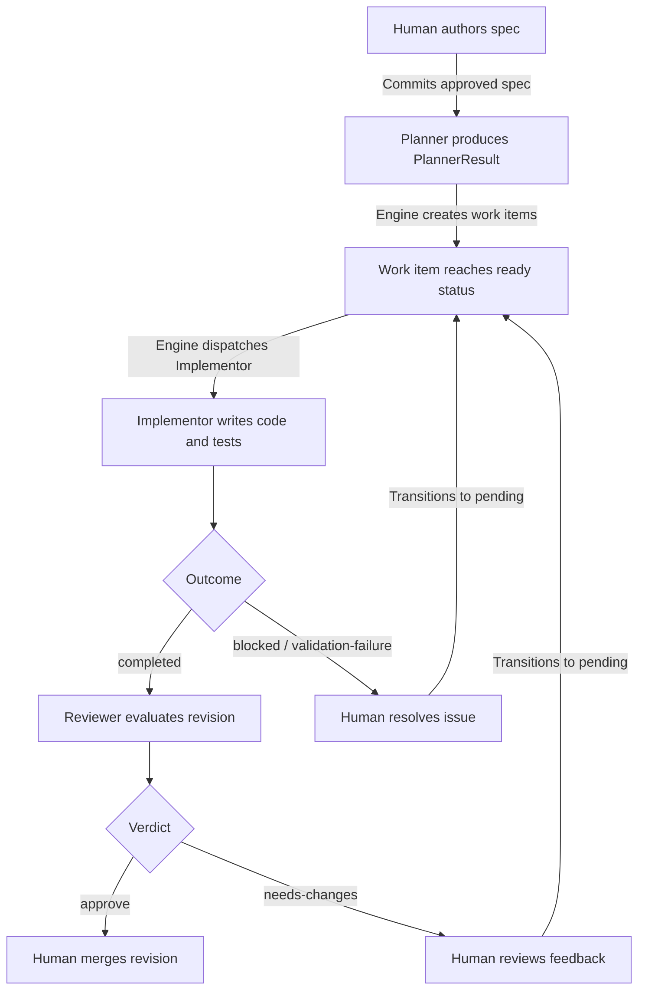
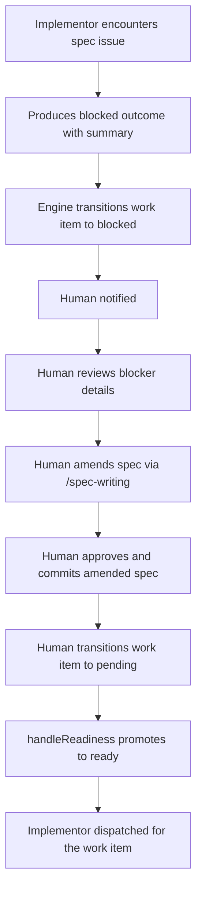
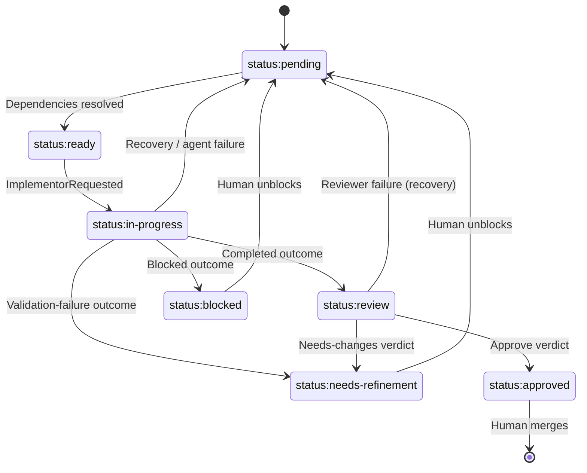

# Development Workflow

## Overview

System-level specification for the AI-led development workflow. Defines the principles, roles,
lifecycle, quality gates, and escalation protocol that govern how specifications are authored,
decomposed into work items, implemented, reviewed, and integrated. This document is the entry point
to the workflow system — individual component specs define agent behavior, engine mechanics, and
tooling in detail.

## Constraints

- All workflow state is tracked via work items (GitHub Issues) and status labels — no external
  tracking systems.
- Specifications are the source of truth for all implementation work.
- Only the Human can approve spec changes and merge code.
- Agents must not make interpretive decisions when specs are ambiguous — they must escalate.
- Each work item has exactly one label from each mutually exclusive category (type, status,
  priority, and complexity for `task:implement` work items).
- Status transitions follow the valid transition table — no skipping phases. Transitions are
  handler-mediated: the engine's handlers react to domain events and emit commands that drive status
  changes.
- Agents produce structured artifacts only — no direct GitHub operations, status transitions, or
  review posting. All external mutations are performed by the engine's CommandExecutor.

## Specification

### Principles

1. **Spec is source of truth** — Implementation conforms to spec. When they conflict, work stops
   until the spec is amended or clarification is provided.
2. **Human authority** — Only humans approve spec changes and merge code. Agents propose; humans
   decide.
3. **Clarify, don't assume** — When requirements are ambiguous or incomplete, agents escalate rather
   than interpret. Any assumption made must be documented and fed back into the spec.
4. **Correctness over speed** — Accuracy to spec takes priority over velocity. A correct
   implementation delivered later is better than a flawed one delivered sooner.
5. **Testability is required** — Acceptance criteria must be verifiable with observable outcomes. If
   it can't be tested, it must be rewritten.
6. **Consistency with codebase** — New code matches the patterns, style, and conventions of the
   existing codebase. When in doubt, follow precedent.
7. **Explain reasoning** — Agents document _why_ they made decisions, not just _what_ they did.

### Roles

#### Human

The final authority in the workflow. Responsible for:

- Authoring and approving specifications (using the `/spec-writing` skill)
- Dispatching work items for implementation (via the TUI)
- Merging approved revisions into the codebase
- Resolving escalations that agents cannot handle (ambiguity, priority conflicts, judgment calls)
- Unblocking work items that require human decision-making

Agents propose; the Human decides. No spec change, merge, or architectural decision is final without
Human approval.

#### Planner

Agent role that decomposes approved specifications into structured work item operations. Triggered
when spec files change with approved frontmatter status. Reviews existing work items for relevance,
assesses what work remains against the current codebase, and produces a `PlannerResult` containing
work items to create, close, and update with dependency ordering.

Does not perform any external mutations — the engine's CommandExecutor processes the
`PlannerResult`.

See `agent-planner.md` for full behavior specification.

#### Implementor

Agent role that executes assigned work items. Reads the work item body and referenced spec, writes
code and tests within declared scope, and produces an `ImplementorResult` with an outcome
(`completed`, `blocked`, or `validation-failure`), a summary, and a patch artifact (when completed).
Works on exactly one work item at a time; parallelism is achieved by running multiple Implementor
instances.

Does not perform any GitHub operations — no branch pushing, revision creation, status transitions,
or comments. All external mutations are performed by the engine after processing the agent's result.

See `agent-implementor.md` for full behavior specification.

#### Reviewer

Agent role that reviews completed work before integration. Checks acceptance criteria, evaluates
code quality and spec conformance, and confirms scope compliance. Produces a `ReviewerResult`
containing a verdict (`approve` or `needs-changes`), a summary, and line-level comments.

Does not post reviews or transition status — the engine's CommandExecutor processes the
`ReviewerResult`, posts the review to the revision, and transitions the work item status based on
the verdict.

See `agent-reviewer.md` for full behavior specification.

#### Authority Model

The Human has final authority over all decisions. Agents operate autonomously within their defined
scope but cannot override each other or the Human. When agents encounter decisions outside their
scope, they escalate rather than act.

### Lifecycle

The workflow operates in five phases. Each phase has a primary role, a trigger, and a defined output
that feeds the next phase.

| Phase         | Primary Role | Trigger                                              | Output                                                          |
| ------------- | ------------ | ---------------------------------------------------- | --------------------------------------------------------------- |
| **Spec**      | Human        | Feature request, identified gap, or amendment needed | Approved spec committed to `docs/specs/`                        |
| **Plan**      | Planner      | Spec committed or updated with approved frontmatter  | `PlannerResult` — work items to create, close, and update       |
| **Implement** | Implementor  | Work item reaches `ready` status                     | `ImplementorResult` — outcome, patch artifact, and summary      |
| **Review**    | Reviewer     | Revision pipeline status transitions to `success`    | `ReviewerResult` — verdict with summary and line-level comments |
| **Integrate** | Human        | Work item has `status:approved`                      | Revision merged, work item closed                               |

Handoffs between phases are mediated by engine handlers reacting to domain events: spec file commits
trigger planning via `handlePlanning`, work items reaching `ready` status trigger implementation via
`handleImplementation`, revision pipeline success triggers review via `handleReview`, and the Human
can manually dispatch agents via `handleUserDispatch` (e.g., `UserRequestedImplementorRun` from the
TUI). The Human is also the manual bridge for unblocking work items and merging approved revisions.

See [control-plane-engine-handlers.md](./control-plane-engine-handlers.md) for handler dispatch
logic.

Feedback loops exist at two points:

- **Review rejection:** Engine transitions work item to `needs-refinement`. Human reviews the
  feedback and transitions the work item to `pending` via the TUI. `handleReadiness` promotes it to
  `ready`, and a new Implementor run addresses the feedback.
- **Implementation blocker:** Engine transitions work item to `blocked` or `needs-refinement` based
  on the Implementor's outcome. Human resolves the issue (amends the spec, removes the external
  blocker) and transitions the work item to `pending` via the TUI. `handleReadiness` promotes it to
  `ready` for re-dispatch.

#### Standard Flow

#### Spec Amendment Flow

When an Implementor encounters a spec issue (ambiguity, contradiction, or gap) during
implementation:

1. Implementor stops work on the affected work item.
2. Implementor produces a `blocked` outcome with a summary describing the spec reference, options,
   and a recommendation.
3. Engine transitions the work item to `blocked` and includes the summary in the work item update.
4. Human is notified of the blocked work item.
5. Human reviews the blocker details and uses the `/spec-writing` skill to draft a spec amendment.
   The Human provides: (a) the spec file path from the blocker summary's Spec Reference, (b) the
   work item URL so the spec-writing session can read the blocker's Options and Recommendation, and
   (c) the specific section that needs amendment.
6. Human approves and commits the amended spec.
7. Human transitions the work item to `pending` via the TUI.
8. `handleReadiness` promotes the work item to `ready`, and `handleImplementation` dispatches a new
   Implementor run.

#### Work Item Status Transitions

Work item status is tracked via mutually exclusive `status:*` labels. The valid transitions are:

| From                      | To                        | Triggered By                                                                  |
| ------------------------- | ------------------------- | ----------------------------------------------------------------------------- |
| `status:pending`          | `status:ready`            | `handleReadiness` or `handleDependencyResolution` — all `blockedBy` resolved  |
| `status:ready`            | `status:in-progress`      | `handleImplementation` — reacts to `ImplementorRequested` event               |
| `status:in-progress`      | `status:review`           | `ApplyImplementorResult` — `completed` outcome, revision created from patch   |
| `status:in-progress`      | `status:blocked`          | `ApplyImplementorResult` — `blocked` outcome                                  |
| `status:in-progress`      | `status:needs-refinement` | `ApplyImplementorResult` — `validation-failure` outcome                       |
| `status:in-progress`      | `status:pending`          | `handleOrphanedWorkItem` (recovery) or `handleImplementation` (agent failure) |
| `status:review`           | `status:approved`         | `ApplyReviewerResult` — `approve` verdict                                     |
| `status:review`           | `status:needs-refinement` | `ApplyReviewerResult` — `needs-changes` verdict                               |
| `status:review`           | `status:pending`          | `handleReview` — reviewer agent failure (recovery)                            |
| `status:needs-refinement` | `status:pending`          | Human transitions via TUI (`UserTransitionedStatus`)                          |
| `status:blocked`          | `status:pending`          | Human transitions via TUI (`UserTransitionedStatus`)                          |

All status transitions are handler-mediated — handlers react to domain events and emit commands that
the CommandExecutor translates into provider operations. Agents do not perform status transitions
directly.

> **Rationale:** Reactive status transitions prevent status drift when commands are rejected by
> concurrency guards or policy. The work item remains in its current status until the engine
> confirms the operation was accepted. `pending` and `ready` are distinct states — work items must
> pass a readiness check (`handleReadiness`) before entering the dispatch pool. Recovery transitions
> always return to `pending`, forcing a readiness check before re-dispatch.

The `UserTransitionedStatus` event allows the Human to manually transition work items via the TUI.
The standard use cases are unblocking work items (`blocked` → `pending`, `needs-refinement` →
`pending`). The event itself is unconstrained — the Human can attempt any transition, subject to the
CommandExecutor's concurrency guards and policy gate.

`closed` is not a label-based status — it is derived from the GitHub issue state when the Human
closes the issue after merging the revision. The engine does not mediate this transition; the
"Integrate to Complete" quality gate defines the conditions.

This table is the normative home for status transitions.

### Quality Gates

Quality gates define what must be true before transitioning between phases. A transition is invalid
if any gate is not satisfied.

#### Spec to Plan

- Spec frontmatter `status` is `approved`
- All acceptance criteria are testable (observable outcomes)
- Spec is committed to the repository
- No existing work items with `needs-refinement` status reference this spec

#### Plan to Implement

- Work item exists with all required sections (Objective, Spec Reference, Scope, Acceptance
  Criteria)
- Referenced spec is `approved`
- Scope boundaries are explicit (In Scope / Out of Scope)
- Dependencies documented via `blockedBy` references
- Priority label assigned
- Blocking work items (referenced in `blockedBy`) are in terminal status (`closed` or `approved`)

> **Rationale:** Two complementary handlers automate dependency resolution. `handleReadiness`
> promotes newly-pending work items to `ready` when their `blockedBy` list is already satisfied.
> `handleDependencyResolution` promotes already-pending work items when their last blocker reaches
> terminal status. Together they ensure work items only enter the dispatch pool when all
> dependencies are satisfied.

#### Implement to Review

- All acceptance criteria addressed
- Tests pass locally
- Revision created from patch and linked to work item
- Changes are within declared scope or qualify as incidental (minimal, directly required by in-scope
  changes, non-behavioral — see `agent-implementor.md` for full definition)

#### Review to Integrate

- All acceptance criteria verified by Reviewer
- Code quality and spec conformance confirmed
- No unresolved review comments
- `status:approved` label applied (via `ApplyReviewerResult` with `approve` verdict)
- Review posted to revision confirming the approval

#### Integrate to Complete

- Revision merged to main
- Work item closed
- No broken builds or failing tests on main

### Escalation Protocol

#### When to Escalate

Agents must escalate when they encounter any of the following:

1. **Spec issue** — Ambiguity, contradiction, or gap in the specification
2. **Scope conflict** — Work item requires changes outside declared scope
3. **Dependency conflict** — Two work items need to modify the same code
4. **Technical constraint** — Implementation is impossible or impractical as specified
5. **External blocker** — Waiting on an external system, API, or third party
6. **Priority conflict** — Unclear which work item takes precedence
7. **Judgment call** — Decision requires human input (architectural, UX, business logic)

#### Routing

All escalations are directed to the Human. The Human decides how to resolve:

- **Spec issues** → Human uses `/spec-writing` to amend the spec
- **Scope/dependency conflicts** → Human adjusts work item scope or sequencing
- **Technical constraints** → Human decides whether to change the spec or accept the constraint
- **External blockers** → Human coordinates with the external party
- **Priority/judgment calls** → Human makes the decision

#### Blocker vs. Escalation

Agents report issues through their structured output:

- **Blocker** — Prevents further progress on the current work item. The agent produces a structured
  result with an appropriate outcome (`blocked` or `validation-failure`) and a summary describing
  the issue. The engine handles status transitions and work item updates. See `agent-implementor.md`
  for blocker handling and outcome semantics.
- **Escalation** — Does not prevent progress on the current work item but needs Human attention
  (e.g., scope conflict with another work item, priority question). The agent notes the issue in its
  summary and continues working.

### Artifacts

| Artifact      | Location                          | Created By                  | Format Defined In       |
| ------------- | --------------------------------- | --------------------------- | ----------------------- |
| Specification | `docs/specs/*.md`                 | Human (via `/spec-writing`) | `skill-spec-writing.md` |
| Work Item     | GitHub Issues                     | Engine (from PlannerResult) | `workflow-contracts.md` |
| Revision      | GitHub PRs                        | Engine (from patch)         | N/A                     |
| Plan          | PlannerResult (structured output) | Planner                     | `agent-planner.md`      |

Work items are created by the engine's CommandExecutor when processing the Planner's
`PlannerResult`. Revisions are created by the engine when processing the Implementor's
`ImplementorResult` (completed outcome with patch artifact).

#### Labels

Work items use four mutually exclusive label categories. A work item has exactly one label from each
applicable category. Complexity is assigned to `task:implement` work items only; `task:refinement`
work items do not receive a complexity label.

| Category   | Labels                                                                                                                                  | Applies To            | Defined In              |
| ---------- | --------------------------------------------------------------------------------------------------------------------------------------- | --------------------- | ----------------------- |
| Type       | `task:implement` (implementation work), `task:refinement` (spec clarification needed — created by Planner when spec is ambiguous)       | All work items        | `script-label-setup.md` |
| Status     | `status:pending`, `status:ready`, `status:in-progress`, `status:blocked`, `status:needs-refinement`, `status:review`, `status:approved` | All work items        | `script-label-setup.md` |
| Priority   | `priority:high`, `priority:medium`, `priority:low`                                                                                      | All work items        | `script-label-setup.md` |
| Complexity | `complexity:trivial`, `complexity:low`, `complexity:medium`, `complexity:high`                                                          | `task:implement` only | `script-label-setup.md` |

`task:refinement` work items are created by the Planner when spec ambiguity prevents task
decomposition. They are informational — they signal to the Human that a spec needs clarification.
Refinement work items do not flow through the Implement or Review phases. The Human resolves the
ambiguity (via `/spec-writing`), and the next Planner run closes the refinement work item if the
ambiguity is addressed.

Label definitions (names, descriptions, colors) and the setup script are specified in
`script-label-setup.md`.

## Acceptance Criteria

### Lifecycle

- [ ] Given a new specification with `status: approved`, when committed to `docs/specs/`, then
      `handlePlanning` dispatches a Planner run that produces a `PlannerResult` with work items for
      unsatisfied acceptance criteria.
- [ ] Given a work item created from a `PlannerResult`, when inspected, then it has exactly one type
      label, one status label, and one priority label.
- [ ] Given a work item that reaches `ready` status, when `handleImplementation` dispatches an
      Implementor, then the work item transitions to `status:in-progress` only after the
      `ImplementorRequested` event confirms the run was accepted.
- [ ] Given an Implementor that produces a `completed` outcome, when the engine processes the
      `ImplementorResult`, then a revision is created from the patch and the work item transitions
      to `status:review`.
- [ ] Given a Reviewer that produces an `approve` verdict, when the engine processes the
      `ReviewerResult`, then the work item transitions to `status:approved` and the Human can merge
      the revision.

### Quality Gates

- [ ] Given a spec without `status: approved`, when the Planner validates pre-planning gates, then
      it skips that spec with a gate failure report.
- [ ] Given a work item missing a required section (Objective, Spec Reference, Scope, or Acceptance
      Criteria), when the Implementor validates inputs, then it produces a `validation-failure`
      outcome. The Reviewer handles missing sections as warnings within its review checklist and
      continues.
- [ ] Given a work item without `status:approved`, when the Human attempts to integrate, then the
      quality gate from Review to Integrate is not satisfied.

### Status Transitions

- [ ] Given any status transition, when inspected, then it was performed by the engine's
      CommandExecutor in response to a handler-emitted command — not by an agent directly.
- [ ] Given a work item with `status:pending` and all `blockedBy` dependencies in terminal status,
      when `handleReadiness` runs, then the work item transitions to `status:ready`.
- [ ] Given a work item with `status:pending` and unresolved `blockedBy` dependencies, when
      `handleReadiness` runs, then the work item remains in `status:pending`.
- [ ] Given a work item with `status:in-progress` and no active agent run, when a `WorkItemChanged`
      event is processed, then `handleOrphanedWorkItem` transitions the work item to
      `status:pending`.
- [ ] Given a work item with `status:needs-refinement`, when the Human transitions it to `pending`
      via the TUI, then `handleReadiness` re-evaluates the work item for dispatch eligibility.

### Escalation

- [ ] Given an Implementor that encounters a spec ambiguity, when it produces its structured output,
      then the outcome is `blocked` with a summary describing options and a recommendation, and the
      engine transitions the work item to `status:blocked`.
- [ ] Given an Implementor that encounters a non-blocking issue (e.g., scope conflict with another
      work item), when it produces its structured output, then the issue is noted in the summary and
      the outcome reflects continued progress.

### Roles

- [ ] Given any spec change in the workflow, when inspected, then it was approved by the Human
      before being committed.
- [ ] Given any revision merge, when inspected, then it was performed by the Human (not an agent).
- [ ] Given the Planner produces a `PlannerResult`, when inspected, then no work items have been
      assigned to an Implementor by the Planner — dispatch is the engine's responsibility based on
      status transitions.

## Dependencies

- `agent-planner.md` — Planner agent behavior specification
- `agent-implementor.md` — Implementor agent behavior specification
- `agent-reviewer.md` — Reviewer agent behavior specification
- `control-plane-engine-handlers.md` — Handler catalog (dispatch logic, status transitions)
- `control-plane-engine-command-executor.md` — Command execution (provider operations, concurrency
  guards, policy gate)
- `skill-spec-writing.md` — Spec authoring skill and template
- `script-label-setup.md` — Label definitions and setup script
- `CLAUDE.md` — Code style, naming conventions, and project patterns

## References

- `docs/specs/decree/domain-model.md` — Domain model, handler catalog, agent role contracts
- `docs/specs/decree/agent-planner.md`
- `docs/specs/decree/agent-implementor.md`
- `docs/specs/decree/agent-reviewer.md`
- `docs/specs/decree/control-plane-engine-handlers.md`
- `docs/specs/decree/control-plane-engine-command-executor.md`
- `docs/specs/decree/skill-spec-writing.md`
- `docs/specs/decree/script-label-setup.md`
