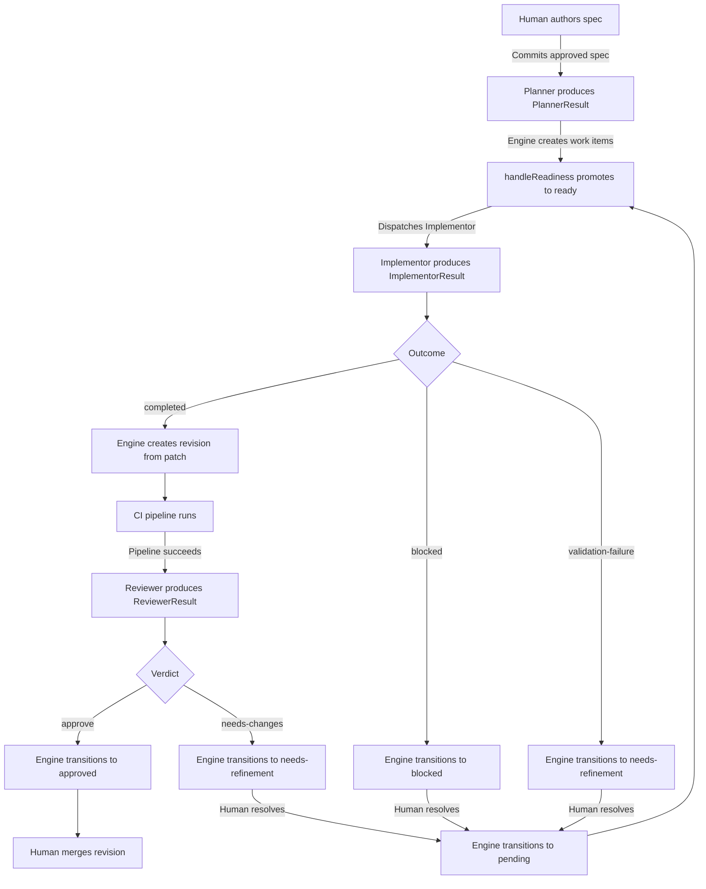
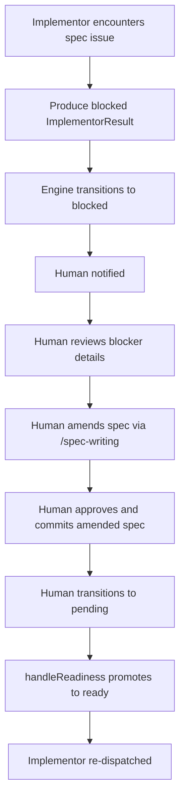
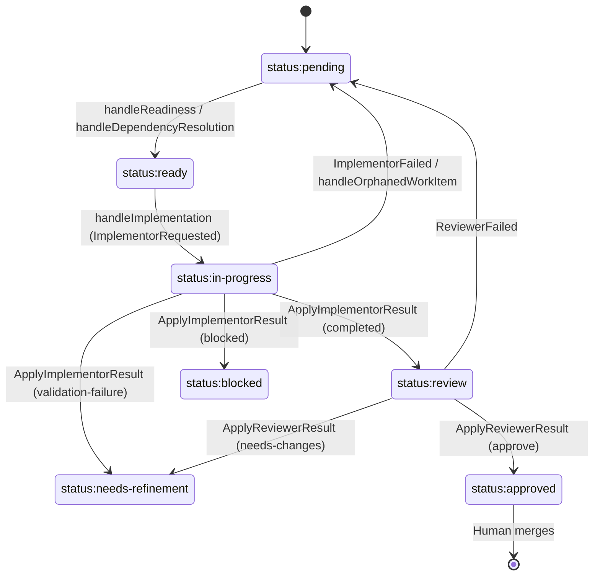

# Development Workflow

## Overview

System-level specification for the AI-led development workflow. Defines the principles, roles,
lifecycle, quality gates, and escalation protocol that govern how specifications are authored,
decomposed into work items, implemented, reviewed, and integrated. This document is the entry point
to the workflow system — individual component specs define agent behavior, engine operations, and
tooling in detail.

## Constraints

- All workflow state is tracked via work items and labels on the work-tracking provider — no
  external tracking systems
- Specifications are the source of truth for all implementation work
- Only the Human can approve spec changes and merge code
- Agents must not make interpretive decisions when specs are ambiguous — they must escalate
- Agents produce structured artifacts only — all external mutations (work item status transitions,
  revision creation, review posting) are performed by the engine's CommandExecutor
- Each work item has exactly one label from each mutually exclusive category (type, status,
  priority, and complexity for `task:implement` work items)
- Status transitions must follow the valid transition table — no skipping phases
- Status transitions are reactive — handlers transition status in response to agent lifecycle
  events, not on dispatch

## Specification

### Principles

1. **Spec is source of truth** — Implementation conforms to spec. When they conflict, work stops
   until the spec is amended or clarification is provided.
2. **Human authority** — Only humans approve spec changes and merge code. Agents propose; humans
   decide.
3. **Clarify, don't assume** — When requirements are ambiguous or incomplete, agents escalate rather
   than interpret. Any assumption made must be documented and fed back into the spec.
4. **Correctness over speed** — Accuracy to spec takes priority over velocity. A correct
   implementation delivered later is better than a flawed one delivered sooner.
5. **Testability is required** — Acceptance criteria must be verifiable with observable outcomes. If
   it can't be tested, it must be rewritten.
6. **Consistency with codebase** — New code matches the patterns, style, and conventions of the
   existing codebase. When in doubt, follow precedent.
7. **Explain reasoning** — Agents document _why_ they made decisions, not just _what_ they did.

### Roles

#### Human

The final authority in the workflow. Responsible for:

- Authoring and approving specifications (using the `/spec-writing` skill)
- Merging approved revisions into the codebase
- Resolving escalations that agents cannot handle (ambiguity, priority conflicts, judgment calls)
- Unblocking work items that require human decision-making

Agents propose; the Human decides. No spec change, merge, or architectural decision is final without
Human approval.

#### Planner

Agent role that analyzes approved specifications and decomposes work into structured work item
operations. Triggered when a spec is committed or updated. Reviews existing work items for
relevance, assesses what work remains against the current codebase, and produces a `PlannerResult`
containing work items to create, close, and update with dependency ordering via `tempID` references.

The Planner does not perform any external mutations — it produces structured output only. The
engine's CommandExecutor processes the `ApplyPlannerResult` command to create, close, and update
work items.

See `agent-planner.md` for full behavior specification.

#### Implementor

Agent role that executes assigned work items. Reads the work item body and referenced spec, writes
code and tests within declared scope, and surfaces blockers when it cannot proceed. Works on exactly
one work item at a time; parallelism is achieved by running multiple Implementor instances.

The Implementor does not push branches, open revisions, post comments, or change work item status.
It produces an `ImplementorResult` with a three-way outcome (`completed`, `blocked`,
`validation-failure`). The engine's CommandExecutor handles all downstream operations — creating
revisions from patches and transitioning status.

Does not make interpretive decisions — escalates ambiguity instead.

See `agent-implementor.md` for full behavior specification.

#### Reviewer

Agent role that reviews completed work before integration. Checks acceptance criteria, evaluates
code quality and spec conformance, and confirms scope compliance. Produces a `ReviewerResult`
containing a structured verdict (`approve` or `needs-changes`), a summary, and optional line-level
comments.

The Reviewer does not post reviews, transition statuses, or merge code. The engine's CommandExecutor
posts the review to the revision and transitions work item status based on the verdict.

See `agent-reviewer.md` for full behavior specification.

#### Authority Model

The Human has final authority over all decisions. Agents operate autonomously within their defined
scope but cannot override each other or the Human. When agents encounter decisions outside their
scope, they escalate rather than act.

### Lifecycle

The workflow operates in five phases. Each phase has a primary role, a trigger, and a defined output
that feeds the next phase.

| Phase         | Primary Role | Trigger                                                    | Output                                                             |
| ------------- | ------------ | ---------------------------------------------------------- | ------------------------------------------------------------------ |
| **Spec**      | Human        | Feature request, identified gap, or amendment needed       | Approved spec committed to `docs/specs/`                           |
| **Plan**      | Planner      | Spec committed or updated with approved frontmatter status | `PlannerResult` containing work items to create, close, and update |
| **Implement** | Implementor  | Work item transitions to `ready` status                    | `ImplementorResult` with patch artifact                            |
| **Review**    | Reviewer     | Linked revision's pipeline status transitions to `success` | `ReviewerResult` with structured verdict                           |
| **Integrate** | Human        | Work item has `status:approved`                            | Revision merged, work item closed                                  |

Handoffs between phases are mediated by handler-driven state changes. The `handlePlanning` handler
dispatches the Planner when approved specs change. The `handleImplementation` handler dispatches the
Implementor when work items reach `ready` status. The `handleReview` handler dispatches the Reviewer
when a linked revision's CI pipeline succeeds. Each handler produces domain commands that the
CommandExecutor translates into provider operations. The Human is the manual bridge for merging
(Review to Integrate).

Dependency resolution is automated: the `handleReadiness` handler promotes work items from `pending`
to `ready` when their `blockedBy` list is empty, and the `handleDependencyResolution` handler
promotes pending work items when their last blocker reaches a terminal status (`closed` or
`approved`).

Feedback loops exist at two points:

- **Review rejection:** Reviewer produces a `needs-changes` verdict, engine transitions the work
  item to `needs-refinement`. When the Human resolves the issue and the work item returns to
  `ready`, the Implementor is re-dispatched with the prior review history in its enriched prompt.
- **Spec issue:** Implementor produces a `blocked` outcome with a spec blocker description. The
  engine transitions the work item to `blocked`. The Human amends the spec and transitions the work
  item back to `pending`, which feeds through `handleReadiness` for re-dispatch.

#### Standard Flow

#### Spec Amendment Flow

When an Implementor encounters a spec issue (ambiguity, contradiction, or gap) during
implementation:

1. Implementor stops work on the affected work item.
2. Implementor produces a `blocked` outcome in its `ImplementorResult`, with a summary containing
   the blocker type, spec reference, options, and recommendation.
3. The engine's CommandExecutor processes the `ApplyImplementorResult` — transitions the work item
   to `blocked` status.
4. Human is notified of the blocked work item.
5. Human reviews the blocker details and uses the `/spec-writing` skill to draft a spec amendment.
   The Human provides: (a) the spec file path from the blocker summary's Spec Reference, (b) the
   work item URL so the spec-writing session can read the blocker's Options and Recommendation, and
   (c) the specific section that needs amendment. The `/spec-writing` skill handles the structured
   authoring process; the Human's role is to supply the right context from the blocker.
6. Human approves and commits the amended spec.
7. Human transitions the work item status back to `pending` (via the TUI or directly).
8. The `handleReadiness` handler checks `blockedBy` and promotes to `ready` if eligible.
9. Implementor is re-dispatched with the updated spec context.

#### Work Item Status Transitions

Work item status is tracked via mutually exclusive `status:*` labels. The valid transitions are:

| From                 | To                        | Triggered By                                                                     |
| -------------------- | ------------------------- | -------------------------------------------------------------------------------- |
| `status:pending`     | `status:ready`            | `handleReadiness` when `blockedBy` is empty                                      |
| `status:pending`     | `status:ready`            | `handleDependencyResolution` when last blocker reaches terminal status           |
| `status:ready`       | `status:in-progress`      | `handleImplementation` in response to `ImplementorRequested`                     |
| `status:in-progress` | `status:review`           | CommandExecutor processes `ApplyImplementorResult` with `completed` outcome      |
| `status:in-progress` | `status:blocked`          | CommandExecutor processes `ApplyImplementorResult` with `blocked` outcome        |
| `status:in-progress` | `status:needs-refinement` | CommandExecutor processes `ApplyImplementorResult` with `validation-failure`     |
| `status:in-progress` | `status:pending`          | `handleImplementation` in response to `ImplementorFailed` (recovery)             |
| `status:in-progress` | `status:pending`          | `handleOrphanedWorkItem` detects orphaned in-progress work item (crash recovery) |
| `status:review`      | `status:approved`         | CommandExecutor processes `ApplyReviewerResult` with `approve` verdict           |
| `status:review`      | `status:needs-refinement` | CommandExecutor processes `ApplyReviewerResult` with `needs-changes` verdict     |
| `status:review`      | `status:pending`          | `handleReview` in response to `ReviewerFailed` (recovery)                        |

All transitions are mediated by engine handlers or the CommandExecutor. Agents do not perform status
transitions directly — they produce structured results that the engine processes.

The `handleUserDispatch` handler translates user actions (`UserTransitionedStatus`) into
`TransitionWorkItemStatus` commands, allowing the Human to manually transition status through the
TUI (e.g., moving a `blocked` work item back to `pending` after resolving the blocker).

### Quality Gates

Quality gates define what must be true before transitioning between phases. A transition is invalid
if any gate is not satisfied.

#### Spec to Plan

- Spec frontmatter `status` is `approved`
- All acceptance criteria are testable (observable outcomes)
- Spec is committed to the repository
- No existing work items with `needs-refinement` status reference this spec

#### Plan to Implement

- Work item exists with all required sections (Objective, Spec Reference, Scope, Acceptance
  Criteria)
- Referenced spec is `approved`
- Scope boundaries are explicit (In Scope / Out of Scope)
- Dependencies documented via `blockedBy` references
- Priority label assigned
- Blocking work items (referenced in `blockedBy`) are in terminal status (`closed` or `approved`) —
  enforced automatically by `handleReadiness` and `handleDependencyResolution`

#### Implement to Review

- All acceptance criteria addressed
- Tests pass locally
- Revision created from patch and linked to work item
- Changes are within declared scope or qualify as incidental (minimal, directly required by in-scope
  changes, non-behavioral — see `workflow-contracts.md` for Scope Enforcement Rules)

#### Review to Integrate

- All acceptance criteria verified by Reviewer
- Code quality and spec conformance confirmed
- No unresolved review comments
- `status:approved` label applied (canonical approval signal)
- Structured review posted to revision confirming the approval

#### Integrate to Complete

- Revision merged to main
- Work item closed
- No broken builds or failing tests on main

### Escalation Protocol

#### When to Escalate

Agents must escalate when they encounter any of the following:

1. **Spec issue** — Ambiguity, contradiction, or gap in the specification
2. **Scope conflict** — Work item requires changes outside declared scope
3. **Dependency conflict** — Two work items need to modify the same code
4. **Technical constraint** — Implementation is impossible or impractical as specified
5. **External blocker** — Waiting on an external system, API, or third party
6. **Priority conflict** — Unclear which work item takes precedence
7. **Judgment call** — Decision requires human input (architectural, UX, business logic)

#### Routing

All escalations are directed to the Human. The Human decides how to resolve:

- **Spec issues** — Human uses `/spec-writing` to amend the spec
- **Scope/dependency conflicts** — Human adjusts work item scope or sequencing
- **Technical constraints** — Human decides whether to change the spec or accept the constraint
- **External blockers** — Human coordinates with the external party
- **Priority/judgment calls** — Human makes the decision

#### Blocker vs. Escalation

Agents distinguish between two types of issues:

- **Blocker** — Prevents further progress on the current work item. Work stops immediately. The
  agent produces a structured result with the appropriate non-completed outcome (e.g.,
  `ImplementorResult` with `blocked` or `validation-failure` outcome), and the engine transitions
  the work item status accordingly. Blocker information is carried in the result's `summary` field.
  See `agent-implementor.md` for outcome semantics.
- **Escalation** — Does not prevent progress on the current work item but needs Human attention
  (e.g., scope conflict with another work item, priority question). The agent notes it in the
  structured result's summary and continues working. See `agent-implementor.md` for escalation
  handling.

### Artifacts

| Artifact      | Location                   | Created By                  | Template Defined In     |
| ------------- | -------------------------- | --------------------------- | ----------------------- |
| Specification | `docs/specs/*.md`          | Human (via `/spec-writing`) | `skill-spec-writing.md` |
| Work Item     | Work-tracking provider     | Planner (via engine)        | `workflow-contracts.md` |
| Revision      | Code-hosting provider      | Implementor (via engine)    | N/A                     |
| Plan          | Structured `PlannerResult` | Planner                     | `agent-planner.md`      |

The Plan is the `PlannerResult` artifact — a structured output containing work items to create,
close, and update. The CommandExecutor processes it into provider operations.

#### Labels

Work items use four mutually exclusive label categories. A work item has exactly one label from each
applicable category. Complexity is assigned to `task:implement` work items only; `task:refinement`
work items do not receive a complexity label.

| Category   | Labels                                                                                                                                                                                                             | Applies To            | Defined In              |
| ---------- | ------------------------------------------------------------------------------------------------------------------------------------------------------------------------------------------------------------------ | --------------------- | ----------------------- |
| Type       | `task:implement` (implementation work), `task:refinement` (spec clarification needed — created by Planner when spec is ambiguous)                                                                                  | All work items        | `script-label-setup.md` |
| Status     | `status:pending`, `status:ready`, `status:in-progress`, `status:blocked`, `status:needs-refinement`, `status:review`, `status:approved`                                                                            | All work items        | `script-label-setup.md` |
| Priority   | `priority:high`, `priority:medium`, `priority:low`                                                                                                                                                                 | All work items        | `script-label-setup.md` |
| Complexity | `complexity:trivial` (trivial changes, mechanical), `complexity:low` (single-file, simple logic), `complexity:medium` (multi-file, moderate coordination), `complexity:high` (multi-file, architecturally nuanced) | `task:implement` only | `script-label-setup.md` |

Label definitions (names, descriptions, colors) and the setup script are specified in
`script-label-setup.md`.

## Acceptance Criteria

### Lifecycle

- [ ] Given a new specification with `status: approved`, when committed to `docs/specs/`, then the
      `handlePlanning` handler dispatches the Planner and the Planner produces a `PlannerResult`
      with work items for unsatisfied acceptance criteria.
- [ ] Given a work item created by the Planner, when inspected, then it has exactly one type label,
      one status label, and one priority label.
- [ ] Given a work item that transitions to `ready`, when the `handleImplementation` handler runs,
      then the Implementor is dispatched and produces an `ImplementorResult`.
- [ ] Given an Implementor that completes work on a work item with a `completed` outcome, when the
      engine processes the `ApplyImplementorResult`, then a revision is created from the patch, and
      the work item transitions to `status:review`.
- [ ] Given a Reviewer that produces an `approve` verdict, when the engine processes the
      `ApplyReviewerResult`, then the work item transitions to `status:approved` and the Human can
      merge the revision and close the work item.

### Quality Gates

- [ ] Given a spec without `status: approved`, when the Planner is invoked, then it skips that spec
      with a gate failure report and continues processing remaining specs.
- [ ] Given a work item missing a required section (Objective, Spec Reference, Scope, or Acceptance
      Criteria), when the Implementor validates inputs, then it posts a validation failure and
      stops. The Reviewer handles missing sections as warnings within its review checklist and
      continues.
- [ ] Given a work item without `status:approved`, when the Human attempts to integrate, then the
      quality gate from Review to Integrate is not satisfied.

### Status Transitions

- [ ] Given any status transition, when inspected, then it matches one of the transitions in the
      valid transition table and was performed by a handler or the CommandExecutor.
- [ ] Given a work item with `status:in-progress`, when the Implementor produces a `blocked`
      outcome, then the engine transitions the status to `status:blocked`.
- [ ] Given a work item with `status:in-progress`, when the Implementor produces a
      `validation-failure` outcome, then the engine transitions the status to
      `status:needs-refinement`.
- [ ] Given a work item with `status:pending` and empty `blockedBy`, when `handleReadiness` runs,
      then the work item transitions to `status:ready`.

### Escalation

- [ ] Given an agent that encounters a spec ambiguity, when it produces its structured result, then
      the result carries a non-completed outcome with a summary containing the blocker type,
      description, options, and recommendation, and the engine transitions the status accordingly.
- [ ] Given an agent that encounters a non-blocking issue (e.g., scope conflict with another work
      item), when it produces its structured result, then the summary notes the issue and work
      continues with a completed or appropriate outcome.

### Roles

- [ ] Given any spec change in the workflow, when inspected, then it was approved by the Human
      before being committed.
- [ ] Given any revision merge, when inspected, then it was performed by the Human (not an agent).
- [ ] Given the Planner produces a `PlannerResult`, when inspected, then no work items have been
      directly created by the Planner — the engine's CommandExecutor processes the result into
      provider operations.
- [ ] Given any agent execution, when inspected, then the agent has not performed any external
      mutations — all mutations were performed by the engine's CommandExecutor.

## Known Limitations

- **Single provider** — Only one work-tracking provider implementation (GitHub) is built. The
  provider abstraction supports future multi-provider integration without engine changes.

## Dependencies

- `agent-planner.md` — Planner agent behavior specification
- `agent-implementor.md` — Implementor agent behavior specification
- `agent-reviewer.md` — Reviewer agent behavior specification
- `workflow-contracts.md` — Shared data formats (work item templates, scope enforcement rules)
- `skill-spec-writing.md` — Spec authoring skill and template
- `script-label-setup.md` — Label definitions and setup script
- `control-plane-engine-handlers.md` — Handler catalog (dispatch behavior, status transitions)
- `002-architecture.md` — Domain model (WorkItemStatus, Priority, Complexity), agent role contracts
- `CLAUDE.md` — Code style, naming conventions, and project patterns

## References

- `docs/specs/decree/agent-planner.md`
- `docs/specs/decree/agent-implementor.md`
- `docs/specs/decree/agent-reviewer.md`
- `docs/specs/decree/workflow-contracts.md`
- `docs/specs/decree/skill-spec-writing.md`
- `docs/specs/decree/script-label-setup.md`
- `docs/specs/decree/control-plane-engine-handlers.md`
- `docs/specs/decree/v2/002-architecture.md`
