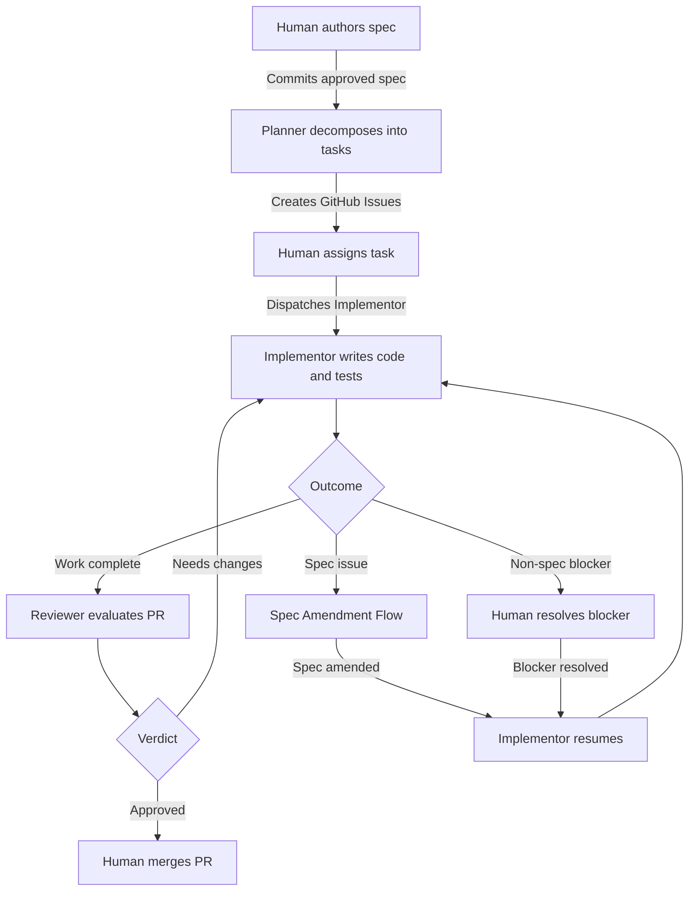
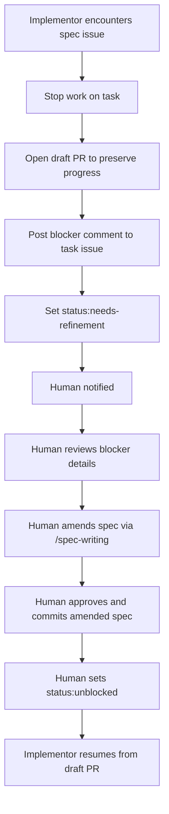
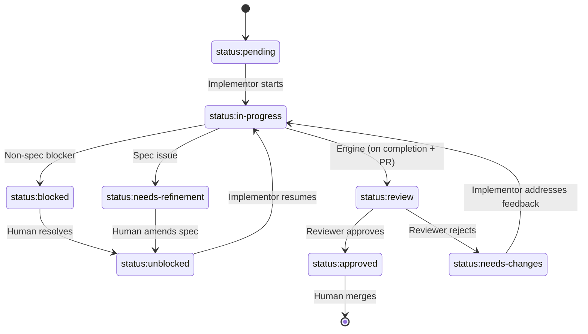

# Development Workflow

## Overview

System-level specification for the AI-led development workflow. Defines the principles, roles,
lifecycle, quality gates, and escalation protocol that govern how specifications are authored,
decomposed into tasks, implemented, reviewed, and integrated. This document is the entry point to
the workflow system — individual component specs define agent behavior, GitHub operations, and
tooling in detail.

## Constraints

- All workflow state is tracked via GitHub Issues and labels — no external tracking systems
- Specifications are the source of truth for all implementation work
- Only the Human can approve spec changes and merge code
- Agents must not make interpretive decisions when specs are ambiguous — they must escalate
- Each task issue has exactly one label from each mutually exclusive category (type, status,
  priority, and complexity for `task:implement` issues)
- Status transitions must follow the valid transition table — no skipping phases

## Specification

### Principles

1. **Spec is source of truth** — Implementation conforms to spec. When they conflict, work stops
   until the spec is amended or clarification is provided.
2. **Human authority** — Only humans approve spec changes and merge code. Agents propose; humans
   decide.
3. **Clarify, don't assume** — When requirements are ambiguous or incomplete, agents escalate rather
   than interpret. Any assumption made must be documented and fed back into the spec.
4. **Correctness over speed** — Accuracy to spec takes priority over velocity. A correct
   implementation delivered later is better than a flawed one delivered sooner.
5. **Testability is required** — Acceptance criteria must be verifiable with observable outcomes. If
   it can't be tested, it must be rewritten.
6. **Consistency with codebase** — New code matches the patterns, style, and conventions of the
   existing codebase. When in doubt, follow precedent.
7. **Explain reasoning** — Agents document _why_ they made decisions, not just _what_ they did.

### Roles

#### Human

The final authority in the workflow. Responsible for:

- Authoring and approving specifications (using the `/spec-writing` skill)
- Assigning tasks to Implementors
- Merging approved PRs into the codebase
- Resolving escalations that agents cannot handle (ambiguity, priority conflicts, judgment calls)
- Unblocking tasks that require human decision-making

Agents propose; the Human decides. No spec change, merge, or architectural decision is final without
Human approval.

#### Planner

Agent that decomposes approved specifications into executable GitHub Issues. Triggered when a spec
is committed or updated. Reviews existing issues for relevance, creates well-scoped tasks with
dependencies and priority, and closes stale issues.

Does not assign tasks — that is the Human's responsibility.

See `agent-planner.md` for full behavior specification.

#### Implementor

Agent that executes assigned tasks. Reads the task issue and referenced spec, writes code and tests
within declared scope, and surfaces blockers when it cannot proceed. Works on exactly one task at a
time; parallelism is achieved by running multiple Implementor instances.

Does not make interpretive decisions — escalates ambiguity instead.

See `agent-implementor.md` for full behavior specification.

#### Reviewer

Agent that reviews completed work before integration. Checks acceptance criteria, evaluates code
quality and spec conformance, and confirms scope compliance. Approves work for Human integration or
rejects with actionable feedback.

Does not merge — approval means setting `status:approved`. The Human performs the merge.

See `agent-reviewer.md` for full behavior specification.

#### Authority Model

The Human has final authority over all decisions. Agents operate autonomously within their defined
scope but cannot override each other or the Human. When agents encounter decisions outside their
scope, they escalate rather than act.

### Lifecycle

The workflow operates in five phases. Each phase has a primary role, a trigger, and a defined output
that feeds the next phase.

| Phase         | Primary Role | Trigger                                                       | Output                                                |
| ------------- | ------------ | ------------------------------------------------------------- | ----------------------------------------------------- |
| **Spec**      | Human        | Feature request, identified gap, or amendment needed          | Approved spec committed to `docs/specs/`              |
| **Plan**      | Planner      | Spec committed or updated                                     | GitHub Issues with labels, dependencies, and priority |
| **Implement** | Implementor  | Human assigns a task                                          | PR linked to task issue                               |
| **Review**    | Reviewer     | Engine dispatches after Implementor completion + non-draft PR | Approval or rejection with feedback                   |
| **Integrate** | Human        | Task has `status:approved`                                    | PR merged, issue closed                               |

Handoffs between phases are mediated by state changes: spec file commits trigger planning,
Implementor completion triggers review (via engine dispatch when a non-draft PR exists), and
approval labels signal readiness for integration. The Human is the manual bridge for task assignment
(Plan → Implement) and merging (Review → Integrate).

The mechanism for detecting state changes and invoking agents (polling, webhooks, manual invocation)
is outside the scope of this spec.

Feedback loops exist at two points:

- **Review rejection:** Reviewer sets `status:needs-changes`, Implementor addresses feedback and
  resubmits.
- **Spec issue:** Implementor sets `status:needs-refinement`, Human amends the spec, task is
  unblocked and Implementor resumes.

#### Standard Flow

#### Spec Amendment Flow

When an Implementor encounters a spec issue (ambiguity, contradiction, or gap) during
implementation:

1. Implementor stops work on the affected task.
2. Implementor opens a draft PR to preserve progress.
3. Implementor adds a blocker comment to the task issue with the spec reference, options, and a
   recommendation.
4. Implementor sets the task label to `status:needs-refinement`.
5. Human is notified of the blocked task.
6. Human reviews the blocker details and uses the `/spec-writing` skill to draft a spec amendment.
   The Human provides: (a) the spec file path from the blocker comment's Spec Reference, (b) the
   issue URL so the spec-writing session can read the blocker's Options and Recommendation, and (c)
   the specific section that needs amendment. The `/spec-writing` skill handles the structured
   authoring process; the Human's role is to supply the right context from the blocker.
7. Human approves and commits the amended spec.
8. Human sets the task label to `status:unblocked`.
9. Implementor resumes from the draft PR with the updated spec.

#### Task Status Transitions

Task status is tracked via mutually exclusive `status:*` labels on GitHub Issues. The valid
transitions are:

| From                      | To                        | Triggered By                                                      |
| ------------------------- | ------------------------- | ----------------------------------------------------------------- |
| `status:pending`          | `status:in-progress`      | Implementor starts work                                           |
| `status:in-progress`      | `status:review`           | Engine sets after Implementor completion when non-draft PR exists |
| `status:in-progress`      | `status:blocked`          | Implementor hits non-spec blocker                                 |
| `status:in-progress`      | `status:needs-refinement` | Implementor hits spec issue                                       |
| `status:blocked`          | `status:unblocked`        | Human resolves blocker                                            |
| `status:needs-refinement` | `status:unblocked`        | Human amends spec                                                 |
| `status:unblocked`        | `status:in-progress`      | Implementor resumes                                               |
| `status:review`           | `status:approved`         | Reviewer approves                                                 |
| `status:review`           | `status:needs-changes`    | Reviewer rejects with feedback                                    |
| `status:needs-changes`    | `status:in-progress`      | Implementor addresses feedback                                    |

No other agent-initiated transitions are valid. The engine performs two administrative overrides
outside this table: `in-progress → pending` (recovery) and `in-progress → review`
(completion-dispatch) — see [control-plane-engine-recovery.md](./control-plane-engine-recovery.md)
and [control-plane-engine.md: Completion-dispatch](./control-plane-engine.md#completion-dispatch).
This table is the normative home for status transitions.
[skill-github-workflow.md](./skill-github-workflow.md) includes a convenience copy for agent
reference.

### Quality Gates

Quality gates define what must be true before transitioning between phases. A transition is invalid
if any gate is not satisfied.

#### Spec to Plan

- Spec frontmatter `status` is `approved`
- All acceptance criteria are testable (observable outcomes)
- Spec is committed to the repository
- No open `task:refinement` issues exist for the spec

#### Plan to Implement

- Task issue exists with all required sections (Objective, Spec Reference, Scope, Acceptance
  Criteria)
- Referenced spec is `approved`
- Scope boundaries are explicit (In Scope / Out of Scope)
- Dependencies documented via issue references
- Priority label assigned
- Blocking tasks (referenced as "Blocked by #X") are resolved

> **Rationale:** Dependency resolution is the Human's responsibility. The control plane dispatches
> based on status labels, not dependency graphs. Before dispatching an Implementor, the Human should
> verify that tasks referenced as "Blocked by #X" are resolved. This is intentional — the system is
> a dispatch tool, not a project manager.

#### Implement to Review

- All acceptance criteria addressed
- Tests pass locally
- PR opened (not draft) and linked to task issue via `Closes #<N>`
- Changes are within declared scope or qualify as incidental (minimal, directly required by in-scope
  changes, non-behavioral — see `agent-implementor.md` for full definition)
- Branch name follows the engine's dispatch convention (`issue-<N>-<timestamp>` for new tasks, PR's
  head branch for resume scenarios — see
  [control-plane.md: Worktree Isolation](./control-plane.md#worktree-isolation))

#### Review to Integrate

- All acceptance criteria verified by Reviewer
- Code quality and spec conformance confirmed
- No unresolved review comments
- `status:approved` label applied (canonical approval signal)
- PR review comment submitted confirming the approval

#### Integrate to Complete

- PR merged to main
- Issue closed
- No broken builds or failing tests on main

### Escalation Protocol

#### When to Escalate

Agents must escalate when they encounter any of the following:

1. **Spec issue** — Ambiguity, contradiction, or gap in the specification
2. **Scope conflict** — Task requires changes outside declared scope
3. **Dependency conflict** — Two tasks need to modify the same code
4. **Technical constraint** — Implementation is impossible or impractical as specified
5. **External blocker** — Waiting on an external system, API, or third party
6. **Priority conflict** — Unclear which task takes precedence
7. **Judgment call** — Decision requires human input (architectural, UX, business logic)

#### Routing

All escalations are directed to the Human. The Human decides how to resolve:

- **Spec issues** → Human uses `/spec-writing` to amend the spec
- **Scope/dependency conflicts** → Human adjusts task scope or sequencing
- **Technical constraints** → Human decides whether to change the spec or accept the constraint
- **External blockers** → Human coordinates with the external party
- **Priority/judgment calls** → Human makes the decision

#### Blocker vs. Escalation

Agents distinguish between two types of issues:

- **Blocker** — Prevents further progress on the current task. Work stops immediately. The agent
  opens a draft PR, posts a blocker comment, and changes the status label (`status:blocked` or
  `status:needs-refinement`). See `agent-implementor.md` for blocker comment format.
- **Escalation** — Does not prevent progress on the current task but needs Human attention (e.g.,
  scope conflict with another task, priority question). The agent posts an escalation comment and
  continues working. See `agent-implementor.md` for escalation comment format.

### Artifacts

| Artifact      | Location                   | Created By                  | Template Defined In        |
| ------------- | -------------------------- | --------------------------- | -------------------------- |
| Specification | `docs/specs/*.md`          | Human (via `/spec-writing`) | `skill-spec-writing.md`    |
| Task Issue    | GitHub Issues              | Planner                     | `agent-planner.md`         |
| Pull Request  | GitHub PRs                 | Implementor                 | `skill-github-workflow.md` |
| Plan          | GitHub Issues (live state) | Planner                     | N/A                        |

The Plan is not a separate document — it is the live state of GitHub Issues, queried via the `gh`
CLI. See `skill-github-workflow.md` for query patterns.

#### Labels

Task issues use four mutually exclusive label categories. An issue has exactly one label from each
applicable category. Complexity is assigned to `task:implement` issues only; `task:refinement`
issues do not receive a complexity label.

| Category   | Labels                                                                                                                                                              | Applies To            | Defined In              |
| ---------- | ------------------------------------------------------------------------------------------------------------------------------------------------------------------- | --------------------- | ----------------------- |
| Type       | `task:implement` (implementation work), `task:refinement` (spec clarification needed — created by Planner when spec is ambiguous)                                   | All issues            | `script-label-setup.md` |
| Status     | `status:pending`, `status:in-progress`, `status:blocked`, `status:needs-refinement`, `status:unblocked`, `status:review`, `status:needs-changes`, `status:approved` | All issues            | `script-label-setup.md` |
| Priority   | `priority:high`, `priority:medium`, `priority:low`                                                                                                                  | All issues            | `script-label-setup.md` |
| Complexity | `complexity:simple` (straightforward, single-file, mechanical), `complexity:complex` (multi-file or architecturally nuanced)                                        | `task:implement` only | `script-label-setup.md` |

Label definitions (names, descriptions, colors) and the setup script are specified in
`script-label-setup.md`.

## Acceptance Criteria

### Lifecycle

- [ ] Given a new specification with `status: approved`, when committed to `docs/specs/`, then the
      Planner is triggered and produces GitHub Issues for unsatisfied acceptance criteria.
- [ ] Given a task issue created by the Planner, when inspected, then it has exactly one type label,
      one status label, and one priority label.
- [ ] Given a task assigned to an Implementor, when the Implementor starts work, then the task label
      transitions from `status:pending` to `status:in-progress` before any code changes are made.
- [ ] Given an Implementor completes work on a task, when a non-draft PR is linked to the task
      issue, then the task transitions to `status:review` and the Reviewer is dispatched (see
      [control-plane-engine.md: Completion-dispatch](./control-plane-engine.md#completion-dispatch)
      for the engine mechanism).
- [ ] Given a Reviewer that approves a PR, when the task label transitions to `status:approved`,
      then the Human can merge the PR and close the issue.

### Quality Gates

- [ ] Given a spec without `status: approved`, when the Planner is invoked, then it stops without
      creating task issues.
- [ ] Given a task issue missing a required section (Objective, Spec Reference, Scope, or Acceptance
      Criteria), when the Implementor validates inputs, then it posts a validation failure and
      stops. The Reviewer handles missing sections as warnings within its review checklist and
      continues.
- [ ] Given a task without `status:approved`, when the Human attempts to integrate, then the quality
      gate from Review to Integrate is not satisfied.

### Status Transitions

- [ ] Given any status transition performed by an agent, when inspected, then it matches one of the
      transitions in the valid transition table.
- [ ] Given a task with `status:in-progress`, when the Implementor encounters a spec issue, then the
      status transitions to `status:needs-refinement` (not `status:blocked`).
- [ ] Given a task with `status:in-progress`, when the Implementor encounters a non-spec blocker,
      then the status transitions to `status:blocked` (not `status:needs-refinement`).
- [ ] Given a task with `status:needs-refinement`, when the Human amends the spec and sets
      `status:unblocked`, then the Implementor resumes from the existing draft PR.

### Escalation

- [ ] Given an agent that encounters a spec ambiguity, when it escalates, then work stops, a blocker
      comment is posted with options and a recommendation, and the status label reflects the blocker
      type.
- [ ] Given an agent that encounters a non-blocking issue (e.g., scope conflict with another task),
      when it posts an escalation comment, then work continues and the status label does not change.

### Roles

- [ ] Given any spec change in the workflow, when inspected, then it was approved by the Human
      before being committed.
- [ ] Given any PR merge, when inspected, then it was performed by the Human (not an agent).
- [ ] Given the Planner creates task issues, when inspected, then no tasks have been assigned to an
      Implementor by the Planner — assignment is the Human's responsibility.

## Known Limitations

- **No dependency graph enforcement** — Dispatch is label-driven, not dependency-driven. The Human
  is responsible for verifying that blocking tasks are resolved before dispatching an Implementor
  for a dependent task.

## Dependencies

- `agent-planner.md` — Planner agent behavior specification
- `agent-implementor.md` — Implementor agent behavior specification
- `agent-reviewer.md` — Reviewer agent behavior specification
- `skill-github-workflow.md` — GitHub operations skill (issue CRUD, PR lifecycle, label management,
  query patterns)
- `skill-spec-writing.md` — Spec authoring skill and template
- `script-label-setup.md` — Label definitions and setup script
- `github-cli.md` — GitHub CLI wrapper (authentication, token caching, `gh` dispatch)
- `CLAUDE.md` — Code style, naming conventions, and project patterns

## References

- `docs/specs/decree/agent-planner.md`
- `docs/specs/decree/agent-implementor.md`
- `docs/specs/decree/agent-reviewer.md`
- `docs/specs/decree/skill-github-workflow.md`
- `docs/specs/decree/skill-spec-writing.md`
- `docs/specs/decree/script-label-setup.md`
- `docs/specs/decree/github-cli.md`
